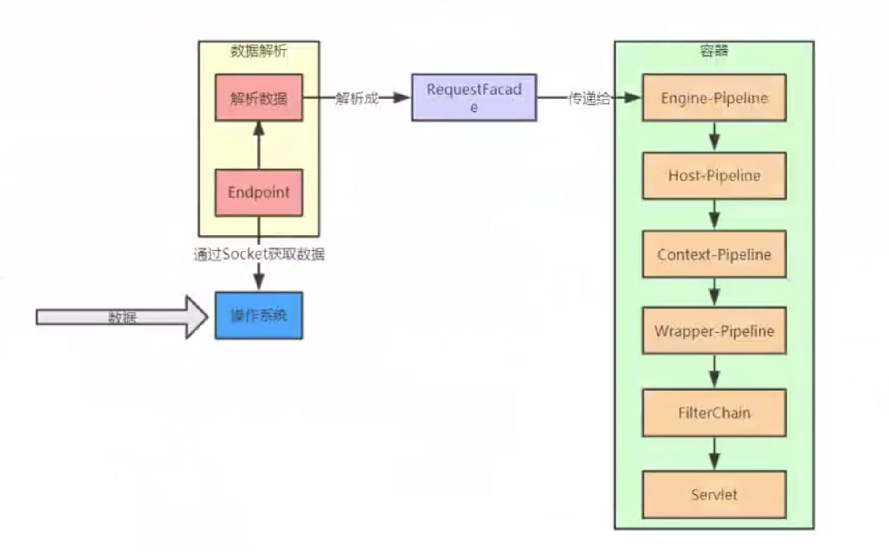
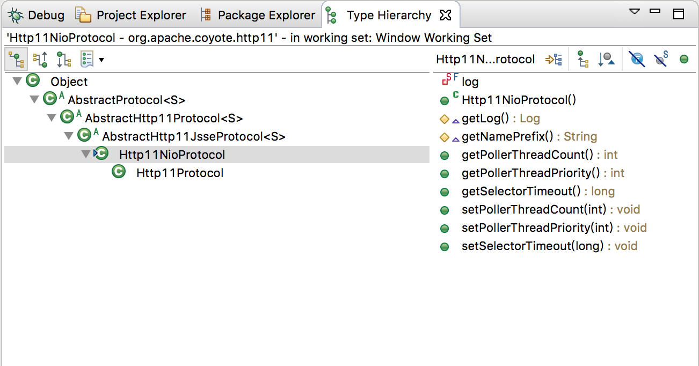

Servlet = Server + Applet

Applet 是Java 早期的一种技术，Java Applet 是一个客户端应用程序，可以运行在浏览器环境中，可以通过鼠标点击、操作

Servlet 则是相对于客户端的应用程序，它是服务端的应用程序，客户端通过网络请求来执行Servlet 的逻辑！

Servlet 是一个接口规范，在应用端要写一个应用程序，就要实现这个接口

>[Servlet3.1规范翻译](https://www.iteye.com/blogs/subjects/Servlet-3-1)

```java
package javax.servlet;

import java.io.IOException;

public interface Servlet {

    public void init(ServletConfig config) throws ServletException;

    public ServletConfig getServletConfig();

    public void service(ServletRequest req, ServletResponse res)
            throws ServletException, IOException;

    public String getServletInfo();

    public void destroy();
}
```

比如实现这个Servlet 接口的类有HttpServlet

## 一个简单的Servlet

编写一个Servlet 类

```java
public class TestServlet extends HttpServlet 
{
    public TestServlet(){
        super();
    }

    @Override
    protected void doGet(HttpServletRequest req, HttpServletResponse resp)
            throws ServletException, IOException {

        resp.setContentType("text/html");
        PrintWriter out = resp.getWriter();
        out.println("<!DOCTYPE HTML PUBLIC \"-//W3C//DTD HTML 4.01 Transitional//EN\">");
        out.println("<HTML>");
        out.println("  <HEAD><TITLE>A Servlet</TITLE></HEAD>");
        out.println("  <BODY>");
        out.print("    This is ");
        out.print(this.getClass());
        out.println(", using the GET method");
        out.println("  </BODY>");
        out.println("</HTML>");
        out.flush();
        out.close();
    }
}
```

在web.xml 中增加Servlet 的定义

```xml
<servlet>
    <servlet-name>TestServlet</servlet-name>
    <servlet-class>TestServlet</servlet-class>
</servlet>
  
<servlet-mapping>
    <servlet-name>TestServlet</servlet-name>
    <url-pattern>/test</url-pattern>
</servlet-mapping>
```

例如项目名是test，运行Tomcat，打开浏览器访问地址 [http://127.0.0.1:8080/test/test](http://127.0.0.1:8080/test/test)，可以触发执行这个Servlet

最著名的一个Servlet，应该就是SpringMVC 框架中的DispatcherServlet，其继承树是这样的


## HttpServletRequest类

在上面的例子中，doGet() 方法的一个参数是HttpServletRequest，是对一个HTTP 请求的封装

HttpServletRequest 其实是一个接口，但是其他程序调用这个doGet() 方法的时候一定是要传入HttpServletRequest 接口的实现类的，但是Servlet 规范只规定了这个接口，谁来实现这个接口呢？其实是由Servlet 容器实现！

而Tomcat 就是一个Servlet 容器实现！另外，Jetty 也是一个Servlet 容器实现！

可以理解Tomcat、Jetty 实现了Servlet 规范！

在tomcat 中，org.apache.catalina.connector.RequestFacade 实现了HttpServletRequest 接口；而jetty 则对应也有自己的实现！

org.apache.catalina.connector.RequestFacade 有一个属性是org.apache.catalina.connector.Request，这是一个典型的外观模式（Facade模式）的应用

## Tomcat架构图

本文主要参考[https://www.bilibili.com/video/BV1jJ41197va](https://www.bilibili.com/video/BV1jJ41197va)


如上图展示了Tomcat 内部的层级关系图：Engine -> Host -> Context -> Wrapper -> Servlet

下面是在一个SpringBoot 项目中，一个Controller 执行的时候，对应线程的调用栈（通过分析一个线程的调用栈，可以对一个项目从上到底层的实现有一个整体的把握！对于后续阅读底层的源码也是很有帮助的！ ）

```
# 业务代码
com.xum.order.OrderController.OrderController.orderForm(Model) line: 21	

# Spring代理
  at sun.reflect.NativeMethodAccessorImpl.NativeMethodAccessorImpl.invoke0(Method, Object, Object[]) line: not available [native method]	
  at sun.reflect.NativeMethodAccessorImpl.NativeMethodAccessorImpl.invoke(Object, Object[]) line: 62	
  at sun.reflect.DelegatingMethodAccessorImpl.DelegatingMethodAccessorImpl.invoke(Object, Object[]) line: 43	
  at java.lang.reflect.Method.invoke(Object, Object...) line: 498	

# SpringMVC
  at org.springframework.web.method.support.ServletInvocableHandlerMethod(InvocableHandlerMethod).doInvoke(Object...) line: 205	
  at org.springframework.web.method.support.ServletInvocableHandlerMethod(InvocableHandlerMethod).invokeForRequest(NativeWebRequest, ModelAndViewContainer, Object...) line: 133	
  at org.springframework.web.servlet.mvc.method.annotation.ServletInvocableHandlerMethod.invokeAndHandle(ServletWebRequest, ModelAndViewContainer, Object...) line: 97	
  at org.springframework.web.servlet.mvc.method.annotation.RequestMappingHandlerAdapter.invokeHandlerMethod(HttpServletRequest, HttpServletResponse, HandlerMethod) line: 827	
  at org.springframework.web.servlet.mvc.method.annotation.RequestMappingHandlerAdapter.handleInternal(HttpServletRequest, HttpServletResponse, HandlerMethod) line: 738	
  at org.springframework.web.servlet.mvc.method.RequestMappingHandlerAdapter(AbstractHandlerMethodAdapter).handle(HttpServletRequest, HttpServletResponse, Object) line: 85	

# SpringMVC DispatcherServlet
  at org.springframework.web.servlet.DispatcherServlet.doDispatch(HttpServletRequest, HttpServletResponse) line: 967	
  at org.springframework.web.servlet.DispatcherServlet.doService(HttpServletRequest, HttpServletResponse) line: 901	
  at org.springframework.web.servlet.DispatcherServlet(FrameworkServlet).processRequest(HttpServletRequest, HttpServletResponse) line: 970	
  at org.springframework.web.servlet.DispatcherServlet(FrameworkServlet).doGet(HttpServletRequest, HttpServletResponse) line: 861	
  at javax.servlet.http.DispatcherServlet(HttpServlet).service(HttpServletRequest, HttpServletResponse) line: 635	
  at org.springframework.web.servlet.DispatcherServlet(FrameworkServlet).service(HttpServletRequest, HttpServletResponse) line: 846	
  at javax.servlet.http.DispatcherServlet(HttpServlet).service(ServletRequest, ServletResponse) line: 742	

# Tomcat 实现的处理Servlet 的Filter 过滤器
  at org.apache.catalina.core.ApplicationFilterChain.internalDoFilter(ServletRequest, ServletResponse) line: 231	
  at org.apache.catalina.core.ApplicationFilterChain.doFilter(ServletRequest, ServletResponse) line: 166	
  at org.apache.tomcat.websocket.server.WsFilter.doFilter(ServletRequest, ServletResponse, FilterChain) line: 52	
  at org.apache.catalina.core.ApplicationFilterChain.internalDoFilter(ServletRequest, ServletResponse) line: 193	
  at org.apache.catalina.core.ApplicationFilterChain.doFilter(ServletRequest, ServletResponse) line: 166	
  at org.springframework.web.filter.OrderedRequestContextFilter(RequestContextFilter).doFilterInternal(HttpServletRequest, HttpServletResponse, FilterChain) line: 99	
  at org.springframework.web.filter.OrderedRequestContextFilter(OncePerRequestFilter).doFilter(ServletRequest, ServletResponse, FilterChain) line: 107	
  at org.apache.catalina.core.ApplicationFilterChain.internalDoFilter(ServletRequest, ServletResponse) line: 193	
  at org.apache.catalina.core.ApplicationFilterChain.doFilter(ServletRequest, ServletResponse) line: 166	
  at org.springframework.web.filter.OrderedHttpPutFormContentFilter(HttpPutFormContentFilter).doFilterInternal(HttpServletRequest, HttpServletResponse, FilterChain) line: 108	
  at org.springframework.web.filter.OrderedHttpPutFormContentFilter(OncePerRequestFilter).doFilter(ServletRequest, ServletResponse, FilterChain) line: 107	
  at org.apache.catalina.core.ApplicationFilterChain.internalDoFilter(ServletRequest, ServletResponse) line: 193	
  at org.apache.catalina.core.ApplicationFilterChain.doFilter(ServletRequest, ServletResponse) line: 166	
  at org.springframework.web.filter.OrderedHiddenHttpMethodFilter(HiddenHttpMethodFilter).doFilterInternal(HttpServletRequest, HttpServletResponse, FilterChain) line: 81	
  at org.springframework.web.filter.OrderedHiddenHttpMethodFilter(OncePerRequestFilter).doFilter(ServletRequest, ServletResponse, FilterChain) line: 107	
  at org.apache.catalina.core.ApplicationFilterChain.internalDoFilter(ServletRequest, ServletResponse) line: 193	
  at org.apache.catalina.core.ApplicationFilterChain.doFilter(ServletRequest, ServletResponse) line: 166	
  at org.springframework.web.filter.OrderedCharacterEncodingFilter(CharacterEncodingFilter).doFilterInternal(HttpServletRequest, HttpServletResponse, FilterChain) line: 197	
  at org.springframework.web.filter.OrderedCharacterEncodingFilter(OncePerRequestFilter).doFilter(ServletRequest, ServletResponse, FilterChain) line: 107	
  at org.apache.catalina.core.ApplicationFilterChain.internalDoFilter(ServletRequest, ServletResponse) line: 193	
  at org.apache.catalina.core.ApplicationFilterChain.doFilter(ServletRequest, ServletResponse) line: 166	

# Tomcat Wrapper
  at org.apache.catalina.core.StandardWrapperValve.invoke(Request, Response) line: 199	
  at org.apache.catalina.core.StandardContextValve.invoke(Request, Response) line: 96	
  at org.apache.catalina.authenticator.NonLoginAuthenticator(AuthenticatorBase).invoke(Request, Response) line: 621	

# Tomcat Host
  at org.apache.catalina.core.StandardHostValve.invoke(Request, Response) line: 140	
  at org.apache.catalina.valves.ErrorReportValve.invoke(Request, Response) line: 81	

# Tomcat Engine
  at org.apache.catalina.core.StandardEngineValve.invoke(Request, Response) line: 87	
  at org.apache.catalina.connector.CoyoteAdapter.service(Request, Response) line: 342	
  at org.apache.coyote.Http11Processor.service(SocketWrapperBase<？>) line: 803	
  at org.apache.coyote.Http11Processor(AbstractProcessorLight).process(SocketWrapperBase<？>, SocketEvent) line: 66	
  at org.apache.coyote.AbstractProtocol$ConnectionHandler<S>.process(SocketWrapperBase<S>, SocketEvent) line: 790	

# Tomcat NIO
  at org.apache.tomcat.util.net.NioEndpoint$SocketProcessor.doRun() line: 1459	
  at org.apache.tomcat.util.net.NioEndpoint$SocketProcessor(SocketProcessorBase<S>).run() line: 49	

# Java 线程池
  at java.util.concurrent.ThreadPoolExecutor(ThreadPoolExecutor).runWorker(ThreadPoolExecutor$Worker) line: 1149	
  at java.util.concurrent.ThreadPoolExecutor$Worker.run() line: 624	
  at org.apache.tomcat.util.threads.TaskThread$WrappingRunnable.run() line: 61	
  at java.lang.Thread.run() line: 748	
```

Linux 系统下，使用Tomcat 处理HTTP 请求的流程是这样的（可以结合上面的调用栈理解）



## 怎么看底层源码

[TCP 协议](http://www.xumenger.com/tcp-ip-family-20180222/)是由操作系统实现的，在Linux 中，具体的实现在net/ipv4/tcp_input.c、net/ipv4/tcp_output.c 等源码中！

Linux、Windows 操作系统层面对外将TCP 协议封装为socket 接口！Linux 的实现源码具体在其net/ 目录下！

另外在Java 中，可能会用到Socket 编程，比如对于其中的connect() 方法，如果一层层往下跟connect() 方法的实现，具体可以看到底层是调用(socket0) 方法（有的版本是socketCreate()），这个方法是native 方法，具体实现在[OpenJDK源码](http://hg.openjdk.java.net/jdk8)中实现的

比如Windows版本的OpenJDK 实现，该方法在OpenJDK 的源码对应在openjdk/jdk/src/windows/native/java/net/DualStackPlainSocket.c

```c
/*
 * Class:     java_net_DualStackPlainSocketImpl
 * Method:    socket0
 * Signature: (ZZ)I
 */
JNIEXPORT jint JNICALL Java_java_net_DualStackPlainSocketImpl_socket0
  (JNIEnv *env, jclass clazz, jboolean stream, jboolean v6Only /*unused*/) {
    int fd, rv, opt=0;

    fd = NET_Socket(AF_INET6, (stream ? SOCK_STREAM : SOCK_DGRAM), 0);
    if (fd == INVALID_SOCKET) {
        NET_ThrowNew(env, WSAGetLastError(), "create");
        return -1;
    }

    rv = setsockopt(fd, IPPROTO_IPV6, IPV6_V6ONLY, (char *) &opt, sizeof(opt));
    if (rv == SOCKET_ERROR) {
        NET_ThrowNew(env, WSAGetLastError(), "create");
    }

    SetHandleInformation((HANDLE)(UINT_PTR)fd, HANDLE_FLAG_INHERIT, FALSE);

    return fd;
}
```

其中NET_Socket 方法，其具体实现可以在openjdk/jdk/src/windows/native/java/net/net_util_md.c

```c
int NET_Socket (int domain, int type, int protocol) {
    SOCKET sock;
    sock = socket (domain, type, protocol);
    if (sock != INVALID_SOCKET) {
        SetHandleInformation((HANDLE)(uintptr_t)sock, HANDLE_FLAG_INHERIT, FALSE);
    }
    return (int)sock;
}
```

再往底层，NET_Socket 方法有调用socket 方法，这个方法的实现是操作系统提供的！其中Windows 操作系统对应的SDK 可以在C:/Program Files(x86)/Microsoft SDKs/ 下面找到！

再比如Java 中Thread 类中有isAlive、suspend0、resume0 等native 方法，对应可以在openjdk/jdk/src/share/native/java/lang/Thread.c 找到其实现

```c
#include "jni.h"
#include "jvm.h"

#include "java_lang_Thread.h"

#define THD "Ljava/lang/Thread;"
#define OBJ "Ljava/lang/Object;"
#define STE "Ljava/lang/StackTraceElement;"
#define STR "Ljava/lang/String;"

#define ARRAY_LENGTH(a) (sizeof(a)/sizeof(a[0]))

static JNINativeMethod methods[] = {
    {"start0",           "()V",        (void *)&JVM_StartThread},
    {"stop0",            "(" OBJ ")V", (void *)&JVM_StopThread},
    {"isAlive",          "()Z",        (void *)&JVM_IsThreadAlive},
    {"suspend0",         "()V",        (void *)&JVM_SuspendThread},
    {"resume0",          "()V",        (void *)&JVM_ResumeThread},
    {"setPriority0",     "(I)V",       (void *)&JVM_SetThreadPriority},
    {"yield",            "()V",        (void *)&JVM_Yield},
    {"sleep",            "(J)V",       (void *)&JVM_Sleep},
    {"currentThread",    "()" THD,     (void *)&JVM_CurrentThread},
    {"countStackFrames", "()I",        (void *)&JVM_CountStackFrames},
    {"interrupt0",       "()V",        (void *)&JVM_Interrupt},
    {"isInterrupted",    "(Z)Z",       (void *)&JVM_IsInterrupted},
    {"holdsLock",        "(" OBJ ")Z", (void *)&JVM_HoldsLock},
    {"getThreads",        "()[" THD,   (void *)&JVM_GetAllThreads},
    {"dumpThreads",      "([" THD ")[[" STE, (void *)&JVM_DumpThreads},
    {"setNativeName",    "(" STR ")V", (void *)&JVM_SetNativeThreadName},
};

#undef THD
#undef OBJ
#undef STE
#undef STR

JNIEXPORT void JNICALL
Java_java_lang_Thread_registerNatives(JNIEnv *env, jclass cls)
{
    (*env)->RegisterNatives(env, cls, methods, ARRAY_LENGTH(methods));
}
```

其中JVM_StartThread 等方法的具体实现，在openjdk/hotspot/src/share/vm/prims/jvm.cpp

```c
JVM_ENTRY(void, JVM_StartThread(JNIEnv* env, jobject jthread))
  JVMWrapper("JVM_StartThread");
  JavaThread *native_thread = NULL;

  // We cannot hold the Threads_lock when we throw an exception,
  // due to rank ordering issues. Example:  we might need to grab the
  // Heap_lock while we construct the exception.
  bool throw_illegal_thread_state = false;

  // We must release the Threads_lock before we can post a jvmti event
  // in Thread::start.
  {
    // Ensure that the C++ Thread and OSThread structures aren't freed before
    // we operate.
    MutexLocker mu(Threads_lock);

    // Since JDK 5 the java.lang.Thread threadStatus is used to prevent
    // re-starting an already started thread, so we should usually find
    // that the JavaThread is null. However for a JNI attached thread
    // there is a small window between the Thread object being created
    // (with its JavaThread set) and the update to its threadStatus, so we
    // have to check for this
    if (java_lang_Thread::thread(JNIHandles::resolve_non_null(jthread)) != NULL) {
      throw_illegal_thread_state = true;
    } else {
      // We could also check the stillborn flag to see if this thread was already stopped, but
      // for historical reasons we let the thread detect that itself when it starts running

      jlong size =
             java_lang_Thread::stackSize(JNIHandles::resolve_non_null(jthread));
      // Allocate the C++ Thread structure and create the native thread.  The
      // stack size retrieved from java is signed, but the constructor takes
      // size_t (an unsigned type), so avoid passing negative values which would
      // result in really large stacks.
      size_t sz = size > 0 ? (size_t) size : 0;
      native_thread = new JavaThread(&thread_entry, sz);

      // At this point it may be possible that no osthread was created for the
      // JavaThread due to lack of memory. Check for this situation and throw
      // an exception if necessary. Eventually we may want to change this so
      // that we only grab the lock if the thread was created successfully -
      // then we can also do this check and throw the exception in the
      // JavaThread constructor.
      if (native_thread->osthread() != NULL) {
        // Note: the current thread is not being used within "prepare".
        native_thread->prepare(jthread);
      }
    }
  }

  if (throw_illegal_thread_state) {
    THROW(vmSymbols::java_lang_IllegalThreadStateException());
  }

  assert(native_thread != NULL, "Starting null thread?");

  if (native_thread->osthread() == NULL) {
    // No one should hold a reference to the 'native_thread'.
    delete native_thread;
    if (JvmtiExport::should_post_resource_exhausted()) {
      JvmtiExport::post_resource_exhausted(
        JVMTI_RESOURCE_EXHAUSTED_OOM_ERROR | JVMTI_RESOURCE_EXHAUSTED_THREADS,
        "unable to create new native thread");
    }
    THROW_MSG(vmSymbols::java_lang_OutOfMemoryError(),
              "unable to create new native thread");
  }

  Thread::start(native_thread);

JVM_END
```

## tomcat处理HTTP协议

在org.apache.catalina.connector.Connector 类中有根据判断协议内容选择对应协议处理类的方法

```java
/**
 * Set the Coyote protocol which will be used by the connector.
 *
 * @param protocol The Coyote protocol name
 *
 * @deprecated Will be removed in Tomcat 9. Protocol must be configured via
 *             the constructor
 */
@Deprecated
public void setProtocol(String protocol) {

    boolean aprConnector = AprLifecycleListener.isAprAvailable() &&
            AprLifecycleListener.getUseAprConnector();

    if ("HTTP/1.1".equals(protocol) || protocol == null) {
        if (aprConnector) {
            setProtocolHandlerClassName("org.apache.coyote.http11.Http11AprProtocol");
        } else {
            setProtocolHandlerClassName("org.apache.coyote.http11.Http11NioProtocol");
        }
    } else if ("AJP/1.3".equals(protocol)) {
        if (aprConnector) {
            setProtocolHandlerClassName("org.apache.coyote.ajp.AjpAprProtocol");
        } else {
            setProtocolHandlerClassName("org.apache.coyote.ajp.AjpNioProtocol");
        }
    } else {
        setProtocolHandlerClassName(protocol);
    }
}
```

Http11NioProtocol 的类继承结构如下



## 热部署和热加载

热部署和热加载是类似的，都是在补充器Tomcat 的情况下，使得应用的最新代码生效

热部署表示重新部署应用，它的执行主体是Host（主机）；热加载表示重新加载class，它的执行主体是Context（应用）


热加载会去监听WEB-INF 目录下的classes 目录、lib 目录下文件（class 文件和jar 包）是否发生变化，如果发生了变化，要进行热加载（注意，删除文件是不会触发热加载的）。在Tomcat 中，有一个专门的线程去监听是否发生了变化！具体在org.apache.catalina.loader.WebappClassLoaderBase 中实现！

热部署则是监听项目文件夹（是WEB-INF 的上一级）下的内容是否发生了变化

监听变化，其实就是监听文件夹的修改日期是否变化。比如文件夹1，下面有文件夹2，文件夹1 的修改时间是2020-10-07 10:00:00，文件夹2 的修改时间是2020-10-07 10:01:00，在2020-10-07 10:02:00 的时候在文件夹2 中新增一个文件，可以观察到，文件夹2 的修改时间变为2020-10-07 10:02:00，但是文件夹1 的修改时间还是020-10-07 10:00:00

所以当WEB-INF 下的文件发生变化时，只会更改WEB-INF 文件夹的修改时间，其上一级的项目文件夹的修改时间是不会变化的！所以修改WEB-INF 文件夹下的内容，只会发生热加载，不会发生热部署！

## 参考资料

* [openJDK之如何下载各个版本的openJDK源码](https://www.cnblogs.com/jpfss/p/10936167.html)
* [JAVA虚拟机学习笔记（一）编译OpenJDK8或者dragonwell8](http://vlambda.com/wz_wPYkfQCsPP.html)
* [http://hg.openjdk.java.net/jdk8/jdk8/jdk/file/687fd7c7986d](http://hg.openjdk.java.net/jdk8/jdk8/jdk/file/687fd7c7986d)
* [java线程理解以及openjdk中的实现](https://blog.csdn.net/u014493323/article/details/83747563)
