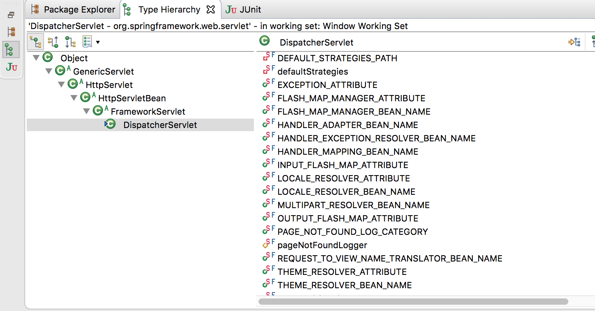
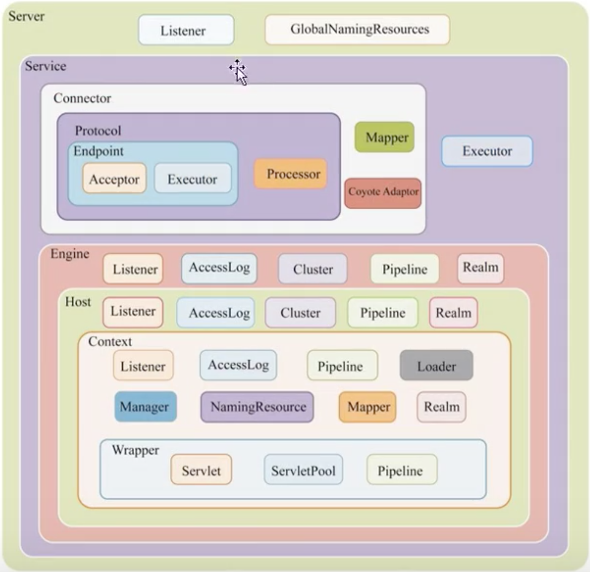

Servlet = Server + Applet

Applet 是Java 早期的一种技术，Java Applet 是一个客户端应用程序，可以运行在浏览器环境中，可以通过鼠标点击、操作

Servlet 则是相对于客户端的应用程序，它是服务端的应用程序，客户端通过网络请求来执行Servlet 的逻辑！

Servlet 是一个接口规范，在应用端要写一个应用程序，就要实现这个接口

>[Servlet3.1规范翻译](https://www.iteye.com/blogs/subjects/Servlet-3-1)

```java
package javax.servlet;

import java.io.IOException;

public interface Servlet {

    public void init(ServletConfig config) throws ServletException;

    public ServletConfig getServletConfig();

    public void service(ServletRequest req, ServletResponse res)
            throws ServletException, IOException;

    public String getServletInfo();

    public void destroy();
}
```

比如实现这个Servlet 接口的类有HttpServlet

## 一个简单的Servlet

编写一个Servlet 类

```java
public class TestServlet extends HttpServlet 
{
    public TestServlet(){
        super();
    }

    @Override
    protected void doGet(HttpServletRequest req, HttpServletResponse resp)
            throws ServletException, IOException {

        resp.setContentType("text/html");
        PrintWriter out = resp.getWriter();
        out.println("<!DOCTYPE HTML PUBLIC \"-//W3C//DTD HTML 4.01 Transitional//EN\">");
        out.println("<HTML>");
        out.println("  <HEAD><TITLE>A Servlet</TITLE></HEAD>");
        out.println("  <BODY>");
        out.print("    This is ");
        out.print(this.getClass());
        out.println(", using the GET method");
        out.println("  </BODY>");
        out.println("</HTML>");
        out.flush();
        out.close();
    }
}
```

在web.xml 中增加Servlet 的定义

```xml
<servlet>
    <servlet-name>TestServlet</servlet-name>
    <servlet-class>TestServlet</servlet-class>
</servlet>
  
<servlet-mapping>
    <servlet-name>TestServlet</servlet-name>
    <url-pattern>/test</url-pattern>
</servlet-mapping>
```

例如项目名是test，运行Tomcat，打开浏览器访问地址 [http://127.0.0.1:8080/test/test](http://127.0.0.1:8080/test/test)，可以触发执行这个Servlet

最著名的一个Servlet，应该就是SpringMVC 框架中的DispatcherServlet，其继承树是这样的



## HttpServletRequest类

在上面的例子中，doGet() 方法的一个参数是HttpServletRequest，是对一个HTTP 请求的封装

HttpServletRequest 其实是一个接口，但是其他程序调用这个doGet() 方法的时候一定是要传入HttpServletRequest 接口的实现类的，但是Servlet 规范只规定了这个接口，谁来实现这个接口呢？其实是由Servlet 容器实现！

而Tomcat 就是一个Servlet 容器实现！另外，Jetty 也是一个Servlet 容器实现！

可以理解Tomcat、Jetty 实现了Servlet 规范！

在tomcat 中，org.apache.catalina.connector.RequestFacade 实现了HttpServletRequest 接口；而jetty 则对应也有自己的实现！

org.apache.catalina.connector.RequestFacade 有一个属性是org.apache.catalina.connector.Request，这是一个典型的外观模式（Facade模式）的应用

## Tomcat架构图

本文主要参考[https://www.bilibili.com/video/BV1jJ41197va](https://www.bilibili.com/video/BV1jJ41197va)



如上图展示了Tomcat 内部的层级关系图：Servlet -> Wrapper -> Context -> Host -> Engine

下面是在一个SpringBoot 项目中，一个Controller 执行的时候，对应线程的调用栈

```
com.cmb.order.OrderController.OrderController.orderForm(Model) line: 21	
  at sun.reflect.NativeMethodAccessorImpl.NativeMethodAccessorImpl.invoke0(Method, Object, Object[]) line: not available [native method]	
  at sun.reflect.NativeMethodAccessorImpl.NativeMethodAccessorImpl.invoke(Object, Object[]) line: 62	
  at sun.reflect.DelegatingMethodAccessorImpl.DelegatingMethodAccessorImpl.invoke(Object, Object[]) line: 43	
  at java.lang.reflect.Method.invoke(Object, Object...) line: 498	
  at org.springframework.web.method.support.ServletInvocableHandlerMethod(InvocableHandlerMethod).doInvoke(Object...) line: 205	
  at org.springframework.web.method.support.ServletInvocableHandlerMethod(InvocableHandlerMethod).invokeForRequest(NativeWebRequest, ModelAndViewContainer, Object...) line: 133	
  at org.springframework.web.servlet.mvc.method.annotation.ServletInvocableHandlerMethod.invokeAndHandle(ServletWebRequest, ModelAndViewContainer, Object...) line: 97	
  at org.springframework.web.servlet.mvc.method.annotation.RequestMappingHandlerAdapter.invokeHandlerMethod(HttpServletRequest, HttpServletResponse, HandlerMethod) line: 827	
  at org.springframework.web.servlet.mvc.method.annotation.RequestMappingHandlerAdapter.handleInternal(HttpServletRequest, HttpServletResponse, HandlerMethod) line: 738	
  at org.springframework.web.servlet.mvc.method.RequestMappingHandlerAdapter(AbstractHandlerMethodAdapter).handle(HttpServletRequest, HttpServletResponse, Object) line: 85	
  at org.springframework.web.servlet.DispatcherServlet.doDispatch(HttpServletRequest, HttpServletResponse) line: 967	
  at org.springframework.web.servlet.DispatcherServlet.doService(HttpServletRequest, HttpServletResponse) line: 901	
  at org.springframework.web.servlet.DispatcherServlet(FrameworkServlet).processRequest(HttpServletRequest, HttpServletResponse) line: 970	
  at org.springframework.web.servlet.DispatcherServlet(FrameworkServlet).doGet(HttpServletRequest, HttpServletResponse) line: 861	
  at javax.servlet.http.DispatcherServlet(HttpServlet).service(HttpServletRequest, HttpServletResponse) line: 635	
  at org.springframework.web.servlet.DispatcherServlet(FrameworkServlet).service(HttpServletRequest, HttpServletResponse) line: 846	
  at javax.servlet.http.DispatcherServlet(HttpServlet).service(ServletRequest, ServletResponse) line: 742	
  at org.apache.catalina.core.ApplicationFilterChain.internalDoFilter(ServletRequest, ServletResponse) line: 231	
  at org.apache.catalina.core.ApplicationFilterChain.doFilter(ServletRequest, ServletResponse) line: 166	
  at org.apache.tomcat.websocket.server.WsFilter.doFilter(ServletRequest, ServletResponse, FilterChain) line: 52	
  at org.apache.catalina.core.ApplicationFilterChain.internalDoFilter(ServletRequest, ServletResponse) line: 193	
  at org.apache.catalina.core.ApplicationFilterChain.doFilter(ServletRequest, ServletResponse) line: 166	
  at org.springframework.web.filter.OrderedRequestContextFilter(RequestContextFilter).doFilterInternal(HttpServletRequest, HttpServletResponse, FilterChain) line: 99	
  at org.springframework.web.filter.OrderedRequestContextFilter(OncePerRequestFilter).doFilter(ServletRequest, ServletResponse, FilterChain) line: 107	
  at org.apache.catalina.core.ApplicationFilterChain.internalDoFilter(ServletRequest, ServletResponse) line: 193	
  at org.apache.catalina.core.ApplicationFilterChain.doFilter(ServletRequest, ServletResponse) line: 166	
  at org.springframework.web.filter.OrderedHttpPutFormContentFilter(HttpPutFormContentFilter).doFilterInternal(HttpServletRequest, HttpServletResponse, FilterChain) line: 108	
  at org.springframework.web.filter.OrderedHttpPutFormContentFilter(OncePerRequestFilter).doFilter(ServletRequest, ServletResponse, FilterChain) line: 107	
  at org.apache.catalina.core.ApplicationFilterChain.internalDoFilter(ServletRequest, ServletResponse) line: 193	
  at org.apache.catalina.core.ApplicationFilterChain.doFilter(ServletRequest, ServletResponse) line: 166	
  at org.springframework.web.filter.OrderedHiddenHttpMethodFilter(HiddenHttpMethodFilter).doFilterInternal(HttpServletRequest, HttpServletResponse, FilterChain) line: 81	
  at org.springframework.web.filter.OrderedHiddenHttpMethodFilter(OncePerRequestFilter).doFilter(ServletRequest, ServletResponse, FilterChain) line: 107	
  at org.apache.catalina.core.ApplicationFilterChain.internalDoFilter(ServletRequest, ServletResponse) line: 193	
  at org.apache.catalina.core.ApplicationFilterChain.doFilter(ServletRequest, ServletResponse) line: 166	
  at org.springframework.web.filter.OrderedCharacterEncodingFilter(CharacterEncodingFilter).doFilterInternal(HttpServletRequest, HttpServletResponse, FilterChain) line: 197	
  at org.springframework.web.filter.OrderedCharacterEncodingFilter(OncePerRequestFilter).doFilter(ServletRequest, ServletResponse, FilterChain) line: 107	
  at org.apache.catalina.core.ApplicationFilterChain.internalDoFilter(ServletRequest, ServletResponse) line: 193	
  at org.apache.catalina.core.ApplicationFilterChain.doFilter(ServletRequest, ServletResponse) line: 166	
  at org.apache.catalina.core.StandardWrapperValve.invoke(Request, Response) line: 199	
  at org.apache.catalina.core.StandardContextValve.invoke(Request, Response) line: 96	
  at org.apache.catalina.authenticator.NonLoginAuthenticator(AuthenticatorBase).invoke(Request, Response) line: 621	
  at org.apache.catalina.core.StandardHostValve.invoke(Request, Response) line: 140	
  at org.apache.catalina.valves.ErrorReportValve.invoke(Request, Response) line: 81	
  at org.apache.catalina.core.StandardEngineValve.invoke(Request, Response) line: 87	
  at org.apache.catalina.connector.CoyoteAdapter.service(Request, Response) line: 342	
  at org.apache.coyote.Http11Processor.service(SocketWrapperBase<？>) line: 803	
  at org.apache.coyote.Http11Processor(AbstractProcessorLight).process(SocketWrapperBase<？>, SocketEvent) line: 66	
  at org.apache.coyote.AbstractProtocol$ConnectionHandler<S>.process(SocketWrapperBase<S>, SocketEvent) line: 790	
  at org.apache.tomcat.util.net.NioEndpoint$SocketProcessor.doRun() line: 1459	
  at org.apache.tomcat.util.net.NioEndpoint$SocketProcessor(SocketProcessorBase<S>).run() line: 49	
  at java.util.concurrent.ThreadPoolExecutor(ThreadPoolExecutor).runWorker(ThreadPoolExecutor$Worker) line: 1149	
  at java.util.concurrent.ThreadPoolExecutor$Worker.run() line: 624	
  at org.apache.tomcat.util.threads.TaskThread$WrappingRunnable.run() line: 61	
  at java.lang.Thread.run() line: 748	
```
