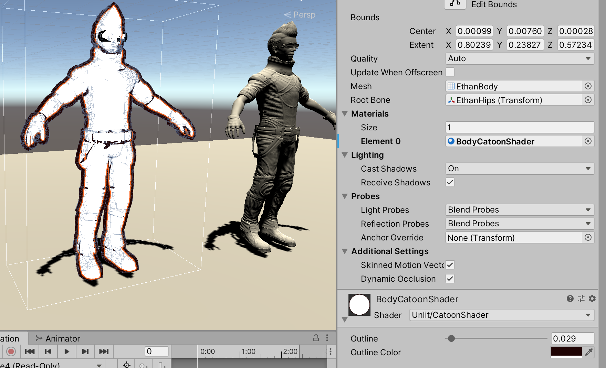

>参考《Unity Shader 入门精要》、《Unity3D ShaderLab 开发实战详解》

>参考[http://www.xumenger.com/dig/render/](http://www.xumenger.com/dig/render/)

首先通过剔除模型正面三角面片的方式实现轮廓颜色的渲染效果，对应的Pass 实现如下

```shaderlab
Shader "Unlit/CatoonShader"
{
    Properties {
        // 控制轮廓线宽度
        _Outline ("Outline", Range(0, 1)) = 0.1

        // 控制轮廓线颜色
        _OutlineColor ("Outline Color", Color) = (0, 0, 0, 1)
    }

    SubShader {
        Tags {"RenderType"="Opaque" "Queue"="Geometry"}

        // 定义渲染轮廓线需要的Pass，这个Pass 只渲染背面的三角面片
        Pass {
            NAME "OUTLINE"
            Cull Front      // 把正面的三角面片剔除，只渲染背面

            CGPROGRAM

            #pragma vertex vert
            #pragma fragment frag

            #include "UnityCG.cginc"

            float _Outline;
            fixed4 _OutlineColor;

            struct a2v {
                float4 vertex: POSITION;
                float3 normal: NORMAL;
            };

            struct v2f {
                float4 pos: SV_POSITION;
            };

            v2f vert(a2v v) {
                v2f o;

                // 首先把顶点和法线变换到视角空间下。这是为了让描线边可以在观察空间达到最好的效果
                float4 pos = float4(UnityObjectToViewPos(v.vertex), 1.0);
                float3 normal = mul((float3x3)UNITY_MATRIX_IT_MV, v.normal);

                // 设置法线的z 分量，对其归一化后再将顶点沿某方向扩展，得到扩展后的顶点坐标
                // 对法线的处理是为了尽可能避免背面扩张后的顶点挡住正面的面片
                normal.z = -0.5;
                pos = pos + float4(normalize(normal), 0) * _Outline;

                // 把顶点从视角空间变换到裁剪空间
                o.pos = mul(UNITY_MATRIX_P, pos);

                return o;
            }

            float4 frag(v2f i): SV_Target {
                // 片元着色器只需要用轮廓线颜色渲染整个背面即可
                return float4(_OutlineColor.rgb, 1);
            }

            ENDCG
        }
        
        Pass {

        }
    }

	FallBack "Diffuse"
}
```

对模型应用该Shader 材质后渲染的效果是这样的



最终实现版本的卡通Shader 是这样的

```shaderlab
Shader "Unlit/CatoonShader"
{
    Properties {
        // 控制模型的颜色
        _Color ("Color Tint", Color) = (1, 1, 1, 1)

        // 控设置模型的贴图
        _MainTex ("Main Tex", 2D) = "white" {}

        // 控制漫反射色调的渐变纹理
        _Ramp ("Ramp Texture", 2D) = "white" {}

        // 控制轮廓线宽度
        _Outline ("Outline", Range(0, 1)) = 0.1

        // 控制轮廓线颜色
        _OutlineColor ("Outline Color", Color) = (0, 0, 0, 1)

        // 控制高光反射颜色
        _Specular ("Specular", Color) = (1, 1, 1, 1)

        // 控制计算高光反射时使用的阈值
        _SpecularScale ("SpecularScale", Range(0, 0.1)) = 0.01
    }

    SubShader {
        Tags {"RenderType"="Opaque" "Queue"="Geometry"}

        // 定义渲染轮廓线需要的Pass，这个Pass 只渲染背面的三角面片
        Pass {
            NAME "OUTLINE"
            Cull Front      // 把正面的三角面片剔除，只渲染背面

            CGPROGRAM

            #pragma vertex vert
            #pragma fragment frag

            #include "UnityCG.cginc"

            float _Outline;
            fixed4 _OutlineColor;

            struct a2v {
                float4 vertex: POSITION;
                float3 normal: NORMAL;
            };

            struct v2f {
                float4 pos: SV_POSITION;
            };

            v2f vert(a2v v) {
                v2f o;

                // 首先把顶点和法线变换到视角空间下。这是为了让描线边可以在观察空间达到最好的效果
                float4 pos = float4(UnityObjectToViewPos(v.vertex), 1.0);
                float3 normal = mul((float3x3)UNITY_MATRIX_IT_MV, v.normal);

                // 设置法线的z 分量，对其归一化后再将顶点沿某方向扩展，得到扩展后的顶点坐标
                // 对法线的处理是为了尽可能避免背面扩张后的顶点挡住正面的面片
                normal.z = -0.5;
                pos = pos + float4(normalize(normal), 0) * _Outline;

                // 把顶点从视角空间变换到裁剪空间
                o.pos = mul(UNITY_MATRIX_P, pos);

                return o;
            }

            float4 frag(v2f i): SV_Target {
                // 片元着色器只需要用轮廓线颜色渲染整个背面即可
                return float4(_OutlineColor.rgb, 1);
            }

            ENDCG
        }

        // 定义光照模型所在的Pass，渲染模型的正面
        Pass {
            Tags {"LightMode"="ForwardBase"}

            Cull Back

            CGPROGRAM

            #pragma vertex vert
            #pragma fragment frag

            // 设置了编译指令，为了让Shader 中的光照变量可以被正确的赋值
            #pragma multi_compile_fwdbase

            #include "UnityCG.cginc"
            #include "Lighting.cginc"
            #include "AutoLight.cginc"
            #include "UnityShaderVariables.cginc"

            fixed4 _Color;
            sampler2D _MainTex;
            float4 _MainTex_ST;
            sampler2D _Ramp;
            fixed4 _Specular;
            fixed _SpecularScale;

            struct a2v {
                float4 vertex: POSITION;
                float3 normal: NORMAL;
                float4 texcoord: TEXCOORD0;
                float4 tangent: TANGENT;
            };

            struct v2f {
                float4 pos: POSITION;
                float2 uv: TEXCOORD0;
                float3 worldNormal: TEXCOORD1;
                float3 worldPos: TEXCOORD2;
                SHADOW_COORDS(3)
            };

            v2f vert(a2v v) {
                v2f o;

                o.pos = UnityObjectToClipPos(v.vertex);
                o.uv = TRANSFORM_TEX(v.texcoord, _MainTex);

                // 计算世界空间下的法线向量和顶点位置
                o.worldNormal = UnityObjectToWorldNormal(v.normal);
                o.worldPos = mul(unity_ObjectToWorld, v.vertex).xyz;

                // 使用Unity 内置的宏TRANSFER_SHADOW、SHADOW_COORDS 计算阴影所需要的各个变量
                TRANSFER_SHADOW(o);

                return o;
            }

            float4 frag(v2f i):SV_Target {
                // 首先计算了光照模型中需要的各个方向矢量，并对其进行归一化处理
                fixed3 worldNormal = normalize(i.worldNormal);
                fixed3 worldLightDir = normalize(UnityWorldSpaceLightDir(i.worldPos));
                fixed3 worldViewDir = normalize(UnityWorldSpaceViewDir(i.worldPos));
                fixed3 worldHalfDir = normalize(worldLightDir + worldViewDir);

                fixed4 c = tex2D(_MainTex, i.uv);
                // 计算材质的反射率
                fixed3 albedo = c.rgb * _Color.rgb;

                // 计算环境光照
                fixed ambient = UNITY_LIGHTMODEL_AMBIENT.xyz * albedo;

                // 使用内置的宏计算当前世界坐标下的阴影值
                UNITY_LIGHT_ATTENUATION(atten, i, i.worldPos);

                // 计算半兰伯特漫反射系数
                fixed diff = dot(worldNormal, worldLightDir);
                diff = (diff * 0.5 + 0.5) * atten;

                // 并将结果和材质的反射率、光照颜色相乘，作为最后的漫反射光照
                fixed3 diffuse = _LightColor0.rgb * albedo * tex2D(_Ramp, float2(diff, diff)).rgb;

                // 计算高光反射，并使用fwidth 对高光区域的边界进行抗锯齿处理
                fixed spec = dot(worldNormal, worldHalfDir);
                fixed w = fwidth(spec) * 2.0;
                // 并将计算而得出的高光反射系数和高光反射颜色相乘，得到高光反射的光照部分
                // 使用step 是为了在_SpecularScale 为0 时可以完全消除高光反射的光照
                fixed3 specular = _Specular.rgb * lerp(0, 1, smoothstep(-w, w, spec + _SpecularScale - 1)) * step(0.0001, _SpecularScale);

                // 返回环境光照、漫反射光照和高光反射叠加的结果
                return fixed4(ambient + diffuse + specular, 1.0);
            }

            ENDCG
        }
    }

	FallBack "Diffuse"
}
```

试着在不同的模型上展示一下效果。虽然还不是很精致，但是那种感觉已经有了


## 问题列表

* "RenderType"="Opaque" ？
* "Queue"="Geometry" ？
* #pragma multi_compile_fwdbase ？
* o.uv = TRANSFORM_TEX(v.texcoord, _MainTex) ？
* TRANSFER_SHADOW(o) ？
* fixed4 c = tex2D(_MainTex, i.uv) ？
* fixed diff = dot(worldNormal, worldLightDir); ？
* lerp() ？
* smoothstep() ？
* step() ？