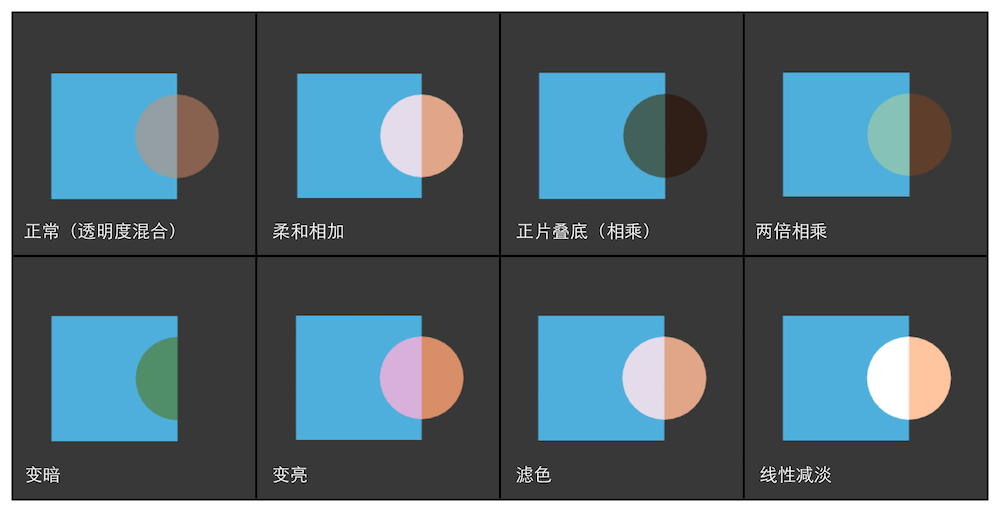

>参考《Unity Shader 入门精要》、《Unity3D ShaderLab 开发实战详解》

>[《Unity Shader入门精要》随书彩色插图](http://candycat1992.github.io/unity_shaders_book/unity_shaders_book_images.html)

>参考[http://www.xumenger.com/dig/render/](http://www.xumenger.com/dig/render/)

透明时游戏中经常要使用的一种效果，比如实现隐身的效果等，在实时渲染中需要实现透明效果，通常会在渲染模型时控制它的透明通道。当开启透明混合后，当一个物体被渲染到屏幕上时，每个片元除了颜色值和深度值之外，还有另外一个属性——透明度。当透明度为1时，表示该像素是完全不透明的，而当其为0时，表示该像素完全不会显示

## 深度缓冲

事实上，对于不透明物体，不考虑它们的渲染顺序也能得到正确的效果，这是由于强大的深度缓冲（depth buffer，也称为Z-Buffer）的存在

在实时渲染中，深度缓冲是用于解决可见性问题的，它可以决定哪个物体的哪些部分会被渲染在前面，而哪些部分会被其他物体遮挡

它的基本思想是：根据深度缓存中的值来判断该片元距离摄像机的距离，当渲染一个片元时，需要把它的深度值和已经存在于深度缓冲中的值进行比较（如果开启深度测试），如果它的值距离摄像机更远，那么说明这个片元不应该被渲染到屏幕上（有物体挡住了它）；否则这个片元应该覆盖掉此时颜色缓冲中的像素值，并把它的深度值更新到深度缓冲中（如果开启了深度写入）

但是要想实现透明效果，问题就没有那么简单了，透明的物体可以被前面不透明的物体挡住，但是它挡不住后面的物体

实现透明效果有两种主要方式：透明度测试和透明度混合

## 透明度测试

采用一种“霸道极端”的机制，只要一个片元的透明度不满足条件（通常小于某个阈值），那么它对应的片元就会被舍弃，被舍弃的片元将不会再进行任何处理，也不会对颜色缓冲产生任何影响，否则就会按照普通的不透明物体的方式来处理它，进行深度测试、深度写入等

也就是说，透明度测试时不需要关闭深度写入的，它和其他不透明物体最大的区别就是它会根据透明度来舍弃一些片元

虽然简单，但是它产生的效果也是极端的，要么完全透明，即看不见，要么完全不透明

在处理透明度测试时，实际上跟对待普通的不透明问题时一样的，只是在片元着色器中增加了对透明度判断并裁剪片元的代码

## 透明度混合

该方法可以得到真正的半透明效果

它会使用当前片元的透明度作为混合因子，与已经存储在颜色缓冲中的颜色值进行混合，得到新的颜色

但是，透明度混合需要关闭深度写入，这使得要非常小心物体的渲染顺序

需要注意的是，透明度混合知识关闭了深度写入，并没有关闭深度测试。这意味着，当使用透明度混合渲染一个片元时，还是会比较它的深度值与当前深度缓冲中的深度值，如果它的深度值距离摄像机更远，就不需要再进行混合操作

这一点决定了，当一个不透明的物体出现在透明物体的前面，而我们先渲染了不透明物体，它仍然可以正常的遮住透明物体

对于透明度混合来说，深度缓冲时只读的！！

下面使用透明度混合的方式实现透明度的效果，详细说明参见代码注释！

## 透明度混合效果展示

对应的Shader 的代码是这样的

```shaderlab
Shader "Unlit/TransparentShader"
{
    Properties {
        _Color ("Color Tint", Color) = (1, 1, 1, 1)
        _MainTex ("Main Tex", 2D) = "white" {}

        // 控制整体的透明度
        _AlphaScale ("Alpha Scale", Range(0, 1)) = 1
    }
    SubShader {
        // Unity 为了解决渲染顺序的问题，提供了渲染队列的解决方案，索引号越小越早被渲染
        // Background=1000   Geometry=2000(默认，比如不透明物体) AlphaTest=3000 Transparent=4000 Overlay=5000
        // 如果使用透明度测试，需要使用AlphaTest；如果使用透明度混合，需要使用Transparent
        Tags {"Queue"="Transparent" "IgnoreProjector"="True" "RenderType"="Transparent"}
        // "IgnoreProjector"="True" 表示这个Shader 不会受到投影器(Projector)的影响
        // "RenderType"="Transparent" 让Unity 把这个Shader 归入提前定义的组。这里用于指明该Shader 是一个使用了透明度混合的Shader
        
        Pass {
            // 让Unity 使用前向渲染路径的方式正确提供各个光照变量
            Tags { "LightMode"="ForwardBase" }
            
            // 默认情况下，渲染引擎提出了物体背面（相对于摄像机的方向）的渲染图元，只渲染了物体的正面
            // 如果要想实现双面渲染的效果，要在第一个Pass 中剔除正面，先只渲染背面
            Cull Front

            // 正如提到的，使用透明度混合时，深度缓冲时只读的，需要关闭深度写入
            ZWrite Off

            // 要想实现半透明的效果，就需要把当前自身的颜色与已经存在于颜色缓冲中的颜色进行混合，就需要Blend 指令
            // Blend SrcFactor DstFactor 开启混合，并设置混合因子
            // 源颜色(该片元产生的颜色)乘以SrcFactor，而目标颜色(已经存在于颜色缓冲中的颜色)乘以DstFactor
            // 然后再把两者相加后再存入颜色缓冲中
            // 对于透明度混合，要用Blend SrcAlpha OneMinusSrcAlpha
            // DstColor(new) = SrcAlpha * SrcColor + (1-SrcSrcAlpha) * DstColor(old)
            // 用于实现半透明效果
            Blend SrcAlpha OneMinusSrcAlpha
            
            CGPROGRAM
            
            #pragma vertex vert
            #pragma fragment frag
            
            #include "Lighting.cginc"
            
            fixed4 _Color;
            sampler2D _MainTex;
            float4 _MainTex_ST;
            fixed _AlphaScale;
            
            struct a2v {
                float4 vertex : POSITION;
                float3 normal : NORMAL;
                float4 texcoord : TEXCOORD0;
            };
            
            struct v2f {
                float4 pos : SV_POSITION;
                float3 worldNormal : TEXCOORD0;
                float3 worldPos : TEXCOORD1;
                float2 uv : TEXCOORD2;       // 存储变换后的纹理坐标
            };
            
            v2f vert(a2v v) {
                v2f o;
                o.pos = UnityObjectToClipPos(v.vertex);

                // 计算出世界空间中的法线向量和顶点位置
                o.worldNormal = UnityObjectToWorldNormal(v.normal);
                o.worldPos = mul(unity_ObjectToWorld, v.vertex).xyz;

                // 得到变换后的纹理坐标
                o.uv = TRANSFORM_TEX(v.texcoord, _MainTex);
                
                return o;
            }
            
            fixed4 frag(v2f i) : SV_Target {
                fixed3 worldNormal = normalize(i.worldNormal);
                fixed3 worldLightDir = normalize(UnityWorldSpaceLightDir(i.worldPos));
                
                fixed4 texColor = tex2D(_MainTex, i.uv);

                // 材质的反射率
                fixed3 albedo = texColor.rgb * _Color.rgb;

                // 环境光照
                fixed3 ambient = UNITY_LIGHTMODEL_AMBIENT.xyz * albedo;

                // 漫反射光照
                fixed3 diffuse = _LightColor0.rgb * albedo * max(0, dot(worldNormal, worldLightDir));

                // 设置了该着色器返回值中的透明通道，它是纹理像素的透明通道texColor.a和材质参数_AlphaScale的乘积
                // 只有使用Blend命令打开混合后，在这里设置透明通道才有意义，否则这些透明度并不会对片元的透明效果产生影响
                return fixed4(ambient + diffuse, texColor.a * _AlphaScale);
            }
            
            ENDCG
        }

        // 分两个Pass 主要用于实现双面渲染的效果
        // 除了Cull Back，其他和之前的代码一样
        Pass {
            Tags { "LightMode"="ForwardBase" }
            
            // 在第二个Pass 中剔除背面，只渲染正面，刚好可以和第一个Pass 中渲染背面的结果混合
            // Unity 会顺序执行SubShader 中的Pass，所以可以保证背面先于正面渲染，从而得到正确的深度渲染关系
            Cull Back
            
            ZWrite Off
            Blend SrcAlpha OneMinusSrcAlpha
            
            CGPROGRAM
            
            #pragma vertex vert
            #pragma fragment frag
            
            #include "Lighting.cginc"
            
            fixed4 _Color;
            sampler2D _MainTex;
            float4 _MainTex_ST;
            fixed _AlphaScale;
            
            struct a2v {
                float4 vertex : POSITION;
                float3 normal : NORMAL;
                float4 texcoord : TEXCOORD0;
            };
            
            struct v2f {
                float4 pos : SV_POSITION;
                float3 worldNormal : TEXCOORD0;
                float3 worldPos : TEXCOORD1;
                float2 uv : TEXCOORD2;
            };
            
            v2f vert(a2v v) {
                v2f o;
                o.pos = UnityObjectToClipPos(v.vertex);
                
                o.worldNormal = UnityObjectToWorldNormal(v.normal);
                
                o.worldPos = mul(unity_ObjectToWorld, v.vertex).xyz;
                
                o.uv = TRANSFORM_TEX(v.texcoord, _MainTex);
                
                return o;
            }
            
            fixed4 frag(v2f i) : SV_Target {
                fixed3 worldNormal = normalize(i.worldNormal);
                fixed3 worldLightDir = normalize(UnityWorldSpaceLightDir(i.worldPos));
                
                fixed4 texColor = tex2D(_MainTex, i.uv);
                
                fixed3 albedo = texColor.rgb * _Color.rgb;
                
                fixed3 ambient = UNITY_LIGHTMODEL_AMBIENT.xyz * albedo;
                
                fixed3 diffuse = _LightColor0.rgb * albedo * max(0, dot(worldNormal, worldLightDir));
                
                return fixed4(ambient + diffuse, texColor.a * _AlphaScale);
            }
            
            ENDCG
        }
    } 
    FallBack "Transparent/VertexLit"
}
```

直接看一下为模型添加该材质后的效果


## 常见的Blend类型

>Blend SrcFactor DstFactor

>DstColor(new) = SrcFactor * SrcColor + DstFactor * DstColor(old)

通过混合操作和混合因子命令的组合，可以得到一些类似Photoshop 混合模式中的混合效果

```
// 正常(Normal)，即透明度混合
Blend SrcAplha OneMinusSrcAlpha

// 柔和相加
Blend OneMinusDstAlpha One

// 正片叠底，即相乘
Blend DstColor Zero

// 两倍相乘
Blend DstColor SrcColor

// 变暗
BlendOp Min
Blend One One

// 变亮
BlendOp Max
Blend One One

// 滤色
Blend OneMinusDstAlpha One
// 等价于
Blend One OneMinusDSrcAlpha

// 线性减淡
Blend One One
```

