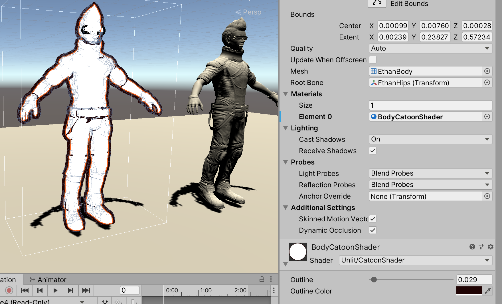

>参考《Unity Shader 入门精要》、《Unity3D ShaderLab 开发实战详解》

首先通过剔除模型正面三角面片的方式实现轮廓颜色的渲染效果，对应的Pass 实现如下

```
Shader "Unlit/CatoonShader"
{
    Properties {
        // 控制轮廓线宽度
        _Outline ("Outline", Range(0, 1)) = 0.1

        // 控制轮廓线颜色
        _OutlineColor ("Outline Color", Color) = (0, 0, 0, 1)
    }

    SubShader {
        Tags {"RenderType"="Opaque" "Queue"="Geometry"}

        // 定义渲染轮廓线需要的Pass，这个Pass 只渲染背面的三角面片
        Pass {
            NAME "OUTLINE"
            Cull Front      // 把正面的三角面片剔除，只渲染背面

            CGPROGRAM

            #pragma vertex vert
            #pragma fragment frag

            #include "UnityCG.cginc"

            float _Outline;
            fixed4 _OutlineColor;

            struct a2v {
                float4 vertex: POSITION;
                float3 normal: NORMAL;
            };

            struct v2f {
                float4 pos: SV_POSITION;
            };

            v2f vert(a2v v) {
                v2f o;

                // 首先把顶点和法线变换到视角空间下。这是为了让描线边可以在观察空间达到最好的效果
                float4 pos = float4(UnityObjectToViewPos(v.vertex), 1.0);
                float3 normal = mul((float3x3)UNITY_MATRIX_IT_MV, v.normal);

                // 设置法线的z 分量，对其归一化后再将顶点沿某方向扩展，得到扩展后的顶点坐标
                // 对法线的处理是为了尽可能避免背面扩张后的顶点挡住正面的面片
                normal.z = -0.5;
                pos = pos + float4(normalize(normal), 0) * _Outline;

                // 把顶点从视角空间变换到裁剪空间
                o.pos = mul(UNITY_MATRIX_P, pos);

                return o;
            }

            float4 frag(v2f i): SV_Target {
                // 片元着色器只需要用轮廓线颜色渲染整个背面即可
                return float4(_OutlineColor.rgb, 1);
            }

            ENDCG
        }
        
        Pass {

        }
    }

	FallBack "Diffuse"
}
```

对模型应用该Shader 材质后渲染的效果是这样的




