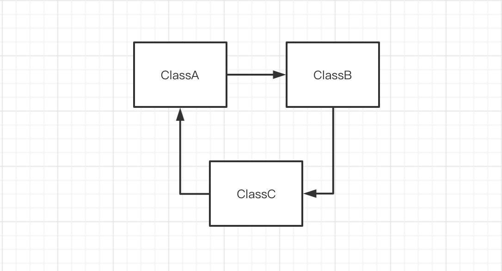
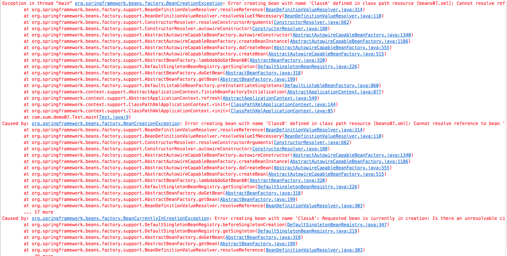
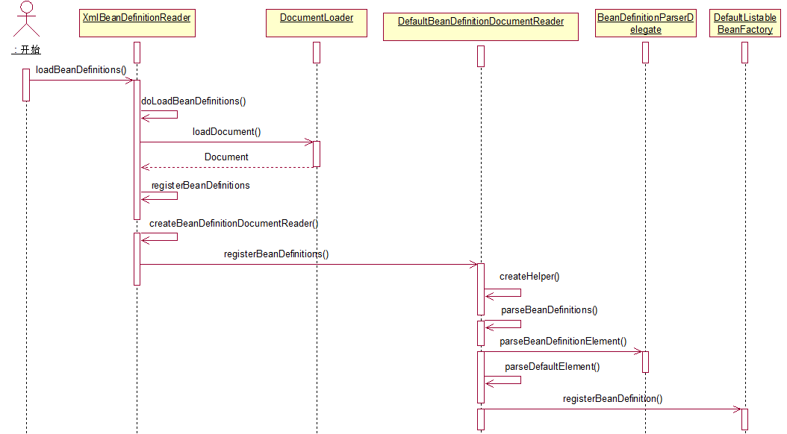

>参考《Spring技术内幕》、《Spring源码深度解析》

>本文涉及到的代码，不要在看文章的时候仅看列出来的这些框架的代码，跟着思路自己去Eclipse 中跟一下代码，这样才有效！

Spring 循环依赖一定是所有稍微深入了解了Spring 之后都会听到的一个知识点，也是大家所谓的面试问题热点

所谓循环依赖是指两个或多个Bean 相互地持有对方，比如A 引用B，B 引用C，C 引用A，最终反映为一个环



Spring 容器循环依赖包括构造器循环依赖和setter 循环依赖。本文重点介绍构造器循环依赖，以及背后的原理

## 构造器循环依赖

即通过构造器注入构成的循环依赖，这种依赖是无法解决的，只能抛出BeanCurrentlyInCreationException 异常表示依赖

比如创建A的时候，构造器需要B，那么去创建B，创建B 的时又发现依赖C，再去创建C，但是创建C 又发现需要A，那么都无法完成创建

Spring 容器将每一个正在创建的Bean 标识符放在一个“当前创建Bean 池”中，Bean 标识符在创建过程中将一直保持在这个池中，因此如果在创建Bean 过程中发现自己已经在“当前创建Bean 池”里时，抛出BeanCurrentlyInCreationException；而对于创建完毕的Bean 将从“当前创建Bean 池”里清除掉

首先尝试去复现问题

```java
package com.xum.demo07;

public class ClassA {
    private ClassB b;
    
    public void a() {
        b.b();
    }
    
    public ClassB getClassB() {
        return b;
    }
    
    public void setClassB(ClassB b) {
        this.b = b;
    }
}
```

```java
package com.xum.demo07;


public class ClassB {
    private ClassA a;
    
    public void b() {
        a.a();
    }
    
    public ClassA getClassA() {
        return a;
    }
    
    public void setClassA(ClassA a) {
        this.a = a;
    }
}
```

```java
package com.xum.demo07;

import org.springframework.context.support.ClassPathXmlApplicationContext;

public class Test {

    @SuppressWarnings("resource")
    public static void main(String[] args) {
        new ClassPathXmlApplicationContext("beans07.xml");
    }
    
}
```

配置文件

```xml
<?xml version="1.0" encoding="UTF-8"?>
<beans xmlns="http://www.springframework.org/schema/beans"
       xmlns:xsi="http://www.w3.org/2001/XMLSchema-instance"
       xmlns:context="http://www.springframework.org/schema/context"
       xmlns:mvc="http://www.springframework.org/schema/mvc"
       xsi:schemaLocation="http://www.springframework.org/schema/beans
       http://www.springframework.org/schema/beans/spring-beans-4.2.xsd
    http://www.springframework.org/schema/mvc
    http://www.springframework.org/schema/mvc/spring-mvc-4.2.xsd
    http://www.springframework.org/schema/context
    http://www.springframework.org/schema/context/spring-context-4.2.xsd">
        
    <bean id="ClassA" class="com.xum.demo07.ClassA">
        <constructor-arg index="0" ref="ClassB"/>
    </bean>
    
    <bean id="ClassB" class="com.xum.demo07.ClassB">
        <constructor-arg index="0" ref="ClassA"/>
    </bean>
</beans>
```

运行之后，果然出现报错！



其中BeanCurrentlyInCreationException 异常的信息如下

```
Caused by: org.springframework.beans.factory.BeanCurrentlyInCreationException: Error creating bean with name 'ClassA': Requested bean is currently in creation: Is there an unresolvable circular reference?
    at org.springframework.beans.factory.support.DefaultSingletonBeanRegistry.beforeSingletonCreation(DefaultSingletonBeanRegistry.java:347)
    at org.springframework.beans.factory.support.DefaultSingletonBeanRegistry.getSingleton(DefaultSingletonBeanRegistry.java:219)
    at org.springframework.beans.factory.support.AbstractBeanFactory.doGetBean(AbstractBeanFactory.java:318)
    at org.springframework.beans.factory.support.AbstractBeanFactory.getBean(AbstractBeanFactory.java:199)
    at org.springframework.beans.factory.support.BeanDefinitionValueResolver.resolveReference(BeanDefinitionValueResolver.java:303)
    ... 29 more
```

再将其中报错时候的调用栈贴在下面

```
Exception in thread "main" org.springframework.beans.factory.BeanCreationException: Error creating bean with name 'ClassA' defined in class path resource [beans07.xml]: Cannot resolve reference to bean 'ClassB' while setting constructor argument; nested exception is org.springframework.beans.factory.BeanCreationException: Error creating bean with name 'ClassB' defined in class path resource [beans07.xml]: Cannot resolve reference to bean 'ClassA' while setting constructor argument; nested exception is org.springframework.beans.factory.BeanCurrentlyInCreationException: Error creating bean with name 'ClassA': Requested bean is currently in creation: Is there an unresolvable circular reference?
    at org.springframework.beans.factory.support.BeanDefinitionValueResolver.resolveReference(BeanDefinitionValueResolver.java:314)
    at org.springframework.beans.factory.support.BeanDefinitionValueResolver.resolveValueIfNecessary(BeanDefinitionValueResolver.java:110)
    at org.springframework.beans.factory.support.ConstructorResolver.resolveConstructorArguments(ConstructorResolver.java:662)
    at org.springframework.beans.factory.support.ConstructorResolver.autowireConstructor(ConstructorResolver.java:188)
    at org.springframework.beans.factory.support.AbstractAutowireCapableBeanFactory.autowireConstructor(AbstractAutowireCapableBeanFactory.java:1340)
    at org.springframework.beans.factory.support.AbstractAutowireCapableBeanFactory.createBeanInstance(AbstractAutowireCapableBeanFactory.java:1186)
    at org.springframework.beans.factory.support.AbstractAutowireCapableBeanFactory.doCreateBean(AbstractAutowireCapableBeanFactory.java:555)
    at org.springframework.beans.factory.support.AbstractAutowireCapableBeanFactory.createBean(AbstractAutowireCapableBeanFactory.java:515)
    at org.springframework.beans.factory.support.AbstractBeanFactory.lambda$doGetBean$0(AbstractBeanFactory.java:320)
    at org.springframework.beans.factory.support.DefaultSingletonBeanRegistry.getSingleton(DefaultSingletonBeanRegistry.java:226)
    at org.springframework.beans.factory.support.AbstractBeanFactory.doGetBean(AbstractBeanFactory.java:318)
    at org.springframework.beans.factory.support.AbstractBeanFactory.getBean(AbstractBeanFactory.java:199)
    at org.springframework.beans.factory.support.DefaultListableBeanFactory.preInstantiateSingletons(DefaultListableBeanFactory.java:860)
    at org.springframework.context.support.AbstractApplicationContext.finishBeanFactoryInitialization(AbstractApplicationContext.java:877)
    at org.springframework.context.support.AbstractApplicationContext.refresh(AbstractApplicationContext.java:549)
    at org.springframework.context.support.ClassPathXmlApplicationContext.<init>(ClassPathXmlApplicationContext.java:144)
    at org.springframework.context.support.ClassPathXmlApplicationContext.<init>(ClassPathXmlApplicationContext.java:85)
    at com.xum.demo07.Test.main(Test.java:9
```

其中的refresh() -> ... -> getBean() 是初始化单例Bean 的核心方法，后面都会讲到！

接下来逐步分析这个问题，以这个问题为切入点研究Spring Bean 解析XML、加载Bean 的原理！

## constructor-arg配置项

比如这样一个带有onstructor-arg配置项的bean

```xml
<bean id="student" class="com.rc.sp.Student">
    <constructor-arg name="id" value="1"/>
    <constructor-arg name="name" value="student"/>
    <constructor-arg name="dream">
        <list>
            <value>soldier</value>
            <value>scientist</value>
            <value>pilot</value>
        </list>
    </constructor-arg>
    <constructor-arg name="score">
        <map>
            <entry key="math" value="90"/>
            <entry key="english" value="85"/>
        </map>
    </constructor-arg>
    <constructor-arg name="graduation" value="false"/>
</bean>
```

这个配置的功能就是对ClassA 自动寻找对应的构造函数，并在初始化时将设置的参数传入

针对上面的这个测试案例，org.springframework.context.support.ClassPathXmlApplicationContext 类找到其对配置文件的处理入口

```java
    public ClassPathXmlApplicationContext(
            String[] configLocations, boolean refresh, @Nullable ApplicationContext parent)
            throws BeansException {

        super(parent);
        setConfigLocations(configLocations);
        if (refresh) {
            refresh();
        }
    }
```

简单列一下ClassPathXmlApplicationContext 的继承树，以及找一下具体是在哪个地方解析配置文件的

* ClassPathXmlApplicationContext，该类的构造方法中设置了配置文件路径
    * 对应的函数setConfigLocations(configLocations)
    * 猜测对应有getConfigLocations() 的方法，对应调用该方法获取配置文件用于解析
* ClassPathXmlApplicationContext 继承自AbstractXmlApplicationContext
    * 在这个类中搜索getConfigLocations() 的调用，找到了对应的方法
    * loadBeanDefinitions(XmlBeanDefinitionReader reader)
    * 又被其他方法调用 protected void loadBeanDefinitions(DefaultListableBeanFactory beanFactory)
    * 下一个loadBeanDefinitions() 被@Override
    * 猜测这个是模板设计模式，某个父类中提供接口供子类具体实现，父类调用该方法实现解析，又不要关注解析细节
* AbstractXmlApplicationContext 的父类是AbstractRefreshableConfigApplicationContext
    * 这个类中没有loadBeanDefinitions() 的定义
    * 但是发现了是在这个方法中实现setConfigLocations()、getConfigLocations()
* AbstractRefreshableConfigApplicationContext 的父类是AbstractRefreshableApplicationContext
    * 这个类中搜索到对于loadBeanDefinitions() 的调用
    * 具体在 protected final void refreshBeanFactory()
    * refreshBeanFactory() 也被@Override 的
    * 而且看到refreshBeanFactory() 就想到了著名的refresh() 方法，继续找
* AbstractRefreshableApplicationContext 的父类是AbstractApplicationContext
    * 在这里找到了refreshBeanFactory() 的定义
    * 这个方法被obtainFreshBeanFactory() 调用
    * obtainFreshBeanFactory() 又被refresh() 调用
    * 果然是在Spring 容器初始化过程中执行的解析方法

```java
@Override
public void refresh() throws BeansException, IllegalStateException {
    synchronized (this.startupShutdownMonitor) {
        // Prepare this context for refreshing.
        prepareRefresh();

        // Tell the subclass to refresh the internal bean factory.
        ConfigurableListableBeanFactory beanFactory = obtainFreshBeanFactory();

        // Prepare the bean factory for use in this context.
        prepareBeanFactory(beanFactory);

        try {
            // Allows post-processing of the bean factory in context subclasses.
            postProcessBeanFactory(beanFactory);

            ...
```

所以容器启动时解析XML 文件的调用栈是这样的

refresh() -> obtainFreshBeanFactory() -> refreshBeanFactory() -> loadBeanDefinitions()

接下来看一下loadBeanDefinitions() 的实现

## 解析XML 配置文件

```java
protected void loadBeanDefinitions(XmlBeanDefinitionReader reader) throws BeansException, IOException {
    Resource[] configResources = getConfigResources();
    if (configResources != null) {
        reader.loadBeanDefinitions(configResources);
    }
    String[] configLocations = getConfigLocations();
    if (configLocations != null) {
        reader.loadBeanDefinitions(configLocations);
    }
}
```

所以具体是在XmlBeanDefinitionReader 类中实现XML 配置文件的解析的

loadBeanDefinitions() 调用doLoadBeanDefinitions()，然后调用registerBeanDefinitions() 完成XML 配置文件的解析，看方法名，基本就是这个方法解析得到BeanDefinition 的

```java
public int registerBeanDefinitions(Document doc, Resource resource) throws BeanDefinitionStoreException {
    BeanDefinitionDocumentReader documentReader = createBeanDefinitionDocumentReader();
    int countBefore = getRegistry().getBeanDefinitionCount();
    documentReader.registerBeanDefinitions(doc, createReaderContext(resource));
    return getRegistry().getBeanDefinitionCount() - countBefore;
}
```

所以可以看到是BeanDefinitionDocumentReader 完成将XML 配置文件解析为BeanDefinition 的处理的，具体是其子类DefaultBeanDefinitionDocumentReader 做的

>可以看到Spring 框架有着“复杂”的继承体系，理解这些类的继承体系，对于理解Spring 原理、设计模式都是极其有益的！

DefaultBeanDefinitionDocumentReader 中具体解析的方法如下

```java
protected void doRegisterBeanDefinitions(Element root) {
    // Any nested <beans> elements will cause recursion in this method. In
    // order to propagate and preserve <beans> default-* attributes correctly,
    // keep track of the current (parent) delegate, which may be null. Create
    // the new (child) delegate with a reference to the parent for fallback purposes,
    // then ultimately reset this.delegate back to its original (parent) reference.
    // this behavior emulates a stack of delegates without actually necessitating one.
    BeanDefinitionParserDelegate parent = this.delegate;
    this.delegate = createDelegate(getReaderContext(), root, parent);

    if (this.delegate.isDefaultNamespace(root)) {
        String profileSpec = root.getAttribute(PROFILE_ATTRIBUTE);
        if (StringUtils.hasText(profileSpec)) {
            String[] specifiedProfiles = StringUtils.tokenizeToStringArray(
                    profileSpec, BeanDefinitionParserDelegate.MULTI_VALUE_ATTRIBUTE_DELIMITERS);
            // We cannot use Profiles.of(...) since profile expressions are not supported
            // in XML config. See SPR-12458 for details.
            if (!getReaderContext().getEnvironment().acceptsProfiles(specifiedProfiles)) {
                if (logger.isDebugEnabled()) {
                    logger.debug("Skipped XML bean definition file due to specified profiles [" + profileSpec +
                            "] not matching: " + getReaderContext().getResource());
                }
                return;
            }
        }
    }

    preProcessXml(root);
    parseBeanDefinitions(root, this.delegate);
    postProcessXml(root);

    this.delegate = parent;
}
```

可以看到具体的解析工作又是委托（Delegate）给BeanDefinitionParserDelegate 做的，在BeanDefinitionParserDelegate 的代码中找到解析constructor-arg 的方法

```java
@Nullable
public AbstractBeanDefinition parseBeanDefinitionElement(
        Element ele, String beanName, @Nullable BeanDefinition containingBean) {

    this.parseState.push(new BeanEntry(beanName));

    String className = null;
    if (ele.hasAttribute(CLASS_ATTRIBUTE)) {
        className = ele.getAttribute(CLASS_ATTRIBUTE).trim();
    }
    String parent = null;
    if (ele.hasAttribute(PARENT_ATTRIBUTE)) {
        parent = ele.getAttribute(PARENT_ATTRIBUTE);
    }

    try {
        AbstractBeanDefinition bd = createBeanDefinition(className, parent);

        parseBeanDefinitionAttributes(ele, beanName, containingBean, bd);
        bd.setDescription(DomUtils.getChildElementValueByTagName(ele, DESCRIPTION_ELEMENT));

        parseMetaElements(ele, bd);
        parseLookupOverrideSubElements(ele, bd.getMethodOverrides());
        parseReplacedMethodSubElements(ele, bd.getMethodOverrides());

        parseConstructorArgElements(ele, bd);
        parsePropertyElements(ele, bd);
        parseQualifierElements(ele, bd);

        bd.setResource(this.readerContext.getResource());
        bd.setSource(extractSource(ele));

        return bd;
    }
    catch (ClassNotFoundException ex) {
        error("Bean class [" + className + "] not found", ele, ex);
    }
    catch (NoClassDefFoundError err) {
        error("Class that bean class [" + className + "] depends on not found", ele, err);
    }
    catch (Throwable ex) {
        error("Unexpected failure during bean definition parsing", ele, ex);
    }
    finally {
        this.parseState.pop();
    }

    return null;
}


/**
 * Parse constructor-arg sub-elements of the given bean element.
 */
public void parseConstructorArgElements(Element beanEle, BeanDefinition bd) {
    NodeList nl = beanEle.getChildNodes();
    for (int i = 0; i < nl.getLength(); i++) {
        Node node = nl.item(i);
        if (isCandidateElement(node) && nodeNameEquals(node, CONSTRUCTOR_ARG_ELEMENT)) {
            parseConstructorArgElement((Element) node, bd);
        }
    }
}


/**
 * Parse a constructor-arg element.
 */
public void parseConstructorArgElement(Element ele, BeanDefinition bd) {
    String indexAttr = ele.getAttribute(INDEX_ATTRIBUTE);
    String typeAttr = ele.getAttribute(TYPE_ATTRIBUTE);
    String nameAttr = ele.getAttribute(NAME_ATTRIBUTE);
    if (StringUtils.hasLength(indexAttr)) {
        try {
            int index = Integer.parseInt(indexAttr);
            if (index < 0) {
                error("'index' cannot be lower than 0", ele);
            }
            else {
                try {
                    this.parseState.push(new ConstructorArgumentEntry(index));
                    Object value = parsePropertyValue(ele, bd, null);
                    ConstructorArgumentValues.ValueHolder valueHolder = new ConstructorArgumentValues.ValueHolder(value);
                    if (StringUtils.hasLength(typeAttr)) {
                        valueHolder.setType(typeAttr);
                    }
                    if (StringUtils.hasLength(nameAttr)) {
                        valueHolder.setName(nameAttr);
                    }
                    valueHolder.setSource(extractSource(ele));
                    if (bd.getConstructorArgumentValues().hasIndexedArgumentValue(index)) {
                        error("Ambiguous constructor-arg entries for index " + index, ele);
                    }
                    else {
                        bd.getConstructorArgumentValues().addIndexedArgumentValue(index, valueHolder);
                    }
                }
                finally {
                    this.parseState.pop();
                }
            }
        }
        catch (NumberFormatException ex) {
            error("Attribute 'index' of tag 'constructor-arg' must be an integer", ele);
        }
    }
    else {
        try {
            this.parseState.push(new ConstructorArgumentEntry());
            Object value = parsePropertyValue(ele, bd, null);
            ConstructorArgumentValues.ValueHolder valueHolder = new ConstructorArgumentValues.ValueHolder(value);
            if (StringUtils.hasLength(typeAttr)) {
                valueHolder.setType(typeAttr);
            }
            if (StringUtils.hasLength(nameAttr)) {
                valueHolder.setName(nameAttr);
            }
            valueHolder.setSource(extractSource(ele));
            bd.getConstructorArgumentValues().addGenericArgumentValue(valueHolder);
        }
        finally {
            this.parseState.pop();
        }
    }
}
```

在解析了这个参数的过程中，将对应的属性刚好填充到对应的BeanDefinition 中了！

以上的流程，对应的时序图如下（参考[spring解析xml生成beandefinition的进程](http://www.myexception.cn/xml-soap/1470294.html)）



Spring初始化的过程中，首先解析XML配置文件，将一个个`<bean>` 转换为BeanDefinition

Spring 通过BeanDefinition 将配置文件中的`<bean>` 配置内容转换为容器的内部表示，并将这些BeanDefinition 注册到BeanDefinitionRegistry 中

Spring 容器的BeanDefinitionRegistry 就像是Spring 配置信息的内存数据库，主要以map 的形式存储。后续操作直接从BeanDefinitionRegistry 中读取配置信息

在DefaultListableBeanFactory 中，是通过一个HashMap 来持有载入的BeanDefinition 的！

```java
/** Map of bean definition objects, keyed by bean name */
private final Map<String, BeanDefinition> beanDefinitionMap 
    = new ConcurrentHashMap<String, BeanDefinition>(64);


@Override
public void registerBeanDefinition(String beanName, BeanDefinition beanDefinition)
        throws BeanDefinitionStoreException {

    Assert.hasText(beanName, "Bean name must not be empty");
    Assert.notNull(beanDefinition, "BeanDefinition must not be null");

    if (beanDefinition instanceof AbstractBeanDefinition) {
        try {
            ((AbstractBeanDefinition) beanDefinition).validate();
        }
        catch (BeanDefinitionValidationException ex) {
            throw new BeanDefinitionStoreException(beanDefinition.getResourceDescription(), beanName,
                    "Validation of bean definition failed", ex);
        }
    }

    synchronized (this.beanDefinitionMap) {
        BeanDefinition oldBeanDefinition = this.beanDefinitionMap.get(beanName);
        if (oldBeanDefinition != null) {
            if (!this.allowBeanDefinitionOverriding) {
                throw new BeanDefinitionStoreException(beanDefinition.getResourceDescription(), beanName,
                        "Cannot register bean definition [" + beanDefinition + "] for bean '" + beanName +
                        "': There is already [" + oldBeanDefinition + "] bound.");
            }
            else if (oldBeanDefinition.getRole() < beanDefinition.getRole()) {
                // e.g. was ROLE_APPLICATION, now overriding with ROLE_SUPPORT or ROLE_INFRASTRUCTURE
                if (this.logger.isWarnEnabled()) {
                    this.logger.warn("Overriding user-defined bean definition for bean '" + beanName +
                            " with a framework-generated bean definition ': replacing [" +
                            oldBeanDefinition + "] with [" + beanDefinition + "]");
                }
            }
            else {
                if (this.logger.isInfoEnabled()) {
                    this.logger.info("Overriding bean definition for bean '" + beanName +
                            "': replacing [" + oldBeanDefinition + "] with [" + beanDefinition + "]");
                }
            }
        }
        else {
            this.beanDefinitionNames.add(beanName);
            this.frozenBeanDefinitionNames = null;
        }
        this.beanDefinitionMap.put(beanName, beanDefinition);
    }

    resetBeanDefinition(beanName);
}
```

本文主要讲解初始化的过程，但上面的代码中的方法parseBeanDefinitionElement() 其实完整地记录了一个bean 节点是如何解析为BeanDefinition 的！这个是理解Spring IoC 容器的关键所在，后续有机会会专题分析！

关于Bean 初始化的部分在接下来的文章中再继续！
