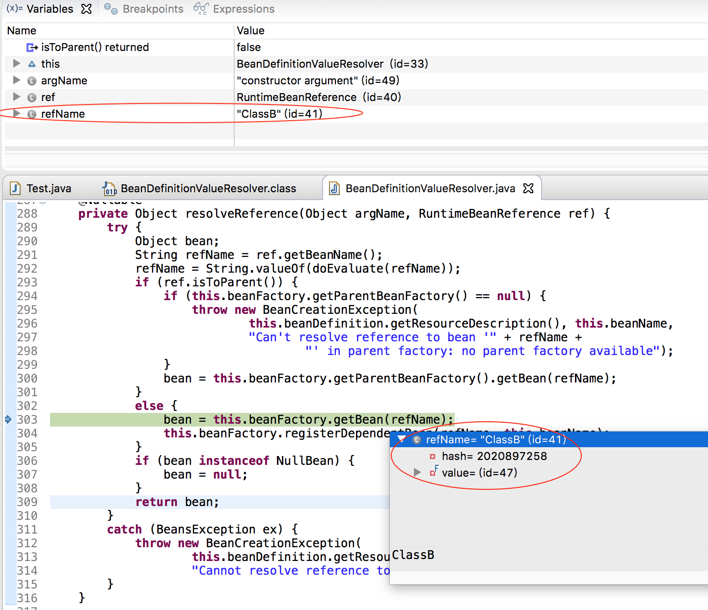
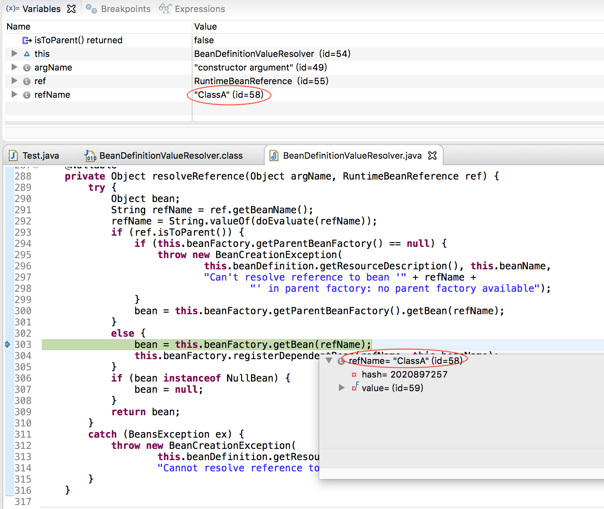

>参考《Spring技术内幕》、《Spring源码深度解析》

>本文涉及到的代码，不要在看文章的时候仅看列出来的这些框架的代码，跟着思路自己去Eclipse 中跟一下代码，这样才有效！

在[上一篇](http://www.xumenger.com/spring-bean-circle-20201026/)中讲到了Spring 容器启动过程中加载配置文件，解析得到BeanDefinition 的过程

>Spring初始化的过程中，首先解析XML配置文件，将一个个`<bean>` 转换为BeanDefinition

>Spring 通过BeanDefinition 将配置文件中的`<bean>` 配置内容转换为容器的内部表示，并将这些BeanDefinition 注册到BeanDefinitionRegistry 中

>Spring 容器的BeanDefinitionRegistry 就像是Spring 配置信息的内存数据库，主要以map 的形式存储。后续操作直接从BeanDefinitionRegistry 中读取配置信息

>但还没有讲到Bean 的加载（初始化）过程，所以还是解释不了Spring 是如何处理循环依赖的

在上一篇中的案例中，复现了构造器循环依赖的报错情况，当时报错时对应的调用栈是这样的

```
Exception in thread "main" org.springframework.beans.factory.BeanCreationException: Error creating bean with name 'ClassA' defined in class path resource [beans07.xml]: Cannot resolve reference to bean 'ClassB' while setting constructor argument; nested exception is org.springframework.beans.factory.BeanCreationException: Error creating bean with name 'ClassB' defined in class path resource [beans07.xml]: Cannot resolve reference to bean 'ClassA' while setting constructor argument; nested exception is org.springframework.beans.factory.BeanCurrentlyInCreationException: Error creating bean with name 'ClassA': Requested bean is currently in creation: Is there an unresolvable circular reference?
    at org.springframework.beans.factory.support.BeanDefinitionValueResolver.resolveReference(BeanDefinitionValueResolver.java:314)
    at org.springframework.beans.factory.support.BeanDefinitionValueResolver.resolveValueIfNecessary(BeanDefinitionValueResolver.java:110)
    at org.springframework.beans.factory.support.ConstructorResolver.resolveConstructorArguments(ConstructorResolver.java:662)
    at org.springframework.beans.factory.support.ConstructorResolver.autowireConstructor(ConstructorResolver.java:188)
    at org.springframework.beans.factory.support.AbstractAutowireCapableBeanFactory.autowireConstructor(AbstractAutowireCapableBeanFactory.java:1340)
    at org.springframework.beans.factory.support.AbstractAutowireCapableBeanFactory.createBeanInstance(AbstractAutowireCapableBeanFactory.java:1186)
    at org.springframework.beans.factory.support.AbstractAutowireCapableBeanFactory.doCreateBean(AbstractAutowireCapableBeanFactory.java:555)
    at org.springframework.beans.factory.support.AbstractAutowireCapableBeanFactory.createBean(AbstractAutowireCapableBeanFactory.java:515)
    at org.springframework.beans.factory.support.AbstractBeanFactory.lambda$doGetBean$0(AbstractBeanFactory.java:320)
    at org.springframework.beans.factory.support.DefaultSingletonBeanRegistry.getSingleton(DefaultSingletonBeanRegistry.java:226)
    at org.springframework.beans.factory.support.AbstractBeanFactory.doGetBean(AbstractBeanFactory.java:318)
    at org.springframework.beans.factory.support.AbstractBeanFactory.getBean(AbstractBeanFactory.java:199)
    at org.springframework.beans.factory.support.DefaultListableBeanFactory.preInstantiateSingletons(DefaultListableBeanFactory.java:860)
    at org.springframework.context.support.AbstractApplicationContext.finishBeanFactoryInitialization(AbstractApplicationContext.java:877)
    at org.springframework.context.support.AbstractApplicationContext.refresh(AbstractApplicationContext.java:549)
    at org.springframework.context.support.ClassPathXmlApplicationContext.<init>(ClassPathXmlApplicationContext.java:144)
    at org.springframework.context.support.ClassPathXmlApplicationContext.<init>(ClassPathXmlApplicationContext.java:85)
    at com.xum.demo07.Test.main(Test.java:9
```

现在再看这个调用栈可以大概分析出就是在加载Bean 时处理构造参数（resolveConstructorArguments()）导致的报错，这篇文章针对这个点就进一步进行研究

## IoC 容器的依赖注入

上面一章讲到了解析`<bean>` 得到BeanDefinition 并注册到容器的过程，但这个时候并没有生成实际的Bean，也没有对Bean 依赖关系进行注入

依赖注入的过程是首次调用getBean() 的时候触发的，当然在ApplicationContext(AbstractApplicationContext) 的refresh() 方法中，有调用finishBeanFactoryInitialization(beanFactory) 方法，这个方法就是在初始化的过程中对于non-lazy-init 的Bean 通过调用getBean() 方法实现容器初始化阶段的依赖注入

```java
protected void finishBeanFactoryInitialization(ConfigurableListableBeanFactory beanFactory) {
    // Initialize conversion service for this context.
    if (beanFactory.containsBean(CONVERSION_SERVICE_BEAN_NAME) &&
            beanFactory.isTypeMatch(CONVERSION_SERVICE_BEAN_NAME, ConversionService.class)) {
        beanFactory.setConversionService(
                beanFactory.getBean(CONVERSION_SERVICE_BEAN_NAME, ConversionService.class));
    }

    // Initialize LoadTimeWeaverAware beans early to allow for registering their transformers early.
    String[] weaverAwareNames = beanFactory.getBeanNamesForType(LoadTimeWeaverAware.class, false, false);
    for (String weaverAwareName : weaverAwareNames) {
        getBean(weaverAwareName);
    }

    // Stop using the temporary ClassLoader for type matching.
    beanFactory.setTempClassLoader(null);

    // Allow for caching all bean definition metadata, not expecting further changes.
    beanFactory.freezeConfiguration();

    // Instantiate all remaining (non-lazy-init) singletons.
    beanFactory.preInstantiateSingletons();
}
```

具体在DefaultListableBeanFactory 的preInstantiateSingletons() 方法中

```java
@Override
public void preInstantiateSingletons() throws BeansException {
    if (this.logger.isDebugEnabled()) {
        this.logger.debug("Pre-instantiating singletons in " + this);
    }
    List<String> beanNames;
    synchronized (this.beanDefinitionMap) {
        // Iterate over a copy to allow for init methods which in turn register new bean definitions.
        // While this may not be part of the regular factory bootstrap, it does otherwise work fine.
        beanNames = new ArrayList<String>(this.beanDefinitionNames);
    }
    for (String beanName : beanNames) {
        RootBeanDefinition bd = getMergedLocalBeanDefinition(beanName);
        if (!bd.isAbstract() && bd.isSingleton() && !bd.isLazyInit()) {
            if (isFactoryBean(beanName)) {
                final FactoryBean<?> factory = (FactoryBean<?>) getBean(FACTORY_BEAN_PREFIX + beanName);
                boolean isEagerInit;
                if (System.getSecurityManager() != null && factory instanceof SmartFactoryBean) {
                    isEagerInit = AccessController.doPrivileged(new PrivilegedAction<Boolean>() {
                        @Override
                        public Boolean run() {
                            return ((SmartFactoryBean<?>) factory).isEagerInit();
                        }
                    }, getAccessControlContext());
                }
                else {
                    isEagerInit = (factory instanceof SmartFactoryBean &&
                            ((SmartFactoryBean<?>) factory).isEagerInit());
                }
                if (isEagerInit) {
                    getBean(beanName);
                }
            }
            else {
                getBean(beanName);
            }
        }
    }
}
```

getBean() 是依赖注入的起点，之后会调用createBean()，在这个过程中，Bean 对象会依据BeanDefinition 定义的要求生成。AbstractAutowireCapableBeanFactory 中实现了这个createBean()，createBean() 不但生成了需要的Bean，还对Bean 初始化进行了处理，比如实现了在BeanDefinition 中的init-method 属性定义、Bean 后置处理器等

在IoC 容器的初始化过程中，主要的工作是对BeanDefinition 的定位、载入、解析和注册。此时依赖注入并没有发生，依赖注入发生在应用第一次向容器索要Bean 时。向容器索要Bean 时通过getBean() 的调用来完成的，该getBean() 是容器提供Bean 服务的最基本的接口！

## 构造器循环依赖

继续基于上文中的例子，它们没有设置lazy-init 属性，所以都默认是non-lazy-init，对应的在ApplicationContext 的refresh() 调用到finishBeanFactoryInitialization() 的时候，会针对其进行初始化等工作，根据BeanDefinition 得到具体的Bean

基于上面的调用栈，直接到抛出异常的事发现场看一下，也就是`at org.springframework.beans.factory.support.BeanDefinitionValueResolver.resolveReference(BeanDefinitionValueResolver.java:314)`

```java
/**
 * Resolve a reference to another bean in the factory.
 */
@Nullable
private Object resolveReference(Object argName, RuntimeBeanReference ref) {
    try {
        Object bean;
        String refName = ref.getBeanName();
        refName = String.valueOf(doEvaluate(refName));
        if (ref.isToParent()) {
            if (this.beanFactory.getParentBeanFactory() == null) {
                throw new BeanCreationException(
                        this.beanDefinition.getResourceDescription(), this.beanName,
                        "Can't resolve reference to bean '" + refName +
                                "' in parent factory: no parent factory available");
            }
            bean = this.beanFactory.getParentBeanFactory().getBean(refName);
        }
        else {
            bean = this.beanFactory.getBean(refName);
            this.beanFactory.registerDependentBean(refName, this.beanName);
        }
        if (bean instanceof NullBean) {
            bean = null;
        }
        return bean;
    }
    catch (BeansException ex) {
        // 对应就是抛出这个异常
        throw new BeanCreationException(
                this.beanDefinition.getResourceDescription(), this.beanName,
                "Cannot resolve reference to bean '" + ref.getBeanName() + "' while setting " + argName, ex);
    }
}
```

结合调试去分析一下，在resolveReference() 方法中加断点，第一次命中断点的时候，是这样的



这里面可以看到，这个是在创建ClassA 的过程中，处理其constructor-arg 配置的时候，发现其依赖ClassB，所以通过调用getBean() 的方式获取ClassB 对应的Bean

继续运行，也就是在getBean(ClassB) 的时候第二次命中这个断点



这里面可以看到，这个是在创建ClassB 的过程中，处理其constructor-arg 配置的时候，发现其依赖ClassA，所以通过调用getBean() 的方式获取ClassA 对应的Bean

调试的时候发现在这次getBean() 的时候出现异常，并且发现上面列出的异常并不是第一个异常，第一个异常是这个

```
Caused by: org.springframework.beans.factory.BeanCurrentlyInCreationException: Error creating bean with name 'ClassA': Requested bean is currently in creation: Is there an unresolvable circular reference?
    at org.springframework.beans.factory.support.DefaultSingletonBeanRegistry.beforeSingletonCreation(DefaultSingletonBeanRegistry.java:347)
    at org.springframework.beans.factory.support.DefaultSingletonBeanRegistry.getSingleton(DefaultSingletonBeanRegistry.java:219)
    at org.springframework.beans.factory.support.AbstractBeanFactory.doGetBean(AbstractBeanFactory.java:318)
    at org.springframework.beans.factory.support.AbstractBeanFactory.getBean(AbstractBeanFactory.java:199)
    at org.springframework.beans.factory.support.BeanDefinitionValueResolver.resolveReference(BeanDefinitionValueResolver.java:303)
    ... 29 more
```

对应的是DefaultSingletonBeanRegistry 类中的beforeSingletonCreation() 方法

```java
protected void beforeSingletonCreation(String beanName) {
    if (!this.inCreationCheckExclusions.contains(beanName) && !this.singletonsCurrentlyInCreation.add(beanName)) {
        throw new BeanCurrentlyInCreationException(beanName);
    }
}
```

慢慢就找到了关键所在！

分别看一下**inCreationCheckExclusions**、**singletonsCurrentlyInCreation** 是什么，其对应在DefaultSingletonBeanRegistry 中的声明如下

```java
/** Names of beans that are currently in creation. */
// 这个Set 记录了所有正在创建中的Bean
private final Set<String> singletonsCurrentlyInCreation =
        Collections.newSetFromMap(new ConcurrentHashMap<>(16));

/** Names of beans currently excluded from in creation checks. */

private final Set<String> inCreationCheckExclusions =
        Collections.newSetFromMap(new ConcurrentHashMap<>(16));
```

## setter 循环依赖

上文也提到了，在Spring 中的循环依赖除了构造器循环依赖，还有setter 循环依赖！

