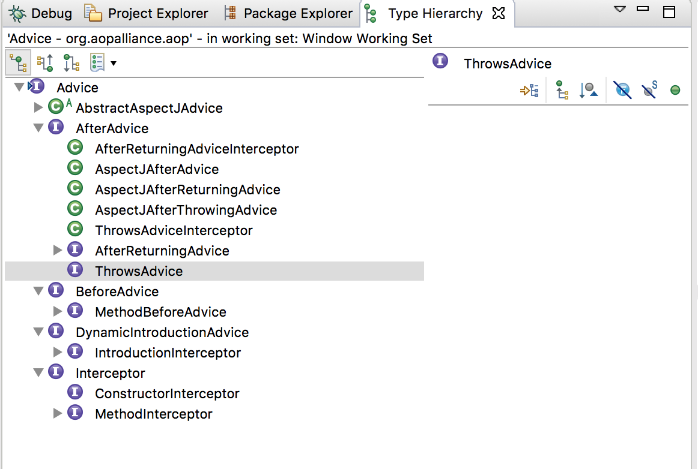
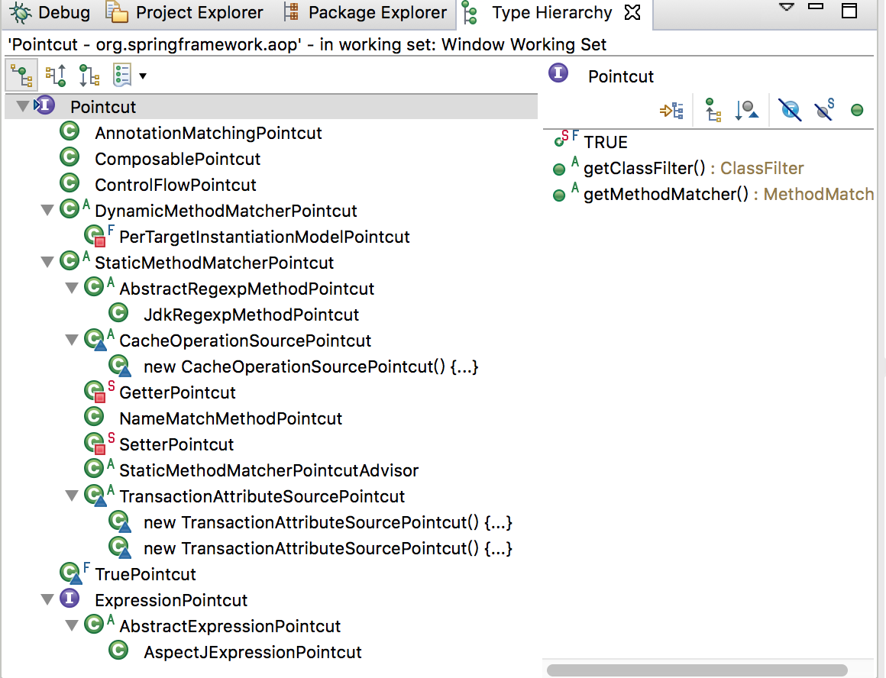

>主要参考《Spring技术内幕》

通过AOP 提出横切的概念之后，在把模块功能正交化的同时，也在此基础上提供了一系列横切的灵活实现。比如通过使用Proxy 代理对象、拦截器字节码翻译技术等一系列已有的AOP 或AOP 实现技术，来实现切面应用的各种编织实现和环绕增强！

在Spring AOP 中，使用的是Java 本身的语言特性，如Java Proxy 代理类、拦截器等技术，来完成AOP 编织的实现

Spring AOP 的实现和其他特性的实现一样，除了可以使用Spring 本身提供的AOP 实现外，还封装了业界优秀的AOP 解决方案AspectJ 来供应用使用

在Spring 自身的AOP 实现中，Spring 充分利用了IoC 容器Proxy 代理对象以及AOP 拦截器的功能特性，通过这些对AOP 基本功能的封装机制，为用户提供了AOP 的实现框架

## Advice 通知

Advice（通知）定义在连接点做什么，为切面增强提供织入接口。在Spring AOP 中，它要描述Spring AOP 围绕方法调用而注入的切面行为，在Spring 中其定义如下

```java
package org.aopalliance.aop;

/**
 * Tag interface for Advice. Implementations can be any type
 * of advice, such as Interceptors.
 *
 * @author Rod Johnson
 * @version $Id: Advice.java,v 1.1 2004/03/19 17:02:16 johnsonr Exp $
 */
public interface Advice {

}
```

具体有AfterAdvice、BeforeAdvice 等类型，其继承关系如下



比如MethodBeforeAdvice，定义了为待增强的目标方法设置的前置增强接口

```java
package org.springframework.aop;

import java.lang.reflect.Method;

public interface MethodBeforeAdvice extends BeforeAdvice {

	/**
	 * Callback before a given method is invoked.
	 * @param method method being invoked
	 * @param args arguments to the method
	 * @param target target of the method invocation. May be {@code null}.
	 * @throws Throwable if this object wishes to abort the call.
	 * Any exception thrown will be returned to the caller if it's
	 * allowed by the method signature. Otherwise the exception
	 * will be wrapped as a runtime exception.
	 */
	void before(Method method, Object[] args, Object target) throws Throwable;

}
```

before() 作为一个回调函数，其实现在Advice 中被配置到目标方法后，会在调用目标方法时被回调

## Pointcut 切点

Pointcut（切点）决定Advice 通知应该作用于哪些连接点，也就是说通过Pointcut 来定义增强的方法的集合，这些集合的选取可以按照一定的规则来完成。在这种情况下，Pointcut 通常意味着标识方法，例如，需要增强的地方可以由某个正则表达式进行标识、根据某个方法名进行匹配

```java
package org.springframework.aop;


public interface Pointcut {

	/**
	 * Return the ClassFilter for this pointcut.
	 * @return the ClassFilter (never {@code null})
	 */
	ClassFilter getClassFilter();

	/**
	 * Return the MethodMatcher for this pointcut.
	 * @return the MethodMatcher (never {@code null})
	 */
	// 对于Pointcut 的匹配功能由其返回的MethodMatcher 决定
	// 即由这个MethodMatcher 判断是否需要对当前调用方法进行增强
	// 或者说是否需要对当前调用方法应用配置好的Advice 通知
	MethodMatcher getMethodMatcher();


	/**
	 * Canonical Pointcut instance that always matches.
	 */
	Pointcut TRUE = TruePointcut.INSTANCE;

}
```

其继承关系如下



比如JdkRegexpMethodPointcut 是正则表达式切点

```java
package org.springframework.aop.support;

import java.util.regex.Matcher;
import java.util.regex.Pattern;
import java.util.regex.PatternSyntaxException;

@SuppressWarnings("serial")
public class JdkRegexpMethodPointcut extends AbstractRegexpMethodPointcut {

	/**
	 * Compiled form of the patterns.
	 */
	private Pattern[] compiledPatterns = new Pattern[0];

	/**
	 * Compiled form of the exclusion patterns.
	 */
	private Pattern[] compiledExclusionPatterns = new Pattern[0];


	/**
	 * Initialize {@link Pattern Patterns} from the supplied {@code String[]}.
	 */
	@Override
	protected void initPatternRepresentation(String[] patterns) throws PatternSyntaxException {
		this.compiledPatterns = compilePatterns(patterns);
	}

	/**
	 * Initialize exclusion {@link Pattern Patterns} from the supplied {@code String[]}.
	 */
	@Override
	protected void initExcludedPatternRepresentation(String[] excludedPatterns) throws PatternSyntaxException {
		this.compiledExclusionPatterns = compilePatterns(excludedPatterns);
	}

	/**
	 * Returns {@code true} if the {@link Pattern} at index {@code patternIndex}
	 * matches the supplied candidate {@code String}.
	 */
	@Override
	protected boolean matches(String pattern, int patternIndex) {
		Matcher matcher = this.compiledPatterns[patternIndex].matcher(pattern);
		return matcher.matches();
	}

	/**
	 * Returns {@code true} if the exclusion {@link Pattern} at index {@code patternIndex}
	 * matches the supplied candidate {@code String}.
	 */
	@Override
	protected boolean matchesExclusion(String candidate, int patternIndex) {
		Matcher matcher = this.compiledExclusionPatterns[patternIndex].matcher(candidate);
		return matcher.matches();
	}


	/**
	 * Compiles the supplied {@code String[]} into an array of
	 * {@link Pattern} objects and returns that array.
	 */
	private Pattern[] compilePatterns(String[] source) throws PatternSyntaxException {
		Pattern[] destination = new Pattern[source.length];
		for (int i = 0; i < source.length; i++) {
			destination[i] = Pattern.compile(source[i]);
		}
		return destination;
	}

}
```

## Advisor 通知器

