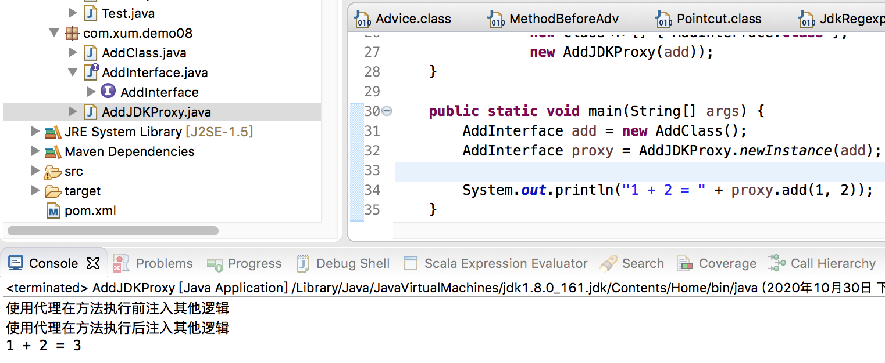
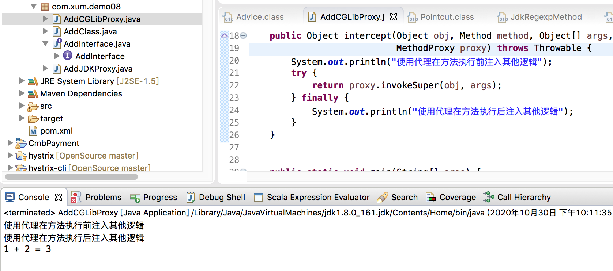

Spring 的AOP 实现中，使用到了动态代理的技术，所以本文针对动态代理进行针对性梳理

如果目标对象是接口类，那么适合使用JDK 来生成代理对象，否则Spring 会使用CGLib 来生成目标对象的代理对象

接下来准备测试使用的接口和类，展示各种动态代理的使用

```java
package com.xum.demo08;

public interface AddInterface {
    
    public int add(int a, int b);

}
```

```java
package com.xum.demo08;

public class AddClass implements AddInterface {
    
    public int add(int a, int b) {
        return a + b;
    }
}
```

## JDK 动态代理

首先展示JDK 动态代理的使用

```java
package com.xum.demo08;

import java.lang.reflect.InvocationHandler;
import java.lang.reflect.Method;
import java.lang.reflect.Proxy;

public class AddJDKProxy implements InvocationHandler {

    AddInterface add;
    
    private AddJDKProxy(AddInterface add) {
        this.add = add;
    }
    
    public Object invoke(Object proxy, Method method, Object[] args) throws Throwable {
        System.out.println("使用代理在方法执行前注入其他逻辑");
        try {
            return method.invoke(add, args);
        } finally {
            System.out.println("使用代理在方法执行后注入其他逻辑");
        }
    }
    
    public static AddInterface newInstance(AddInterface add) {
        return (AddInterface) Proxy.newProxyInstance(AddJDKProxy.class.getClassLoader(), 
                new Class<?>[] { AddInterface.class },
                new AddJDKProxy(add));
    }
    

    public static void main(String[] args) {
        AddInterface add = new AddClass();
        AddInterface proxy = AddJDKProxy.newInstance(add);
        
        System.out.println("1 + 2 = " + proxy.add(1, 2));
    }
}
```

其运行效果是这样的



## CGLib 实现动态代理

首先展示CGLib 实现动态代理的语法

```java
package com.xum.demo08;

import java.lang.reflect.Method;

import org.springframework.cglib.proxy.Enhancer;
import org.springframework.cglib.proxy.MethodInterceptor;
import org.springframework.cglib.proxy.MethodProxy;

public class AddCGLibProxy implements MethodInterceptor{
    
    public static <T extends AddInterface> AddInterface newInstance(Class<T> targetInstanceClazz) {
        Enhancer enhancer = new Enhancer();
        enhancer.setSuperclass(targetInstanceClazz);
        enhancer.setCallback(new AddCGLibProxy());
        return (AddInterface) enhancer.create();
    }

    public Object intercept(Object obj, Method method, Object[] args, MethodProxy proxy) throws Throwable {
        System.out.println("使用代理在方法执行前注入其他逻辑");
        try {
            return proxy.invokeSuper(obj, args);
        } finally {
            System.out.println("使用代理在方法执行后注入其他逻辑");
        }
    }
    
    
    public static void main(String[] args) {
        AddInterface proxy = AddCGLibProxy.newInstance(AddClass.class);
        
        System.out.println("1 + 2 = " + proxy.add(1, 2));
    }
}
```

其运行效果是这样的，和JDK 动态代理的运行效果一致



