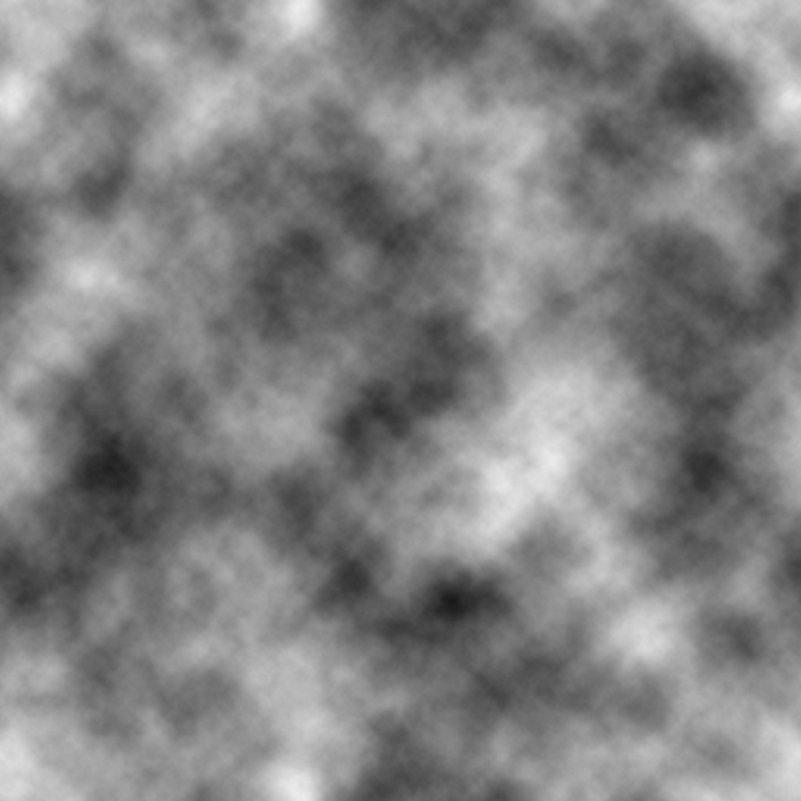
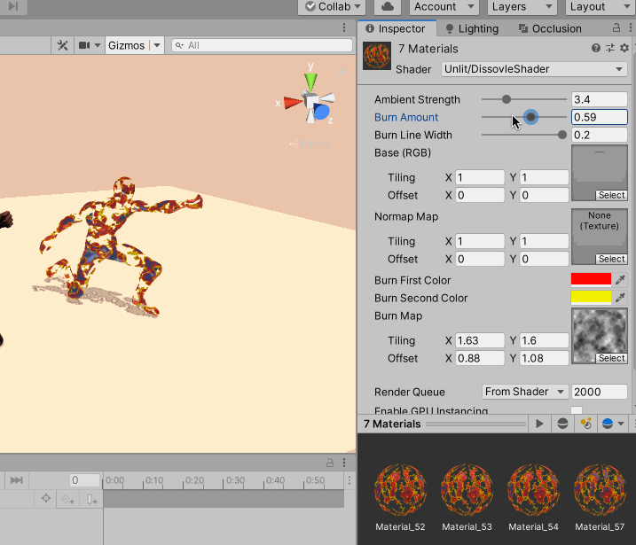

>《Unity Shader 入门精要》

消融效果常见于游戏中的角色死亡、地图烧毁等效果。在这些小锅中，消融往往从不同的区域开始，并向看似随机的方向扩张，最后整个物体消失不见

实现的基本原理是噪声纹理 + 透明度测试。使用对噪声纹理采样的结果和某个控制消融程度的阈值比较，如果小于阈值，就使用clip() 函数把它对应的像素裁剪掉，这些部分就对应了被“烧毁”的区域。而镂空区域边缘的烧焦效果则是将两种颜色混合，再用pow() 函数处理后，与原纹理颜色混合后的结果

使用到的噪声贴图如下



```
Shader "Unlit/DissovleShader"
{
    Properties {
        // 控制环境光照强度
        _AmbientStrength ("Ambient Strength", Range(1.0, 10.0)) = 1.0

        // 控制消融程度，当为0.0 时，为正常效果，当为1.0 时，完全消融
        _BurnAmount ("Burn Amount", Range(0.0, 1.0)) = 0.0

        // 控制模拟烧焦程度的线宽，值越大，火焰边缘的蔓延范围越广
        _LineWidth ("Burn Line Width", Range(0.0, 0.2)) = 0.1

        // 漫反射纹理
        _MainTex ("Base (RGB)", 2D) = "white" {}

        // 法线纹理。可以不设置具体的法线贴图，而是使用默认的值
        _BumpMap ("Normap Map", 2D) = "bump" {}

        // 火焰边缘的两种颜色值
        _BurnFirstColor ("Burn First Color", Color) = (1, 0, 0, 1)
        _BurnSecondColor ("Burn Second Color", Color) = (1, 0, 0, 1)

        // 噪声纹理
        // 使用不同的噪声纹理会得到不同的消融效果
        _BurnMap ("Burn Map", 2D) = "white" {}
    }

    SubShader {
        Tags {"RenderType"="Opaque" "Queue"="Geometry"}

        Pass {
            Tags {"LigthMode" = "ForwardBase"}

            // 关闭了面片剔除，模型的正面和背面都会被渲染，因为消融会导致裸露，模型内部的构造
            Cull Off

            CGPROGRAM

            #include "Lighting.cginc"
            #include "AutoLight.cginc"

            #pragma multi_compile_fwdbase

            #pragma vertex vert
            #pragma fragment frag

            fixed _AmbientStrength;
            fixed _BurnAmount;
            fixed _LineWidth;
            sampler2D _MainTex;
            sampler2D _BumpMap;
            fixed4 _BurnFirstColor;
            fixed4 _BurnSecondColor;
            sampler2D _BurnMap;

            float4 _MainTex_ST;
            float4 _BumpMap_ST;
            float4 _BurnMap_ST;

            struct a2v {
                float4 vertex : POSITION;
                float3 normal : NORMAL;
                float4 tangent : TANGENT;
                float4 texcoord : TEXCOORD0;
            };

            struct v2f {
                float4 pos : SV_POSITION;
                float2 uvMainTex : TEXCOORD0;
                float2 uvBumpMap : TEXCOORD1;
                float2 uvBurnMap : TEXCOORD2;
                float3 lightDir : TEXCOORD3;
                float3 worldPos : TEXCOORD4;
                SHADOW_COORDS(5)
            };

            v2f vert(a2v v) {
                v2f o;
                o.pos = UnityObjectToClipPos(v.vertex);

                // 使用TRANSFORM_TEX() 计算了三张纹理对应的纹理坐标
                o.uvMainTex = TRANSFORM_TEX(v.texcoord, _MainTex);
                o.uvBumpMap = TRANSFORM_TEX(v.texcoord, _BumpMap);
                o.uvBurnMap = TRANSFORM_TEX(v.texcoord, _BurnMap);

                // 把光源方向从模型空间变换为切线空间
                TANGENT_SPACE_ROTATION;
                o.lightDir = mul(rotation, ObjSpaceLightDir(v.vertex)).xyz;

                // 计算了世界空间下的顶点位置
                o.worldPos = mul(unity_ObjectToWorld, v.vertex).xyz;

                // 计算阴影纹理的采样坐标
                TRANSFER_SHADOW(o);

                return o;
            }

            // 使用片元着色器模拟消融效果
            fixed4 frag(v2f i) : SV_Target {
                // 首先对噪声纹理进行采样
                fixed3 burn = tex2D(_BurnMap, i.uvBurnMap);
                // 将采样结果和用于控制消融程度的属性_BurnAmount 相减，传递给clip()
                // 当结果小于0 时，该像素会被剔除，从而不会显示到屏幕上；否则进行正常的光照计算
                clip(burn.r - _BurnAmount);


                float3 tangentLightDir = normalize(i.lightDir);
                fixed3 tangentNormal = UnpackNormal(tex2D(_BumpMap, i.uvBumpMap));

                // 根据漫反射纹理得到材质的反射率albedo
                fixed3 albedo = tex2D(_MainTex, i.uvMainTex);
                // 并由此计算得到环境光照，同时乘以设置的环境光照强度
                fixed3 ambient = UNITY_LIGHTMODEL_AMBIENT.xyz * albedo * _AmbientStrength;
                // 进而得到漫反射光照
                fixed3 diffuse = _LightColor0.rgb * albedo * max(0, dot(tangentNormal, tangentLightDir));

                // 计算烧焦颜色burnColor。想要得在宽度为_LineWidth 的范围内模拟烧焦的颜色变化
                // 第一步使用smoothstep() 函数来计算混合系数 t
                fixed t = 1 - smoothstep(0.0, _LineWidth, burn.r - _BurnAmount);
                // 当t 为1 时，表明该像素位于消融的边界处；当t 为0 时，表明该像素为正常的模型颜色
                // 而中间的插值则表示需要模拟一个烧焦效果
                // 用t 混合两种火焰颜色_BurnFirstColor, _BurnSecondColor
                fixed3 burnColor = lerp(_BurnFirstColor, _BurnSecondColor, t);
                // 为了让效果更接近烧焦的痕迹，还是用pow() 对结果进行处理
                burnColor = pow(burnColor, 5);

                UNITY_LIGHT_ATTENUATION(atten, i, i.worldPos);
                // 然后再用t 来混合正常的光照颜色（环境光+漫反射）和烧焦颜色
                // 又使用了step() 来保证当_BurnAmount 为0 时，不显示任何消融效果
                fixed3 finalColor = lerp(ambient + diffuse * atten, burnColor, t * step(0.0001, _BurnAmount));

                // 最后返回混合后的颜色值
                return fixed4(finalColor, 1);
            }

            ENDCG
        }


        // 定义用于投射阴影的Pass，实现当物体消融时，阴影对应发生变化
        // 阴影投射的重点在于需要按正常Pass 的处理来剔除片元或进行顶点动画，以便阴影可以和物体正常渲染的结果相匹配
        // 使用Unity 内置的V2F_SHADOW_CASTER、TRANSFER_SHADOW_CASTER_NORMALOFFSET、SHADOW_CASTER_FRAGMENT 帮助计算阴影投射时需要的各种变量
        Pass {
            // 用于投射阴影的Pass 的LightMode 必须设置为LightMode
            Tags {"LightMode" = "ShadowCaster"}

            CGPROGRAM

            #pragma vertex vert
            #pragma fragment frag

            // 还需要#pragma multi_compile_shadowcaster 指明它需要的编译指令
            #pragma multi_compile_shadowcaster

            #include "UnityCG.cginc"

            fixed _BurnAmount;
            sampler2D _BurnMap;
            float4 _BurnMap_ST;

            struct v2f {
                // 使用V2F_SHADOW_CASTER 定义阴影投射需要定义的变量
                V2F_SHADOW_CASTER;
                float2 uvBurnMap : TEXCOORD1;
            };

            v2f vert(appdata_base v) {
                v2f o;

                // 填充V2F_SHADOW_CASTER 背后声明的一些变量
                TRANSFER_SHADOW_CASTER_NORMALOFFSET(o);

                // 自定义计算部分，计算噪声纹理的采样坐标uvBurnMap
                o.uvBurnMap = TRANSFORM_TEX(v.texcoord, _BurnMap);

                return o;
            }

            fixed4 frag(v2f i): SV_Target {
                // 和上一个片元着色器一样，使用噪声纹理的采样来剔除片元
                fixed3 burn = tex2D(_BurnMap, i.uvBurnMap).rgb;
                clip(burn.r - _BurnAmount);

                // 再利用SHADOW_CASTER_FRAGMENT 来让Unity 完成阴影投射的部分
                // 把结果输出到深度图和阴影映射纹理中
                SHADOW_CASTER_FRAGMENT(i)
            }

            ENDCG
        }
    }

    FallBack "Diffuse"
}
```

最后看一下消融效果

