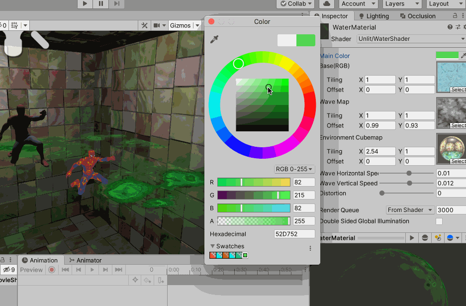

>《Unity Shader 入门精要》

在模拟实时水面的过程中，往往也会使用噪声纹理，此时，噪声纹理通常会用作一个高度图，以不断修改水面的法线向量。为了模拟水不断流动的效果，会使用和事件相关的变量来对噪声纹理进行采样，当得到法线信息后，再进行正常的反射+折射计算，得到最后的水面波动效果

使用到的贴图是


```
Shader "Unlit/WaterShader"
{
    Properties {
        // 控制水面颜色
        _Color ("Main Color", Color) = (0, 0.15, 0.115, 1)

        // 水面波纹材质纹理
        _MainTex ("Base(RGB)", 2D) = "white" {}

        // 噪声纹理生成的法线贴图
        _WaveMap ("Wave Map", 2D) = "bump" {}

        // 控制反射的立方体纹理
        _Cubemap ("Environment Cubemap", Cube) = "_Skybox" {}

        // 控制法线纹理在X、Y方向上的平移速度
		_WaveXSpeed ("Wave Horizontal Speed", Range(-0.1, 0.1)) = 0.01
		_WaveYSpeed ("Wave Vertical Speed", Range(-0.1, 0.1)) = 0.01

        // 控制模拟折射时图像的扭曲程度
        _Distortion ("Distortion", Range(0, 100)) = 10
    }

    SubShader {
        // 渲染队列设置为Transparent，保证渲染时，其他所有不透明的物体都已经被渲染到屏幕上了，否则可能无法正确得到“透过水面看到的图像“
        // "RenderType"="Opaque" 则是为了在使用着色器替换时，该物体可以被正确渲染
        Tags {"Queue"="Transparent" "RenderType"="Opaque"}

        GrabPass {"_RefractionTex"}

        Pass {
            Tags {"LightMode" = "ForwardBase"}

            CGPROGRAM

            #include "UnityCG.cginc"
            #include "Lighting.cginc"

            #pragma multi_compile_fwdbase

            #pragma vertex vert
            #pragma fragment frag

            fixed _AmbientStrength;
            fixed4 _Color;
            sampler2D _MainTex;
            float4 _MainTex_ST;
            sampler2D _WaveMap;
            float4 _WaveMap_ST;
            samplerCUBE _Cubemap;
            fixed _WaveXSpeed;
            fixed _WaveYSpeed;
            float _Distortion;

            // 下面这两个变量，对应了在使用GrabPass 时，指定的纹理名
            sampler2D _RefractionTex;
            // 得到该纹理的纹素大小，比如256*512的纹理，纹素大小为(1/256, 1/512)，需要在对屏幕图像的采样坐标进行偏移时使用该变量
            float4 _RefractionTex_TexelSize;  

            struct a2v {
                float4 vertex : POSITION;
                float3 normal : NORMAL;
                float4 tangent : TANGENT;
                float4 texcoord : TEXCOORD0;
            };

            struct v2f {
                float4 pos : SV_POSITION;
                float4 srcPos : TEXCOORD0;
                float4 uv : TEXCOORD1;
                float4 TtoW0 : TEXCOORD2;
                float4 TtoW1 : TEXCOORD3;
                float4 TtoW2 : TEXCOORD4;
            };

            v2f vert(a2v v) {
                v2f o;

                o.pos = UnityObjectToClipPos(v.vertex);

                // 得到对应被抓取屏幕图像的采样坐标，在UnityCG.cginc 中
                o.srcPos = ComputeGrabScreenPos(o.pos);

                // 计算_MainTex、_WaveMap的采样坐标，并将其存储在一个float4 类型的xy和zw 分量中
                o.uv.xy = TRANSFORM_TEX(v.texcoord, _MainTex);
                o.uv.zw = TRANSFORM_TEX(v.texcoord, _WaveMap);

                float3 worldPos = mul(unity_ObjectToWorld, v.vertex).xyz;
                fixed3 worldNormal = UnityObjectToWorldNormal(v.normal);
                fixed3 worldTangent = UnityObjectToWorldDir(v.tangent.xyz);
                fixed3 worldBinormal = cross(worldNormal, worldTangent) * v.tangent.w;

                // 由于需要在片元着色器中把法线法相从切线空间变换到世界空间下，以便对Cubemap 进行采样
                // 所以需要计算该顶点对应的从切线空间到世界空间的变换矩阵，并将该矩阵的每一行分别存储到TtoW0、TtoW1、TtoW2
                o.TtoW0 = float4(worldTangent.x, worldBinormal.x, worldNormal.x, worldPos.x);
                o.TtoW1 = float4(worldTangent.y, worldBinormal.y, worldNormal.y, worldPos.y);
                o.TtoW2 = float4(worldTangent.z, worldBinormal.z, worldNormal.z, worldPos.z);

                return o;
            }


            fixed4 frag(v2f i): SV_Target {
                // 使用TtoW0等变量的w 分量得到世界坐标
                float3 worldPos = float3(i.TtoW0.w, i.TtoW1.w, i.TtoW2.w);
                // 并用世界坐标得到该片元对应的视角方向
                fixed3 viewDir = normalize(UnityWorldSpaceViewDir(worldPos));

                // 用内置的_Time变量和_WaveXSpeed、_WaveYSpeed 计算法线纹理的当前偏移量
                float2 speed = _Time.y * float2(_WaveXSpeed, _WaveYSpeed);

                // 得到法线的偏移量后，利用该值对法线纹理进行两次采样，这是为了模拟两层交叉的水面波动效果
                fixed3 bump1 = UnpackNormal(tex2D(_WaveMap, i.uv.zw + speed)).rgb;
                fixed3 bump2 = UnpackNormal(tex2D(_WaveMap, i.uv.zw - speed)).rgb;
                // 对两次结果相加并归一化处理后得到切线空间下的法线向量
                fixed3 bump = normalize(bump1 + bump2);

                // 将bump 和_Distortion 属性 以及_RefractionTex_TexelSize 对屏幕图像的采样坐标进行偏移
                // _Distortion 越大，偏移越大，水面后的物体变形的程度越大
                float2 offset = bump.xy * _Distortion * _RefractionTex_TexelSize.xy;
                // 计算偏移后的屏幕坐标时，把偏移量和屏幕坐标的z 分量相乘，这是为了模拟深度越大，折射程度越大的效果
                i.srcPos.xy = offset * i.srcPos.z + i.srcPos.xy;
                // 对srcPos 进行透视除法，再使用该坐标对抓取的屏幕图像_RefractionTex 进行采样，得到模拟的这这颜色
                fixed3 refrCol = tex2D(_RefractionTex, i.srcPos.xy/i.srcPos.w).rgb;

                // 把法线方向从切线空间切换到世界空间下
                bump = normalize(half3(dot(i.TtoW0.xyz, bump), dot(i.TtoW1.xyz, bump), dot(i.TtoW2.xyz, bump)));
                fixed4 texColor = tex2D(_MainTex, i.uv.xy + speed);

                // 得到视角方向相对于法线方向的反射方向
                fixed3 reflDir = reflect(-viewDir, bump);
                // 使用反射方向对_Cubemap 进行采样，并把结果和主纹理颜色相乘后得到反射颜色
                fixed3 reflCol = texCUBE(_Cubemap, reflDir).rgb * texColor.rgb * _Color.rgb;

                // 为了混合折射和反射颜色，计算了菲涅尔系数，并得到最终的颜色
                fixed fresnel = pow(1 - saturate(dot(viewDir, bump)), 4);
                fixed3 finalColor = reflCol * fresnel + refrCol * (1 - fresnel);

                return fixed4(finalColor, 1);
            }

            ENDCG
        }
    }

    FallBack Off
}
```

最后看一下水面效果


