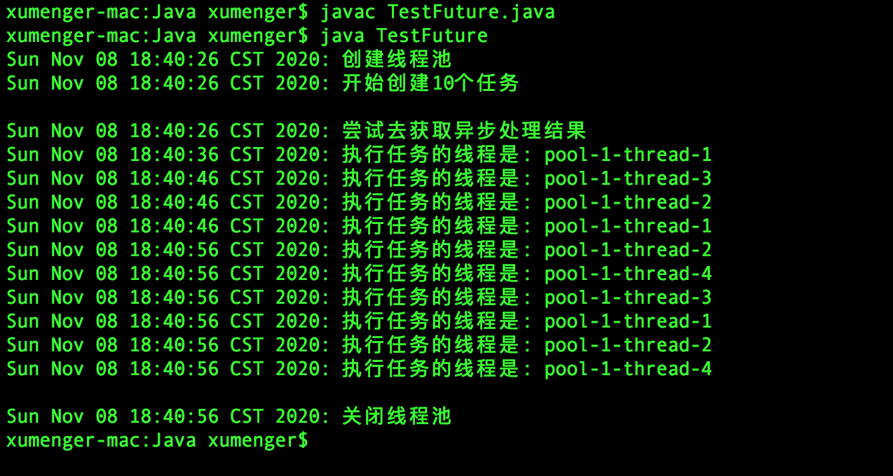

java.util.concurrent 包中提供了一些接口和类，支持异步任务

Callable<T> 接口，其与Runnable 接口类似，都指定了线程所要执行的操作，区别在于，Callable 接口在call() 方法中指定线程所要执行的操作，并且返回泛型T 类型

Future<T> 接口，保存异步运算的结果，其提供了这些方法

* get()。返回异步运算的结果，如果运算结果还没有出来，则阻塞等待直到结果出来
* get(long timeout, TimeUnit unit)。为阻塞设置了时间
    * 如果这个时间内结果出来了，则正确返回异步运算的结果
    * 如果超过这个时间结果还未出来，则TimeoutException
* cancel(boolean mayInterrupt)。取消该运算
    * 如果运算还没有开始，则立即取消
    * 如果运算已经开始，且mayInterrupt 为true，则取消
    * 如果运算已经开始，但mayInterrupt 为false，则不取消

接下来通过一个实际的例子来看一下运行的效果

```java
import java.util.concurrent.ExecutorService;
import java.util.concurrent.Callable;
import java.util.concurrent.Future;
import java.util.concurrent.Executors;
import java.util.Set;
import java.util.HashSet;
import java.util.Date;


class TestFuture {
    // 任务
    static class TestTask implements Callable<String> {
        public String call() {
            // 模拟任务的执行耗时
            try {
                Thread.currentThread().sleep(10000);
            } catch (InterruptedException e) {
                return "任务发生异常: " + e.getMessage();
            }

            return "执行任务的线程是: " + Thread.currentThread().getName();
        }
    }

    public static void main(String[] args) throws Exception {
        System.out.println((new Date()).toString() + ": 创建线程池");
        ExecutorService exeSrc = Executors.newFixedThreadPool(4);

        // 存放所有任务执行结果的集合
        Set<Future<String>> results = new HashSet<Future<String>>();

        System.out.println((new Date()).toString() + ": 开始创建10个任务");
        for (int i=0; i<10; i++) {
            TestTask task = new TestTask();
            Future<String> future = exeSrc.submit(task);
            results.add(future);
        }
        
        System.out.println("");
        System.out.println((new Date()).toString() + ": 尝试去获取异步处理结果");
        for (Future<String> future : results) {
            // 这里会阻塞等待
            String result = future.get();
            System.out.println((new Date()).toString() + ": " + result);
        }

        System.out.println("");
        System.out.println((new Date()).toString() + ": 关闭线程池");
        exeSrc.shutdown();
    }

}
```

实际运行的效果如下


