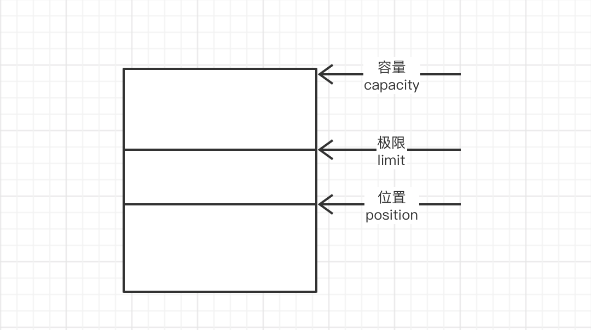
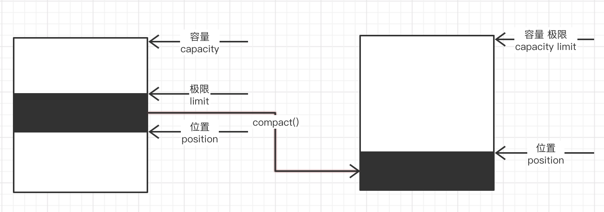
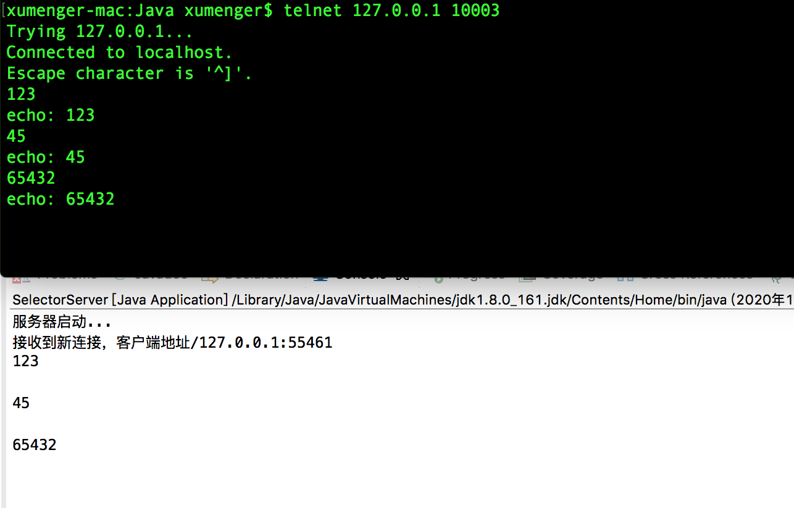

## Buffer 解释

在Java NIO 中，除了Channel、Selecor 之外，还有一个很重要的类，就是Buffer，前两个在后面的代码中比较好理解，所以先重点把Buffer 讲一下！



* 容量：表示缓冲区可以保存多少数据
* 极限：表示缓冲区的当前终点
	* 不能对缓冲区超出极限的区域进行读写操作
	* 极限是可以修改的，这有利于缓冲区的重用
	* 比如假定缓冲区容量是100，已经填满了数据
	* 接着程序再重用缓冲区时，仅仅将10 个新的数据写入缓冲区中从位置0 到10 的区域
	* 这是可以把极限设置为10
	* 这样就不能读取位置从11 到99 的原来的数据了！！！
* 位置：表示缓冲区中写一个读写单元的位置
	* 每次读写缓冲区的数据时，该值都会变化，为下一次读写数据做准备

clear()。把极限设置为容量，把位置设置为0

flip()。将极限设置为位置，把位置设置为0

rewind()。不改变极限，把位置设置为0

remaining()。返回缓冲区的剩余容量。等于 极限 - 位置

compact()。删除缓冲区中从0 到当前位置position 的内容，然后把当前位置position 到极限limit 的内容拷贝到0 到 limit-position 的区域内，position 与limit 的值对应也变化



## Buffer 实现

去看ByteBuffer 的源码，其分配内存的方法有两个

```java
/**
 * Allocates a new direct byte buffer.
 *
 * <p> The new buffer's position will be zero, its limit will be its
 * capacity, its mark will be undefined, and each of its elements will be
 * initialized to zero.  Whether or not it has a
 * {@link #hasArray backing array} is unspecified.
 *
 * @param  capacity
 *         The new buffer's capacity, in bytes
 *
 * @return  The new byte buffer
 *
 * @throws  IllegalArgumentException
 *          If the <tt>capacity</tt> is a negative integer
 */
public static ByteBuffer allocateDirect(int capacity) {
    return new DirectByteBuffer(capacity);
}


/**
 * Allocates a new byte buffer.
 *
 * <p> The new buffer's position will be zero, its limit will be its
 * capacity, its mark will be undefined, and each of its elements will be
 * initialized to zero.  It will have a {@link #array backing array},
 * and its {@link #arrayOffset array offset} will be zero.
 *
 * @param  capacity
 *         The new buffer's capacity, in bytes
 *
 * @return  The new byte buffer
 *
 * @throws  IllegalArgumentException
 *          If the <tt>capacity</tt> is a negative integer
 */
public static ByteBuffer allocate(int capacity) {
    if (capacity < 0)
        throw new IllegalArgumentException();
    return new HeapByteBuffer(capacity, capacity);
}
```

HeapByteBuffer。该实现，缓存是位于JVM 堆上的

DirectByteBuffer。该实现，则是使用堆外内存

堆外（OffHeapStore）存储：被称为BigMemory，只在企业版本的Ehcache 中提供，原理是利用NIO 的DirectByteBuffers 实现，比存储到磁盘上快，而且完全不受GC 的影响，可以保证响应时间的稳定性；但Direct Buffer 的在分配上的开销要比Heap Buffer 大，而且要求必须以字节数组方式存储，因此对象必须在存储过程中进行序列化，读取则进行反序列化操作，它的速度大约比堆内存储慢一个数量级

Direct Buffer 不受GC 影响，但是Direct Buffer 归属的的Java 对象是在堆上且能够被GC 回收的，一旦它被回收，JVM 将释放Direct Buffer 的堆外空间

堆外内存，其实就是不受JVM 控制的内存。相比于堆内内存有几个优势：

* 减少了垃圾回收工作，因为垃圾回收会暂停其他的工作（可能使用多线程或者时间片的方式，根本感觉不到）
* 加快了复制速度。因为堆内在flush到远程时，会先复制到直接内存（非堆内存），然后在发送；而堆外内存相当于省略掉了这个工作
* 可以在进程间共享，减少JVM间的对象复制，使得JVM的分割部署更容易实现
* 可以扩展至更大的内存空间。比如超过1TB甚至比主存还大的空间

而福之祸所依，自然也有不好的一面：

* 堆外内存难以控制，如果内存泄漏，那么很难排查
* 堆外内存相对来说，不适合存储很复杂的对象。一般简单的对象或者扁平化的比较适合

Direct Memory 的回收机制：Direct Memory 是受GC控制的，例如ByteBuffer bb = ByteBuffer.allocateDirect(1024)，这段代码的执行会在堆外占用1k的内存，Java 堆内只会占用一个对象的指针引用的大小，堆外的这1k的空间只有当bb对象被回收时，才会被回收，这里会发现一个明显的不对称现象，就是堆外可能占用了很多，而堆内没占用多少，导致还没触发GC，那就很容易出现Direct Memory 造成物理内存耗光

ByteBuffer 与Unsafe 使用堆外内存在回收时的不同：

Direct ByteBuffer 分配出去的直接内存其实也是由GC 负责回收的，而不像Unsafe 是完全自行管理的，Hotspot 在GC 时会扫描Direct ByteBuffer 对象是否有引用，如没有则同时也会回收其占用的堆外内存

堆外内存回收的几种方法：

Full GC，一般发生在年老代垃圾回收以及调用System.gc() 时，但这样不一顶能满足我们的需求。 调用ByteBuffer 的cleaner 的clean()，内部还是调用System.gc()，所以一定不要-XX:+DisableExplicitGC

## 实现一个非阻塞的服务端

```java
package com.xum.demo09.nio;

import java.io.IOException;
import java.net.InetSocketAddress;
import java.nio.ByteBuffer;
import java.nio.CharBuffer;
import java.nio.channels.SelectionKey;
import java.nio.channels.Selector;
import java.nio.channels.ServerSocketChannel;
import java.nio.channels.SocketChannel;
import java.nio.charset.Charset;
import java.util.Iterator;
import java.util.Set;

public class SelectorServer {

    private Selector selector = null;
    private ServerSocketChannel serverSocketChannel = null;
    
    private Charset charset = Charset.forName("GBK");
    
    
    /**
     * 在构造方法中绑定端口
     * 
     * @throws IOException
     */
    public SelectorServer(int port) throws IOException
    {    
        selector = Selector.open();
        
        serverSocketChannel = ServerSocketChannel.open();
        serverSocketChannel.socket().setReuseAddress(true);
        serverSocketChannel.configureBlocking(false);
        serverSocketChannel.socket().bind(new InetSocketAddress(port));
        
        System.out.println("服务器启动...");
    }
    
    
    /**
     * 启动服务开始处理客户端连接、请求
     * @throws IOException 
     */
    public void service() throws IOException 
    {
        // 为服务端socketchannel 注册监控ACCEPT 事件，当有客户端连接时，该事件触发
        serverSocketChannel.register(selector, SelectionKey.OP_ACCEPT);
        
        /**
         * select() 方法阻塞执行，以下情况会导致其从阻塞中唤醒
         * 至少有一个SelectionKey 相关事件发生
         * 其他线程调用了Selector 的wakeup() 方法，导致执行select() 方法的线程立即从select() 中返回
         * 当前执行select() 的线程被其他线程中断
         */
        while (selector.select() > 0) {
            Set<SelectionKey> readyKeys = selector.selectedKeys();
            Iterator<SelectionKey> it = readyKeys.iterator();
            while (it.hasNext()) {
                SelectionKey key = null;
                try {
                    key = (SelectionKey)it.next();
                    it.remove();
                    
                    if (key.isAcceptable()) {
                        ServerSocketChannel ssc = (ServerSocketChannel)key.channel();
                        SocketChannel socketChannel = (SocketChannel)ssc.accept();
                        System.out.println("接收到新连接，客户端地址" 
                                          + socketChannel.socket().getInetAddress() + ":"
                                          + socketChannel.socket().getPort());
                        
                        // 新接收到的客户端连接，为其注册读、写事件，也使用Selector 监听
                        socketChannel.configureBlocking(false);
                        ByteBuffer buffer = ByteBuffer.allocate(1024);
                        socketChannel.register(selector, SelectionKey.OP_READ | SelectionKey.OP_WRITE, buffer);
                    }

                    if (key.isWritable()) {
                        send(key);
                    }
                    
                    if (key.isReadable()) {
                        receive(key);
                    }
                    
                } catch (IOException ex) {
                    ex.printStackTrace();
                    
                    try {
                        if (null != key) {
                            key.cancel();
                            key.channel().close();
                        }
                    } catch (Exception e) {
                        e.printStackTrace();
                    }
                }
            }
        }
    }
    
    /**
     * 处理写事件

     * @throws IOException 
     */
    private void send(SelectionKey key) throws IOException 
    {
        ByteBuffer buffer = (ByteBuffer)key.attachment();
        SocketChannel socketChannel = (SocketChannel)key.channel();
        buffer.flip();
        
        String data = decode(buffer);
        if (data.indexOf("\r\n") == -1) 
            return;
        String outputData = data.substring(0, data.indexOf("\n") + 1);
        System.out.println(outputData);
        
        ByteBuffer outputBuffer = encode("echo: " + outputData);
        while (outputBuffer.hasRemaining()) 
            socketChannel.write(outputBuffer);
        
        ByteBuffer temp = encode(outputData);
        buffer.position(temp.limit());
        buffer.compact();   // 删除已经处理的字符串
        
        if (outputData.equals("bye\r\n")) {
            key.channel();
            socketChannel.close();
            System.out.println("关闭与客户端的连接");
        }
    }
    
    /**
     * 处理读事件

     * @throws IOException 
     */
    private void receive(SelectionKey key) throws IOException 
    {
        ByteBuffer buffer = (ByteBuffer)key.attachment();
        
        SocketChannel socketChannel = (SocketChannel)key.channel();
        ByteBuffer readBuffer = ByteBuffer.allocate(32);

        // 这里有一个bug，应该判断一下read() 的返回值，因为非阻塞，所以返回值可能小于指定的32
        // 另外还需要判断返回值是否为-1，如果是-1，表示客户端关闭了连接，服务端应该对应做相应处理
        socketChannel.read(readBuffer);
        readBuffer.flip();
        
        buffer.limit(buffer.capacity());
        buffer.put(readBuffer);    // 将读到的数据放到buffer 中
    }
    
    /**
     * 解码
     * 
     * @param buffer
     * @return
     */
    private String decode(ByteBuffer buffer) 
    {
        CharBuffer charBuffer = charset.decode(buffer);
        return charBuffer.toString();
    }
    
    /**
     * 编码
     * 
     * @param str
     * @return
     */
    private ByteBuffer encode(String str) 
    {
        return charset.encode(str);
    }
    
    
    /**
     * 启动服务器
     * @throws IOException 
     */
    public static void main(String[] args) throws IOException 
    {
        SelectorServer server = new SelectorServer(10003);
        server.service();
    }
}
```

启动服务端后，开启一个终端，telnet 连接上去，其效果是这样的


