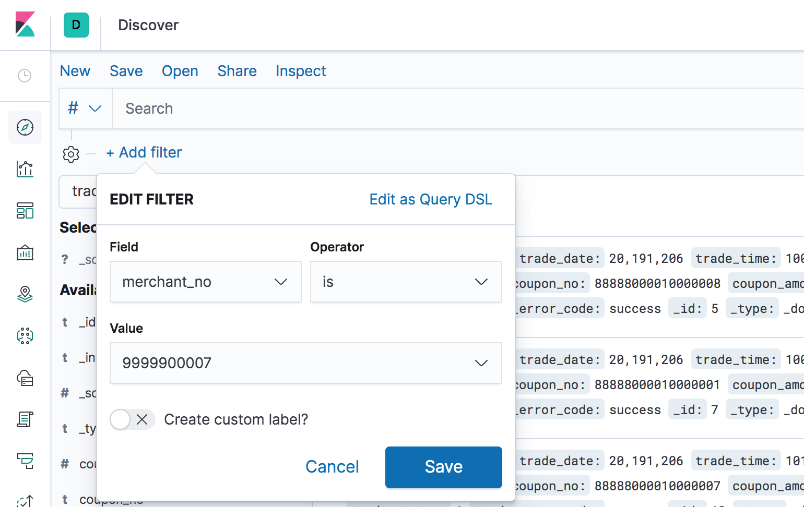
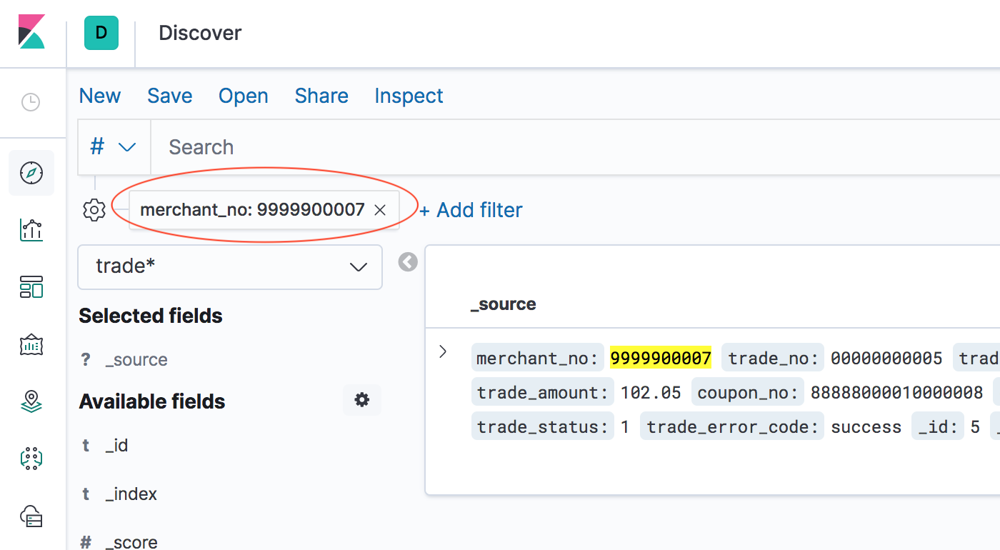
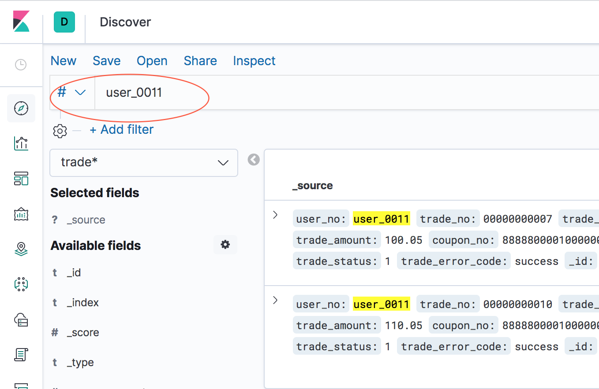

产品的所有接口调用的日志都存放在ES 中，按日期分索引，每天新建一个索引！

现在想统计20201010～20201111 期间，所有接口trade_query 的调用，分析其输入和输出接口，所以就需要对每个索引的trade_query 接口相关的所有文档进行遍历

以下针对某一个索引为例，展示客户端的写法（如果是多个索引，遍历每个索引分别调用下面的代码逻辑即可）

## 分页查询

首先想到的是分页查询的方法，每次记录查询到的文档的位置，然后下一次查询从这个位置继续往后查询

```java
// 每次请求200条，从第0条开始
int size = 200;
int begin = 0;
 
while (true) {
    // 指定查询RequestHead.ApiName 字段为trade_query 的文档
    BoolQueryBuilder boolQueryBuilder = QueryBuilders.boolQuery();
    boolQueryBuilder.must(QueryBuilders.matchQuery("RequestHead.ApiName", "trade_query"));

    // 指定从begin 开始，索要size 个文档
    SearchSourceBuilder searchSourceBuilder = new SearchSourceBuilder();
    searchSourceBuilder.from(begin);
    searchSourceBuilder.size(size);
    searchSourceBuilder.timeout(new TimeValue(120, TimeUnit.SECONDS));
    searchSourceBuilder.query(boolQueryBuilder);

    // 指定具体的索引
    SearchRequest searchRequest = new SearchRequest();
    searchRequest.indices("netpaylog20201104");
    searchRequest.types("entity");
    searchRequest.source(searchSourceBuilder);
    
    // 搜索请求
    SearchResponse searchResponse = highLevelClient.search(wRequest, RequestOptions.DEFAULT);
                                    
    // 获取应答
    SearchHit[] searchHits = searchResponse.getHits().getHits();

    // 逐条处理
    int count = 0;
    for (SearchHit hit : searchHits) {
        begin ++;
        count ++;
        deal(hit);
    }

    // 本次循环拿到的数量小于指定要拿到的数量说明已经到最后一页了
    if (count < size) {
        break;
    }
}
```

使用这种方式查询的话，当searchSourceBuilder.from(begin) 设置的值超过10000 的时候，会出现报错

因为ElasticSearch 默认只能遍历到10000 以内的文档，如果文档数量很多，则需要针对这个索引修改其允许使用这种方式遍历的文档的数量

```json
PUT log20201101/_settings
{
  "index":{
    "max_result_window":1000000
  }
}
```

## 模糊查询

上面的代码中，构造查询条件的时候使用的是这样的方式

```java
BoolQueryBuilder boolQueryBuilder = QueryBuilders.boolQuery();
/**
 * 针对RequestHead.ApiName 字段精确查询值为trade_query 的所有文档
 */
boolQueryBuilder.must(QueryBuilders.matchQuery("RequestHead.ApiName", "trade_query"));
```

其对应在Kibana 上的表现方式是这样的





这个是针对索引中某个keyword 的精确匹配查询，但有时候我们想要对索引中的所有文档模糊查询的方式查询某个信息

```java
BoolQueryBuilder boolQueryBuilder = QueryBuilders.boolQuery();
/**
 * 针对索引中文档的所有字段进行模糊查询
 * 类似于在Kibana 的搜索框中搜索指定内容
 */
boolQueryBuilder.must(QueryBuilders.queryStringQuery("12386732673"))
```

其对应在Kibana 上的表现方式是这样的



## 游标查询

但使用上面的方式“遍历”所有的文档，分析后，发现有一些应该再分析结果中的记录竟然不存在！显然漏掉了一些数据，同时再看最终分析出来的数据，还存在重复的情况

于是查阅ES 的官方文档

>https://www.elastic.co/guide/en/elasticsearch/client/java-rest/current/index.html

>https://www.elastic.co/guide/en/elasticsearch/client/java-rest/current/java-rest-high-search-scroll.html

其推荐使用游标的方式进行查询

```java
// 用于游标查询
final Scroll scroll = new Scroll(TimeValue.timeValueMinutes(1L));

// 指定查询RequestHead.ApiName 字段为trade_query 的文档
SearchSourceBuilder searchSourceBuilder = new SearchSourceBuilder();
searchSourceBuilder.query(matchQuery("RequestHead.ApiName", "trade_query"));

// 创建搜索请求
SearchRequest searchRequest = new SearchRequest("posts");
searchRequest.scroll(scroll);
searchRequest.source(searchSourceBuilder);
 
// 发起请求
SearchResponse searchResponse = highLevelClient.search(searchRequest, RequestOptions.DEFAULT); 
 
// 保留本次应答返回的scrollId，下次请求时传入该scrollId 继续查询
String scrollId = searchResponse.getScrollId();
SearchHit[] searchHits = searchResponse.getHits().getHits();

while (searchHits != null && searchHits.length > 0) { 
    
    // 这里针对每个文档进行分析
    for (SearchHit hit : searchHits)
        deal(hit);
    
    // 从上次返回的scrollId 继续查询
    SearchScrollRequest scrollRequest = new SearchScrollRequest(scrollId); 
    scrollRequest.scroll(scroll);
    searchResponse = highLevelClient.scroll(scrollRequest, RequestOptions.DEFAULT);
    scrollId = searchResponse.getScrollId();
    searchHits = searchResponse.getHits().getHits();
}
 
// 使用游标的方式遍历完后，“归还”游标
ClearScrollRequest clearScrollRequest = new ClearScrollRequest(); 
clearScrollRequest.addScrollId(scrollId);
ClearScrollResponse clearScrollResponse = highLevelClient.clearScroll(clearScrollRequest, RequestOptions.DEFAULT);
boolean succeeded = clearScrollResponse.isSucceeded();
```

该用这种方式之后，没有在漏数据的情况，也没有重复的情况

以log20201110 这个索引为例，该索引上一共有1800 万左右的文档，trade_query 接口相关的文档有4 万左右

使用游标的方式处理完这些文档耗时大概2min 左右！

补充另一个数据：一个索引1800 万级别的文档，一个主分片，一个副分片，分别占7.5G，共占15G

