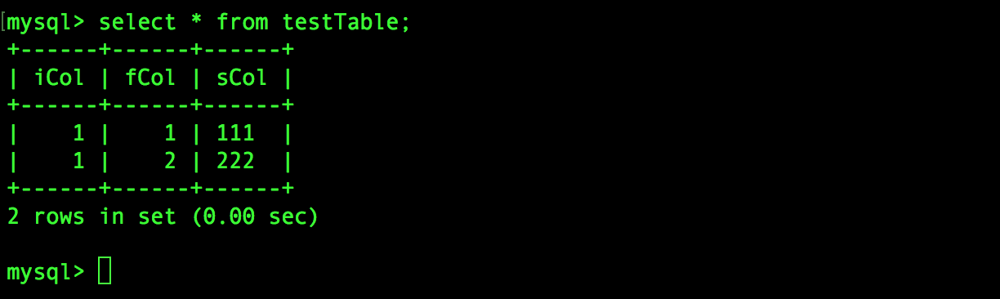

MyBatis 使用简单的XML 或者注解用于配置和原始映射，将接口和Java 对象映射成数据库中的记录，是目前很流行的ORM 框架，本文展示如何独立使用MyBatis，以及初步介绍MyBatis 缓存，其实现在当前的项目中，主流的是Spring 集成MyBatis 下的开发。关于MyBatis 如何集成到Spring 中的，后面会专门讲解，本文先独立地看MyBatis

## MyBatis 实现数据库读写

首先准备一个用于测试的数据表，很简单，三个字段，每个字段不同的类型。这里没有设置索引和主键，因为本文只是用于展示MyBatis 的使用

```sql
CREATE TABLE `testTable` (
  `iCol` int(11) DEFAULT NULL,
  `fCol` float DEFAULT NULL,
  `sCol` varchar(255) DEFAULT NULL
) ENGINE=InnoDB DEFAULT CHARSET=utf8;
```

pom.xml 文件中添加必要的依赖

```xml
<dependency>
  <groupId>mysql</groupId>
  <artifactId>mysql-connector-java</artifactId>
  <version>8.0.11</version>
</dependency>

<dependency>
  <groupId>org.mybatis</groupId>
  <artifactId>mybatis</artifactId>
  <version>3.4.6</version>
</dependency>
```

建立一个和该表映射的类

```java
package com.xum.demo10.mybatis;

public class TestTable 
{
    private Integer iCol;
    private Float fCol;
    private String sCol;
    
    public TestTable(Integer i, Float f, String s) {
        this.iCol = i;
        this.fCol = f;
        this.sCol = s;
    }
    
    // 必须提供这个无参构造方法，不然根据TestTableMapper.xml 中的配置
    // 在查询数据库时，将不能反射构造TestTable 对象
    public TestTable() {
        super();
    }

    public Integer getiCol() {
        return iCol;
    }
    public void setiCol(Integer iCol) {
        this.iCol = iCol;
    }
    
    public Float getfCol() {
        return fCol;
    }
    public void setfCol(Float fCol) {
        this.fCol = fCol;
    }

    public String getsCol() {
        return sCol;
    }
    public void setsCol(String sCol) {
        this.sCol = sCol;
    }
}
```

建立Mapper，该接口是用于数据库操作的映射文件，也就是常说的DAO，用于映射数据库的操作，可以通过对应的配置文件指定方法对应的SQL 语句或者使用Java 提供的注解方式进行SQL 指定

```java
package com.xum.demo10.mybatis;

import java.util.List;

public interface TestTableMapper 
{
    public void addRecord(TestTable t);
    
    public List<TestTable> getRecord(Integer i);
    
    public void deleteRecord(Integer i);
}
```

创建MyBatis 运行需要的配置文件，在这里配置数据源、映射文件信息等，放置在项目的src/main/resources/demo10/ 目录下

```xml
<?xml version="1.0" encoding="UTF-8"?>
<!DOCTYPE configuration 
    PUBLIC "-//mybatis.org//DTD Config 3.0//EN" 
    "http://mybatis.org/dtd/mybatis-3-config.dtd">
<configuration> <!-- 根元素 -->
    <settings> <!-- 全局配置 -->
        <setting name="cacheEnabled" value="false"/>  <!-- 不开启二级缓存 -->
        <setting name="logImpl" value="STDOUT_LOGGING"/> <!-- 打印SQL日记到控制台 -->
        <setting name="defaultExecutorType" value="REUSE"/>
    </settings>
    
    <typeAliases>
        <typeAlias alias="TestTable" type="com.xum.demo10.mybatis.TestTable"/>
    </typeAliases>
    
    <!-- 数据库连接信息 -->
    <environments default="development">
        <environment id="development">
            <!-- 事务管理器 -->
            <transactionManager type="jdbc"/>
            <dataSource type="POOLED">
                <property name="driver" value="com.mysql.jdbc.Driver"/>
                <!-- 指定数据库为testDB -->
                <property name="url" value="jdbc:mysql://localhost/testDB"/>
                <property name="username" value="root"/>
                <property name="password" value=""/>
            </dataSource>
        </environment>
    </environments>
    
    <!-- 映射文件配置路径 -->
    <mappers>
        <mapper resource="demo10/TestTableMapper.xml"/>
    </mappers>
</configuration>
```

创建数据表对应的映射文件。放置在项目的src/main/resources/demo10/ 目录下

```xml
<?xml version="1.0" encoding="UTF-8"?>
<!DOCTYPE mapper 
    PUBLIC "-//mybatis.org//DTD Config 3.0//EN" 
    "http://mybatis.org/dtd/mybatis-3-mapper.dtd">
<mapper namespace="com.xum.demo10.mybatis.TestTableMapper">
    <insert id="addRecord" parameterType="TestTable">
        <!-- 这个SQL 结尾不能加分号，否则报错 ORA-00911 -->
        insert into TestTable(iCol, fCol, sCol) values(#{iCol}, #{fCol}, #{sCol})
    </insert>
    
    <!-- 查询出的结果可能有好多条记录，返回类型即是list。但resultType还是写成resultType="TestTable"（TestTable为集合list中的实体类），而不是写成resultType="java.util.List" -->
    <select id="getRecord" resultType="TestTable" parameterType="java.lang.Integer" >
        select * from TestTable where iCol = #{iCol}
    </select>
    
    <delete id="deleteRecord" parameterType="java.lang.Integer" >
        delete from TestTable where iCol = #{iCol}
    </delete>
</mapper>
```

编写主类，测试该案例

```java
package com.xum.demo10.mybatis;

import java.io.Reader;
import java.util.List;

import org.apache.ibatis.io.Resources;
import org.apache.ibatis.session.SqlSession;
import org.apache.ibatis.session.SqlSessionFactory;
import org.apache.ibatis.session.SqlSessionFactoryBuilder;

public class Application 
{
    public static void main(String args[]) throws Exception
    {
        Reader reader = Resources.getResourceAsReader("demo10/mybatis-setting.xml");
        SqlSessionFactory sqlSessionFactory = new SqlSessionFactoryBuilder().build(reader);
        SqlSession sqlSession = sqlSessionFactory.openSession();
        
        TestTableMapper tableMapper = sqlSession.getMapper(TestTableMapper.class);
        
        System.out.println("往数据库中新增两条记录");
        TestTable table1 = new TestTable(1, 1.0f, "111");
        tableMapper.addRecord(table1);
        TestTable table2 = new TestTable(1, 2.0f, "222");
        tableMapper.addRecord(table2);
        sqlSession.commit();
        
        System.out.println("从数据库中查询记录");
        List<TestTable> tables = tableMapper.getRecord(1);
        for (TestTable t : tables) {
            System.out.println(t.getsCol());
        }
    }
}
```

运行程序的结果如下


原来这个数据表中没有数据，现在也有了数据了



## MyBatis 缓存机制

MyBatis 执行SQL 语句之后，这条语句就是被缓存，以后再执行这条语句的时候，会直接从缓存中拿结果，而不是再次执行SQL，即MyBatis 一级缓存，一级缓存的作用域是SqlSession

* 同一个SqlSession 执行相同的SQL，第二次执行直接取第一次执行的缓存结果
* 同一个SqlSession 执行两个不同的SQL，都实际会去数据库查询
* 两个SqlSession 执行相同的SQL，都各自会去数据库中查询
* 同一个SqlSessionFactory 两次调用openSession() 返回的SqlSession 是不同的
* 执行新增、更新、删除操作后，缓存会被清除

一级缓存不需要任何配置，默认打开

MyBatis 同时还提供了一种全局作用域global scope 的缓存，这也叫做二级缓存，也称作全局缓存。二级缓存的作用域是全局，即二级缓存已经脱离SqlSession 的控制了。二级缓存需要进行必要的配置

* 全局配置文件中setting 中cachEnabled 需要设置为true
* mapper 配置文件中需要加入<cache> 节点
* mapper 配置文件中的select 节点需要加上属性useCache，且设置为true

本文暂时只研究一下一级缓存，基于上面对于一级缓存的描述，设计这样的案例，基于上面的案例，现在数据表中有两条iCol 为1 的数据，仅开启一级缓存的情况下，SqlSessionA 执行查询，SqlSessionB 执行delete 操作，SqlSessionA 再执行查询

```java
package com.xum.demo10.mybatis;

import java.io.Reader;
import java.util.List;

import org.apache.ibatis.io.Resources;
import org.apache.ibatis.session.SqlSession;
import org.apache.ibatis.session.SqlSessionFactory;
import org.apache.ibatis.session.SqlSessionFactoryBuilder;

public class Application 
{
    public static void main(String args[]) throws Exception
    {
        Reader reader = Resources.getResourceAsReader("demo10/mybatis-setting.xml");
        SqlSessionFactory sqlSessionFactory = new SqlSessionFactoryBuilder().build(reader);
        
        // 创建两个SqlSession 用于测试一级缓存
        SqlSession sqlSessionA = sqlSessionFactory.openSession();
        SqlSession sqlSessionB = sqlSessionFactory.openSession();
        
        System.err.println("sqlSessionA执行查询，查询结果为：");
        TestTableMapper tableMapperA = sqlSessionA.getMapper(TestTableMapper.class);
        List<TestTable> tables1 = tableMapperA.getRecord(1);
        for (TestTable t : tables1) {
            System.err.println(t.getsCol());
        }
        
        System.err.println("sqlSessionB执行删除");
        TestTableMapper tableMapperB = sqlSessionB.getMapper(TestTableMapper.class);
        tableMapperB.deleteRecord(1);
        sqlSessionB.commit();
        
        System.err.println("sqlSessionA再执行查询，查询结果为：");
        List<TestTable> tables2 = tableMapperA.getRecord(1);
        for (TestTable t : tables2) {
            System.err.println(t.getsCol());
        }
    }
}
```

执行结果如下


简单复盘一下这个流程：

* sqlSessionA 执行SQL 查询到结果，并缓存起来
* sqlSessionB 执行SQL 将这张表中的相关数据删除
* sqlSessionA 再执行SQL，发现对应的SQL 有缓存数据，不再去数据库，直接取本地缓存
* 这个场景也就导致了数据不一致的问题！

如何规避这个问题，二级缓存的作用是什么？包括一级缓存的原理、二级缓存的原理，后续我会专门研究源码好好分析一下！

实际分布式系统中，可能应用1 使用MyBatis 开发，查询了某张表，结果缓存起来了，但是应用2 对数据做了增删改，那么应用1 缓存中的数据就应该过期的，不过实际两个应用完全不知道对方的存在，所以应用1 还继续使用实际已经失效的缓存，那么就会导致数据一致性问题，这些在做设计和开发的时候都是要重点考虑的！

## 参考资料

* [MyBatis的缓存](https://www.cnblogs.com/jtlgb/p/6037945.html)
* [MyBatis官方文档](https://mybatis.org/mybatis-3/zh/index.html)
