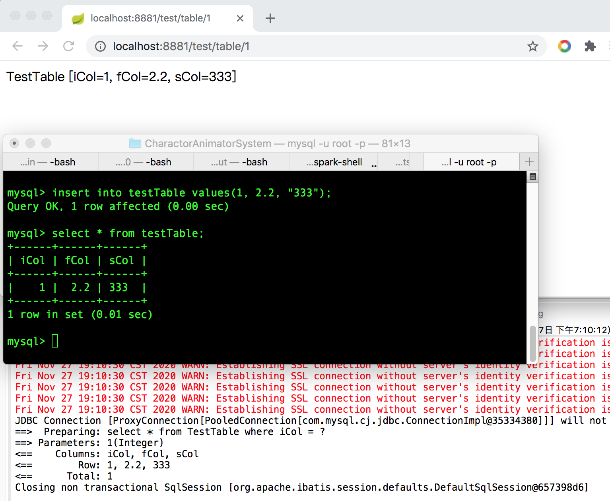

在上一篇中讲到了如何使用MyBatis 独立地开发应用程序，也说到目前主流的开发方式是Spring + MyBatis，所以这里就开始讲一下Spring 是如何集成MyBatis 的！先讲使用，后面再讲原理！

复用上文的数据表，首先启动数据库服务器：`mysql.server start`

在pom.xml 中新增Maven 依赖如下：

```xml
<!-- 没有这个依赖会导致报错 mapper找不到报错：Field xxxMapper in xxx required a bean of type 'xxxMapper' that could not be found -->
<!-- 包含了 mybatis-spring.jar、mybatis.jar -->
<dependency>
    <groupId>org.mybatis.spring.boot</groupId>
    <artifactId>mybatis-spring-boot-starter</artifactId>
    <version>1.3.2</version>
</dependency>

<dependency>
   <groupId>org.springframework.boot</groupId>
   <artifactId>spring-boot-starter</artifactId>
   <version>1.5.6.RELEASE</version>
</dependency>

<dependency>
    <groupId>org.springframework.boot</groupId>
    <artifactId>spring-boot-starter-web</artifactId>
    <version>1.5.6.RELEASE</version>
</dependency>

<dependency>
  <groupId>mysql</groupId>
  <artifactId>mysql-connector-java</artifactId>
  <version>8.0.11</version>
</dependency>
```

在src/main/resources 下新增application.yml 配置文件

```yml
server:
  port: 8881

mybatis:
  # 配置mapper xml文件所在的路径
  mapper-locations: classpath:demo11/*Mapper.xml
  # 配置映射类所在的包名
  type-aliases-package: com.xum.demo11.mybatis.spring.entity
  # 控制台打印日志（事务、SQL）
  configuration:
    log-impl: org.apache.ibatis.logging.stdout.StdOutImpl

spring:
  datasource:
    username: root
    password: 
    url: jdbc:mysql://localhost/testDB
    driver-class-name: com.mysql.jdbc.Driver

```

在src/main/resources/demo11 下新增TestTableMapper 配置文件

```xml
<?xml version="1.0" encoding="UTF-8"?>
<!DOCTYPE mapper 
    PUBLIC "-//mybatis.org//DTD Config 3.0//EN" 
    "http://mybatis.org/dtd/mybatis-3-mapper.dtd">
<mapper namespace="com.xum.demo11.mybatis.spring.mapper.TestTableMapper">
    <!-- 这个更高级的配置创建了一个 FIFO 缓存,并每隔 60 秒刷新,存数结果对象或列表的 512 个引用,而且返回的对象被认为是只读的,因此在不同线程中的调用者之间修改它们会 导致冲突 -->
    <!-- 如果没有这个配置，默认是没有缓存的！ -->
    <cache eviction="FIFO" flushInterval="60000" size="512" readOnly="true"/>

    <insert id="addRecord" parameterType="TestTable">
        <!-- 这个SQL 结尾不能加分号，否则报错 ORA-00911 -->
        insert into TestTable(iCol, fCol, sCol) values(#{iCol}, #{fCol}, #{sCol})
    </insert>
    
    <!-- 查询出的结果可能有好多条记录，返回类型即是list。但resultType还是写成resultType="TestTable"（TestTable为集合list中的实体类），而不是写成resultType="java.util.List" -->
    <select id="getRecord" resultType="TestTable" parameterType="java.lang.Integer" >
        select * from TestTable where iCol = #{iCol}
    </select>
    
    <delete id="deleteRecord" parameterType="java.lang.Integer" >
        delete from TestTable where iCol = #{iCol}
    </delete>
</mapper>
```

主程序逻辑代码如下

```java
package com.xum.demo11.mybatis.spring;

import org.springframework.boot.SpringApplication;
import org.springframework.boot.autoconfigure.SpringBootApplication;

@SpringBootApplication 
public class Application 
{
    public static void main(String[] args) 
    {
        SpringApplication.run(Application.class, args);
    }
}
```

TestController 代码如下，在这里编写处理HTTP 请求的逻辑

```java
package com.xum.demo11.mybatis.spring.controller;

import java.util.List;
import org.springframework.beans.factory.annotation.Autowired;
import org.springframework.stereotype.Controller;
import org.springframework.web.bind.annotation.PathVariable;
import org.springframework.web.bind.annotation.RequestMapping;
import org.springframework.web.bind.annotation.RequestMethod;
import org.springframework.web.bind.annotation.ResponseBody;

import com.xum.demo11.mybatis.spring.entity.TestTable;
import com.xum.demo11.mybatis.spring.service.TestTableService;

@Controller
@RequestMapping("/test")
public class TestController 
{
    @Autowired
    TestTableService service;

    // http://localhost:8881/test/
    @RequestMapping("/")
    @ResponseBody
    public String index() {
        return "This is Index Page";
    }
    
    // http://localhost:8881/test/table/1
    @RequestMapping(value="/table/{id}", method= RequestMethod.GET)
    @ResponseBody
    public String user(@PathVariable("id") Integer id) {
        /// 通过在TestTableMapper.xml 中<cache> 标签开启缓存，如果没有则每次都去数据库
        List<TestTable> tableList = service.getRecord(id);
        return tableList.get(0).toString();
    }
}
```

其调用的TestTableService 代码如下

```java
package com.xum.demo11.mybatis.spring.service;

import java.util.List;
import org.springframework.beans.factory.annotation.Autowired;
import org.springframework.stereotype.Service;

import com.xum.demo11.mybatis.spring.entity.TestTable;
import com.xum.demo11.mybatis.spring.mapper.TestTableMapper;

@Service
public class TestTableService 
{
    @Autowired
    TestTableMapper mapper;
    
    public void addRecord(TestTable t)
    {
        mapper.addRecord(t);
    }
    
    public List<TestTable> getRecord(Integer i)
    {
        return mapper.getRecord(i);
    }
    
    public void deleteRecord(Integer i)
    {
        mapper.deleteRecord(i);
    }
}
```

其调用的TestTableMapper 的代码如下（注意，其是一个接口，并且在TestTableMapper.xml 中有进行配置）

```java
package com.xum.demo11.mybatis.spring.mapper;

import java.util.List;
import org.apache.ibatis.annotations.Mapper;
import com.xum.demo11.mybatis.spring.entity.TestTable;


@Mapper
public interface TestTableMapper 
{
    public void addRecord(TestTable t);
    public List<TestTable> getRecord(Integer i);
    public void deleteRecord(Integer i);
}
```

对应的实体类如下

```java
package com.xum.demo11.mybatis.spring.entity;

public class TestTable 
{
    private Integer iCol;
    private Float fCol;
    private String sCol;

    // 必须提供这个无参构造方法，不然根据TestTableMapper.xml 中的配置
    // 在查询数据库时，将不能反射构造TestTable 对象
    public TestTable() {
        super();
    }

    public Integer getiCol() {
        return iCol;
    }
    public void setiCol(Integer iCol) {
        this.iCol = iCol;
    }
    
    public Float getfCol() {
        return fCol;
    }
    public void setfCol(Float fCol) {
        this.fCol = fCol;
    }

    public String getsCol() {
        return sCol;
    }
    public void setsCol(String sCol) {
        this.sCol = sCol;
    }

    @Override
    public String toString() {
        return "TestTable [iCol=" + iCol + ", fCol=" + fCol + ", sCol=" + sCol + "]";
    }    
}
```

启动程序，通过浏览器访问后运行效果如下



## Spring 集成MyBatis 的原理

上面的文章中通过自己创建SqlSession 来通过MyBatis 与数据库交互，在Spring 中使用MyBatis 完全没有了这个逻辑，但显然与还是需要有SqlSession 的，那这个是在哪里创建的？

关键就在于这个依赖（后续会专门讲解其原理）

```xml
<!-- 没有这个依赖会导致报错 mapper找不到报错：Field xxxMapper in xxx required a bean of type 'xxxMapper' that could not be found -->
<!-- 包含了 mybatis-spring.jar、mybatis.jar -->
<dependency>
    <groupId>org.mybatis.spring.boot</groupId>
    <artifactId>mybatis-spring-boot-starter</artifactId>
    <version>1.3.2</version>
</dependency>
```

另外，可以看到TestTableMapper 是一个接口，但是TestTableService 是有调用它的方法的？都知道接口必须要有实现类才能调用其方法，那么这里我明明没有编写实现类，为什么可以调用

其实是有实现类的，只是不是由开发者实现的！后续会通过单步调试的方式，跟进去看调用TestTableMapper 的方法时具体发生了什么，来分析Spring 集成MyBatis 的实现原理！
