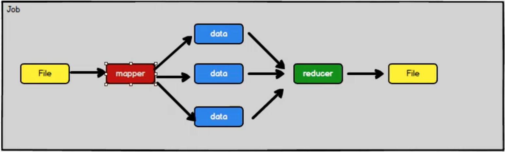
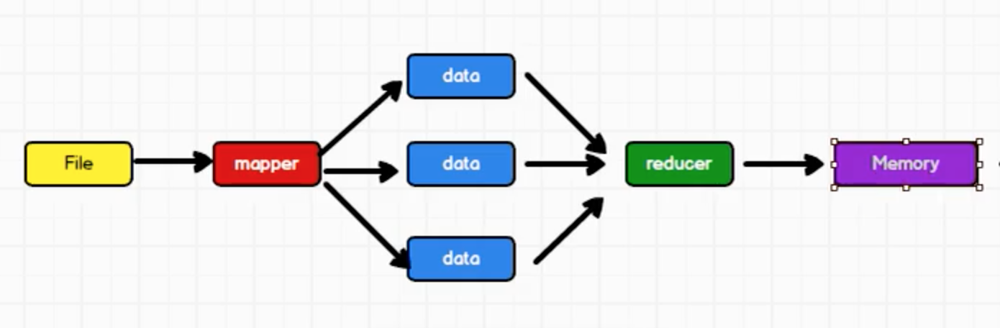
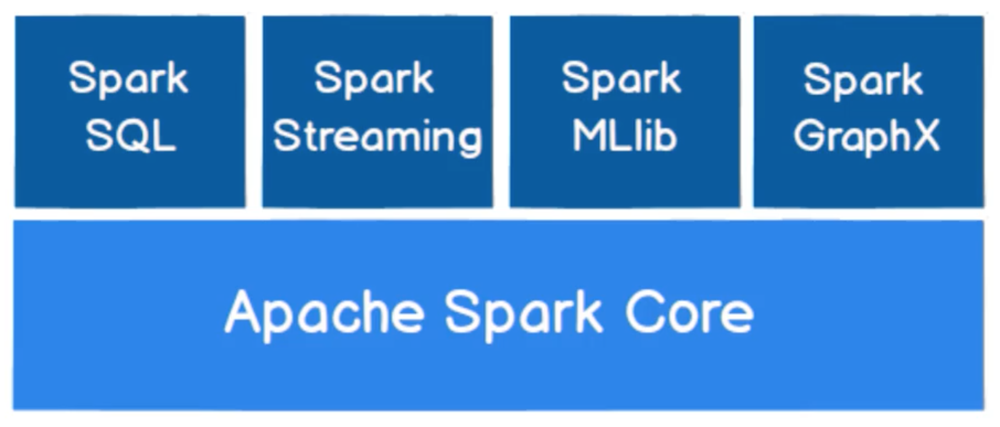

因为一些个人工作上的原因，对于当前主流的大数据框架确实缺少应用的需求，但自己也接触过一些相关领域的概念，一直以来有这些问题困扰着我，列一下这些问题，希望本文对这些问题能够有所解答

>Hadoop 的核心是分布式文件系统HDFS 和分布式计算系统Map Reduce。HDFS、Map Reduce 的底层原理是什么样的？

>Hive、HBase 底层的存储都是基于HDFS 的，Hive、HBase 存储数据的存储结构是什么样的？适用于存储什么类型的数据？

>Spark 本身并没有提供分布式文件系统，所以Spark 的分析大多依赖于Hadoop 的分布式文件系统HDFS

>Hadoop 的Map Reduce 与Spark 都可以进行数据计算，而相比于Map Reduce，Spark 的速度更快且功能更丰富，那么其分布式计算的原理有什么异同？

>什么是离线流处理？什么是实时流处理？

>Kafka、Spark、Storm、Flink 的流处理有什么异同？

## 各种流处理框架比较

>[Kafka Stream 以及其他流处理框架对比](https://www.cnblogs.com/zackstang/p/11522194.html)

[Storm](http://storm.apache.org/) 是最早的流处理框架，其低延时、高吞吐，适用于复杂度不高的流场景；但是没有状态管理，缺少事件-时间处理、聚合、窗口、Session、watermark 等高级功能；at-least-once 语义

Spark Streaming 非常流行，在[Spark](http://spark.apache.org/) 2.0 之后的版本，成为结构化的流（structured streaming），性能提升了很多，并且增加了很多高级功能，例如定制的内存管理、watermark、事件-时间处理等。在2.3.0 版本之后，structured streaming 除了可以（默认）使用micro-batching 处理之外，还可以选择continuous streaming 模式。在micro-batching 模式下，最低延时可达100ms，在continuous streaming 模式下，最低延时可达几毫秒。在大部分real-time 应用场景下，micro-batching 的延时是可以接受的。不过如果有必要实现毫秒级别的延时（比如信用卡交易欺诈之类的），则需要使用continuous streaming

虽然spark streaming 的continuous streaming 可以提供如Storm 与Flink 级别的低延时，不过它仅是一个预览版，尚未完全成熟

[Flink](https://flink.apache.org/) 是第一个真正的流处理框架，具有所有高级功能，例如事件-时间处理、watermarks等；低延时、高吞吐，可以根据需求做配置；自适应，相比于Spark 没有太多的参数需要调优；和Spark 一样，Exactly Once 语义。不过其仅在Streaming 中广泛使用，在Batch 场景中使用较少

[Kafka](http://kafka.apache.org/) 流处理每次处理一个条目，而不像Spark 是微批处理的

Kafka Stream 相较于其他所有流处理框架，是一个轻量级的库。常用于Kafka 中的数据，做一些转换，然后发回Kafka。由于它原生即轻量级，所以适用于一些微服务类型的框架中。Kafka Stream 的部署和使用非常简单，且并不需要额外建立一个集群去运行。它的内部使用的是Kafka Consumer Group，与Kafka Log 的机制共同实现流处理

Kafka Stream 一个最大的优点为：端到端的Exactly Once。启用时也仅需要启用一个flag 即可。另外它是非常轻量级的库，也继承了Kafka 的所有优点，但是它与Kafka 紧密联系，无法在没有Kafka 的场景下使用，另外，相比于Spark Streaming、Flink，不适用于大型业务场景

以上只是转载别人文章中的梳理，具体还得自己经过深入研究和大量对比使用后，才能在更多细节的权衡上有发言权！

## Hadoop 与Spark

>以下是[尚硅谷2020最新版大数据Spark从入门到精通](https://www.bilibili.com/video/BV11A411L7CK) 学习笔记

>之前整理过[认识Hadoop](http://www.xumenger.com/hadoop-20180731/)，可以对比看一下

Hadoop 是一个专用于批处理的数据处理框架，主要用于大规模数据批量处理。Hadoop 包括Map Reduce、HDFS、Yarn，通过配合这些组件使用可以进行批量处理

Spark 是一个包含流处理的批处理数据处理框架，主要通过内存计算等来优化批处理的速度。Spark Core 中提供了Spark 最基础和最核心的功能；Spark SQL 是Spark 用来操作结构化数据的组件，可以通过类似写SQL 的方式来查询数据；Spark Streaming 是Spark 平台上针对实时数据进行流式计算的组件，提供了丰富的处理流数据的API

有很多人认为Spark 是Hadoop 的一个升级版本

Hadoop MapReduce 由于其设计的初衷并不是为了满足循环迭代式数据流处理，适用于一次性数据处理计算，因此在多并行运行的数据可复用场景，比如机器学习、图挖掘算法、交互式数据挖掘算法等场景，存在诸多计算效率问题。因此Spark 应运而生，Spark 就是在传统的MapReduce 计算框架的基础上，利用计算过程的优化，从而大大加快了数据分析挖掘的运算和读写速度，并将计算单元缩小到适合并行计算和重复使用的RDD 计算模型

一次性数据计算：框架在处理数据的时候，会从存储设备中读取数据，进行逻辑操作，然后将处理的结果重新存储到介质中

>Map 过程将数据拆分；Reduce 过程聚合数据

但是这种数据的一次性计算在处理复杂逻辑的时候性能非常低，因为计算模型非常简单，只有Map 和Reduce，那么对于上层应用来说，不得不去拆分算法，甚至不得不在上层应用实现多个Job 的串联，把上一个Job 产生的数据（File）作为数据源。作业间的交互是通过磁盘，显然IO 是会拉低处理的速度的

Spark 提供了更为丰富的数据处理模型，而且可以基于内存实现数据的多次迭代

Spark 和Hadoop 的根本差异是多个作业之间的数据通信问题：Spark 多个作业之间数据通信是基于内存，而Hadoop 是基于磁盘

Spark Task 的启动时间快。Spark 采用fork 线程的方式，而Hadoop 采用创建新的进程的方式

Spark 只有在shuffle 的时候才将数据写入磁盘，而Hadoop 中多个MR 作业之间的数据交互都依赖于磁盘

同样的，因为Spark 基于内存，所以会占用更多内存资源，有时候会因为占有内存资源导致Job 工作失败，那么这种情况下可能就更适合Hadoop 的Map Reduce 计算框架了

Spark 核心模块

* Spark Core 是核心，其他的都是基于此实现的
* Spark SQL 是用于操作结构化数据
* Spark Streaming 是用于对流式数据进行处理的模块
* Spark MLib 是用于机器学习
* Spark GraphX 是用于图形挖掘计算

## 参考资料

* [Storm 官网](http://storm.apache.org/)
* [Flink 官网](https://flink.apache.org/)
* [Kafka 官网](http://kafka.apache.org/)
* [Spark 官网](http://spark.apache.org/)
* [Kafka Stream 以及其他流处理框架对比](https://www.cnblogs.com/zackstang/p/11522194.html)
* [Spark项目实战:大数据实时流处理日志(非常详细)](https://blog.csdn.net/qq_41955099/article/details/88959996)