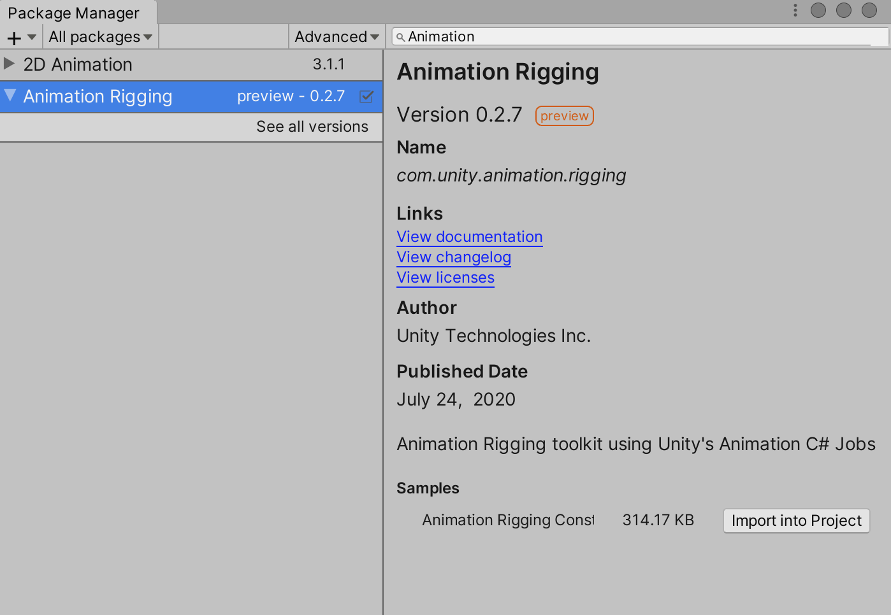
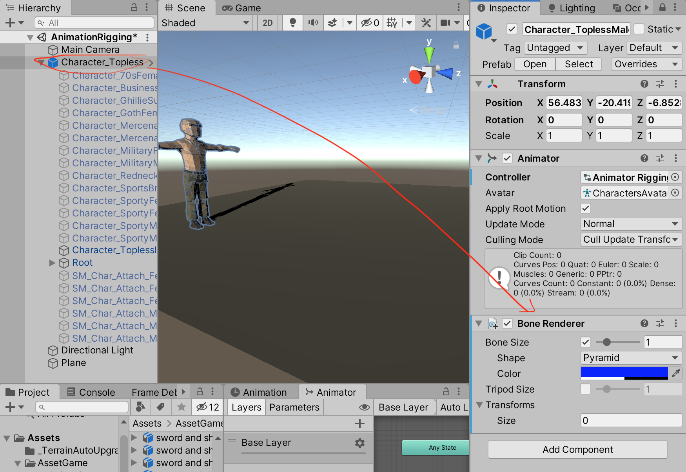
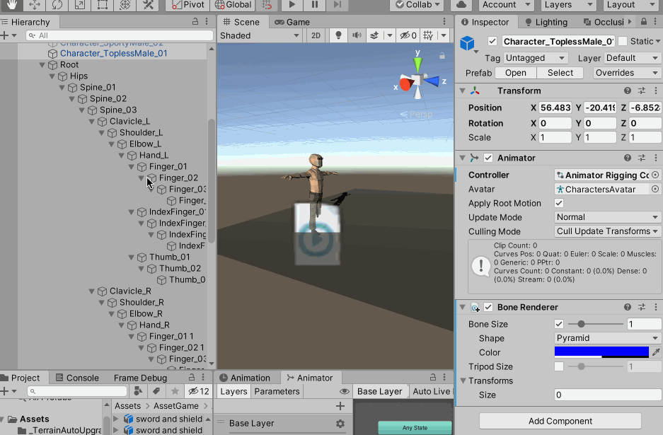
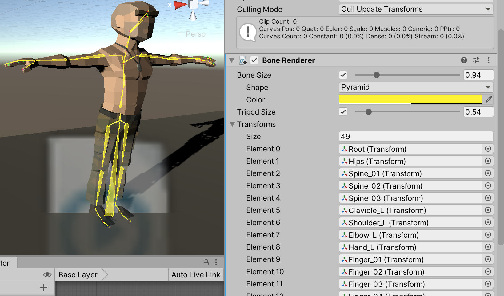

>[https://docs.unity3d.com/Packages/com.unity.animation.rigging@0.2/manual/index.html](https://docs.unity3d.com/Packages/com.unity.animation.rigging@0.2/manual/index.html)

>[达哥的Animation Rigging功能讲解](https://www.bilibili.com/video/BV1dT4y137ps)

>[[Animation Rigging]真的太强大了，可以干这事！](https://www.bilibili.com/video/BV1yE411V7k9)

本文主要是针对上面资料的笔记！！整理使用Animation Rigging 的工作流！

Animation Rigging 是基于Animation C# Jobs 构建的程序化动画绑定系统，支持运行时更新骨架运行行为！

## Rigging 基础概念

Rig Builder 与Animator 位于同一物体上，在内部会生成PlayableGraph 并加到现有的动画状态机上。Rig Builder 主要是依照现有的骨架行为，要把新的位置覆盖上去，Rig Builder 主要是把要做运算的东西，连贯到Animator 里面

Rig Builder 支持多个Rig，比如一个角色处于Idle 状态时，可能要拿着武器Idle，或者挥手Idle，这个时候就可以在这个角色物体下面创建一个空物体，比如命名为Rig，然后在这个空物体下添加几个Rig 组件，这样这个角色就可以Rig Builder 组件下面添加这些Rig 组件

Rig Builder组件 位于物体根层级下；要在物体根层级下建一个空物体，Rig组件放在这个层级下！这样这个Rig 组件中带有的限制器就可以把这个信息通过Rig Builder 把它传到Animator，覆盖Animator 现在正在播放的动作！比如有一个走路的动作，播放到一半，要拔武器，就可以从Rig Builder 中传送新的坐标过来，这样就可以播放新的动画。这样就可以实现下半身走路，上半身拔武器的效果！

Rig 负责收集子节点的约束组件，并按照顺序（深度优先）生成IAnimationJob 的列表，需要注意的是，Rig 节点需要和骨骼的根结点位于同一层级

最后还要绑定Rig Constraints，也就是限制器，限制器是这个系统的精华，要绑定两个骨架之间的限制，比如如果有敌人过来时，头要看着他，但是不能360 度的看，就需要通过限制器来限制如果有敌人进入角色的实现，要看向这个敌人，但只能有270 度范围，如果超过270 度就定位在最终的角度，后面如果再有敌人进入视线范围，则重新看向这个敌人。可以约束头部在某个条件之下，做该有的动作行为，但是身体并没有被约束，身体还可以继续播放Idle、Attack 等动画。类似的，全身上下都可以分成一块一块地来做

许多骨架动作被放在同一个角色下，可同时用权重来调整批次的呈现比例

这个功能是在Unity 2019 才开始支持的，通过Package Manager 进行安装！（如果没有搜索到，是因为需要打开Advanced，勾选show preview packages）

## 先把骨骼渲染出来

为了更好地看到使用Animation Rigging 后的效果，可以先把角色的骨骼渲染出来，使用Bone Render 组件

然后选中这个角色的所有骨骼，拖到Bone Render 组件的Transform 属性上

调整骨骼显示的样式、颜色，可以看到骨骼渲染出来的效果

## 

