>[https://docs.unity3d.com/Packages/com.unity.animation.rigging@0.2/manual/index.html](https://docs.unity3d.com/Packages/com.unity.animation.rigging@0.2/manual/index.html)

>[达哥的Animation Rigging功能讲解](https://www.bilibili.com/video/BV1dT4y137ps)

>[[Animation Rigging]真的太强大了，可以干这事！](https://www.bilibili.com/video/BV1yE411V7k9)

本文主要是针对上面资料的笔记！！整理使用Animation Rigging 的工作流！

Animation Rigging 是基于Animation C# Jobs 构建的程序化动画绑定系统，支持运行时更新骨架运行行为！

## Rigging 基础概念

Rig Builder 与Animator 位于同一物体上，在内部会生成PlayableGraph 并加到现有的动画状态机上。Rig Builder 主要是依照现有的骨架行为，要把新的位置覆盖上去，Rig Builder 主要是把要做运算的东西，连贯到Animator 里面

Rig Builder 支持多个Rig，比如一个角色处于Idle 状态时，可能要拿着武器Idle，或者挥手Idle，这个时候就可以在这个角色物体下面创建一个空物体，比如命名为Rig，然后在这个空物体下添加几个Rig 组件，这样这个角色就可以Rig Builder 组件下面添加这些Rig 组件

Rig Builder组件 位于物体根层级下；要在物体根层级下建一个空物体，Rig组件放在这个层级下！这样这个Rig 组件中带有的限制器就可以把这个信息通过Rig Builder 把它传到Animator，覆盖Animator 现在正在播放的动作！比如有一个走路的动作，播放到一半，要拔武器，就可以从Rig Builder 中传送新的坐标过来，这样就可以播放新的动画。这样就可以实现下半身走路，上半身拔武器的效果！

Rig Builder 组件所在的物体上也要有Animator Controller 组件！

Rig 负责收集子节点的约束组件，并按照顺序（深度优先）生成IAnimationJob 的列表，交给Rig Builder 进行执行，需要注意的是，Rig 节点需要和骨骼的根结点位于同一层级

最后还要绑定Rig Constraints，也就是限制器，限制器是这个系统的精华，要绑定两个骨架之间的限制，比如如果有敌人过来时，头要看着他，但是不能360 度的看，就需要通过限制器来限制如果有敌人进入角色的实现，要看向这个敌人，但只能有270 度范围，如果超过270 度就定位在最终的角度，后面如果再有敌人进入视线范围，则重新看向这个敌人。可以约束头部在某个条件之下，做该有的动作行为，但是身体并没有被约束，身体还可以继续播放Idle、Attack 等动画。类似的，全身上下都可以分成一块一块地来做

许多骨架动作被放在同一个角色下，可同时用权重来调整批次的呈现比例

这个功能是在Unity 2019 才开始支持的，通过Package Manager 进行安装！（如果没有搜索到，是因为需要打开Advanced，勾选show preview packages）

## 先把骨骼渲染出来

为了更好地看到使用Animation Rigging 后的效果，可以先把角色的骨骼渲染出来，使用Bone Render 组件。把骨骼渲染出来是为了后面做Rigging 的时候方便选中特定骨骼

然后选中这个角色的所有骨骼，拖到Bone Render 组件的Transform 属性上

调整骨骼显示的样式、颜色，可以看到骨骼渲染出来的效果

## 实现一个角色手部的约束

为角色心中一个Rig Builder 组件，可以看到Rig Builder 组件下只有一个Rig Layers 属性，这个会在后面添加

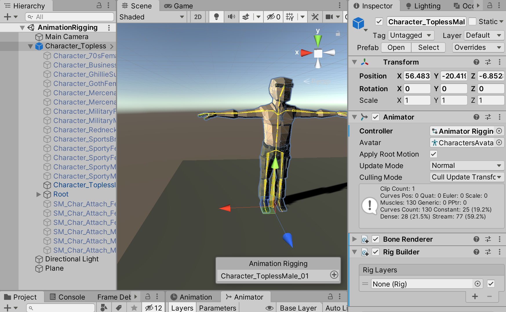

在角色根节点下新增一个空物体，命名为Rig，在这个物体上新增一个Rig 组件

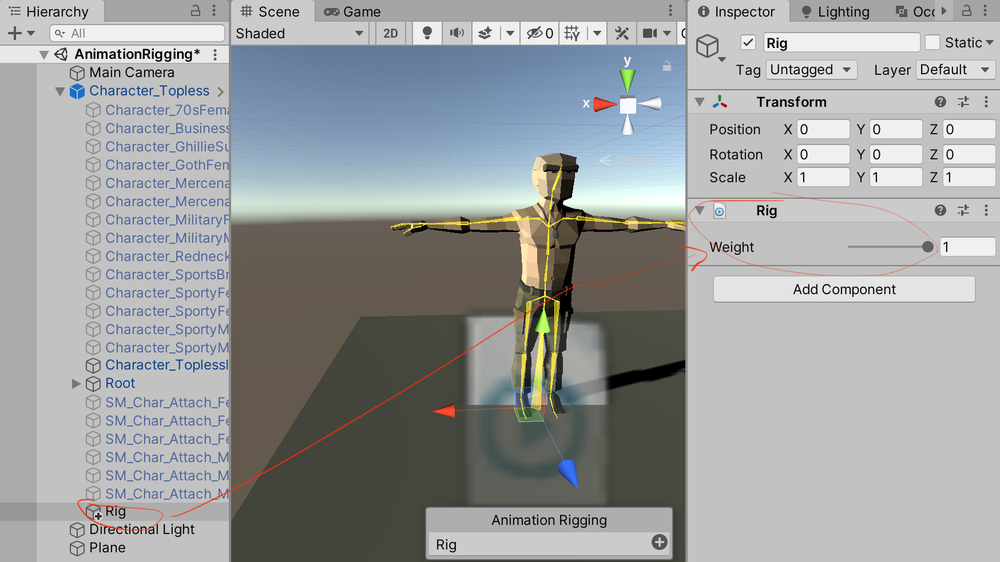

在这个Rig 空物体下面新增一个空物体，用于控制右手的动作，比如命名为RightHandIK，为这个空物体新增一个约束器，手部动作的约束和关节相关，最好使用[Two Bone IK Constraint](https://docs.unity3d.com/Packages/com.unity.animation.rigging@0.2/manual/constraints/TwoBoneIKConstraint.html)

>Animation Rigging 提供了各种约束器，包括[Blend Constraint](https://docs.unity3d.com/Packages/com.unity.animation.rigging@0.2/manual/constraints/BlendConstraint.html)、[Chain IK Constraint](https://docs.unity3d.com/Packages/com.unity.animation.rigging@0.2/manual/constraints/ChainIKConstraint.html)、[Damped Transform](https://docs.unity3d.com/Packages/com.unity.animation.rigging@0.2/manual/constraints/DampedTransform.html)、[Multi-Aim Constraint](https://docs.unity3d.com/Packages/com.unity.animation.rigging@0.2/manual/constraints/MultiAimConstraint.html)、[Multi-Parent Constraint](https://docs.unity3d.com/Packages/com.unity.animation.rigging@0.2/manual/constraints/MultiParentConstraint.html)、[Multi-Position Constraint](https://docs.unity3d.com/Packages/com.unity.animation.rigging@0.2/manual/constraints/MultiPositionConstraint.html)、[Multi-Referential Constraint](https://docs.unity3d.com/Packages/com.unity.animation.rigging@0.2/manual/constraints/MultiReferentialConstraint.html)、[Multi-Rotation Constraint](https://docs.unity3d.com/Packages/com.unity.animation.rigging@0.2/manual/constraints/MultiRotationConstraint.html)、[Override Transform](https://docs.unity3d.com/Packages/com.unity.animation.rigging@0.2/manual/constraints/OverrideTransform.html)、[Twist Correction](https://docs.unity3d.com/Packages/com.unity.animation.rigging@0.2/manual/constraints/TwistCorrection.html)、[Two Bone IK Constraint](https://docs.unity3d.com/Packages/com.unity.animation.rigging@0.2/manual/constraints/TwoBoneIKConstraint.html)

>本文重点只展示[Two Bone IK Constraint](https://docs.unity3d.com/Packages/com.unity.animation.rigging@0.2/manual/constraints/TwoBoneIKConstraint.html)的使用，其他的约束器一样有自己适用的场景

>比如[B 站up 主samlee2018](https://space.bilibili.com/291230921) 实现的各种程序化动画的效果！

[Two Bone IK Constraint](https://docs.unity3d.com/Packages/com.unity.animation.rigging@0.2/manual/constraints/TwoBoneIKConstraint.html) 做关节之间的约束，比如手往后抽的话，这个约束器可以实现在遇到什么角度的时候，实现Rotation、Position 对应变换。对应有三个参数：Root（根节点在哪里）、Mid（中间关节在哪里）、Tip（末端关节在哪里）

为Root 添加骨架上的右上臂的那根骨头Shoulder_R；为Mid 添加骨架上的右手小手臂Elbow_R；为Tip 添加骨架上的右手Hand_R。这样就有三个关节被绑定到约束器上

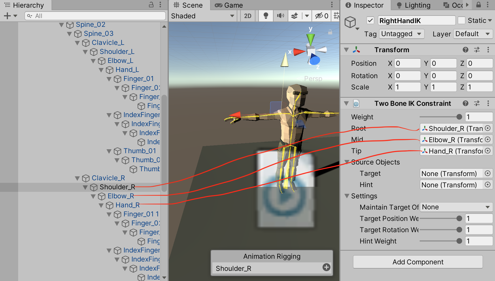

为了方便控制，可以看到在Two Bone IK Constraint 组件上还有一个Source Objects 属性，可以做到通过一个控制点控制这个约束器，在RightHandIK 下面新增两个空物件，分别命名为Target、Hit，指定给对应的属性

Target 用来移动的物体；比如关节扭到左边或者右边都是合法的，Hint 主要是用来做第二个位置的协调，来控制扭转的修正

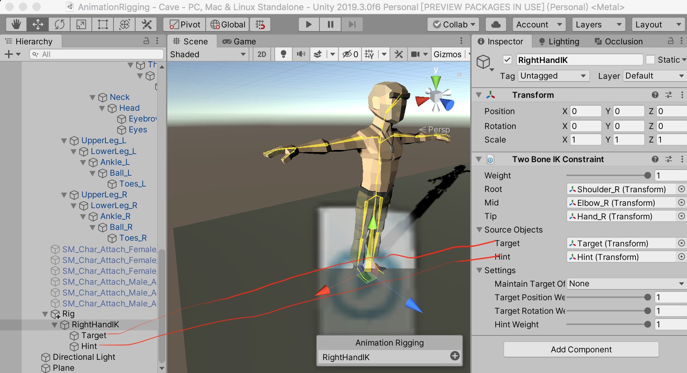

同时可以为Target、Hint 设置两个虚拟的控制点，其实就是做出来一个可视化的控制物体，一般IK 都是这么做的，为了区分Target 与Hint，Target 的Shape 设置为一个正方体，Hint 的Shape 设置为一个球体。因为要控制右手，所以对应调节到右手的位置

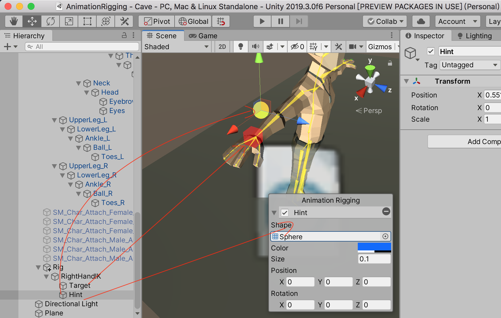

别忘了为Rig Builder 添加刚才的新建的Rig

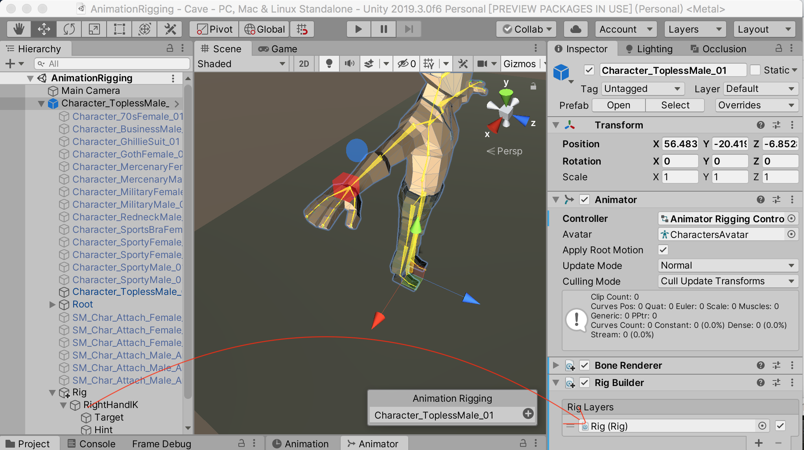

因为希望将Target 放在右手位置，来实现控制“右手”驱动整个手臂的动作，所以需要将按住Command 键，选中Target 和右手骨骼（Hand_R），然后【Animation Rigging】->【Align Transform】

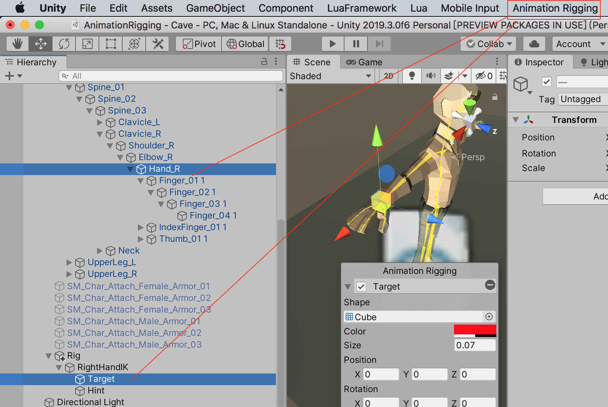

试着将游戏运行起来，然后在Scene 窗口调整Target、Hint 的位置，可以实现实时调整动画的效果

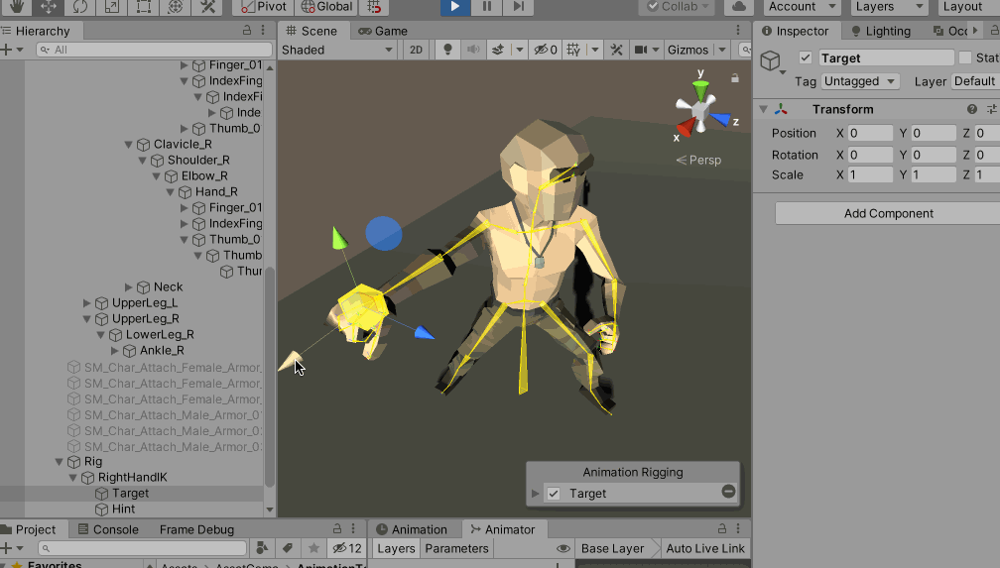

上面是随便调整Target 的效果，显然，有一些时刻的动作不舒服，所以接下来就是调整动画的流程，首先将程序运行起来，将Two Bone IK Constraint 组件Weight 的值设置为1，然后在Scene 窗口调整Target、Hint 的Position、Rotation 值以使得模型摆放为某个姿势

记录下此时Target、Hint 的Transform 值，然后游戏停止，将这个值作为调优后的值回填回对应的，相当于找到了一个想要的效果，比如我现在通过调整Target、Hint 的位置和旋转，摆出了这样的一个姿势

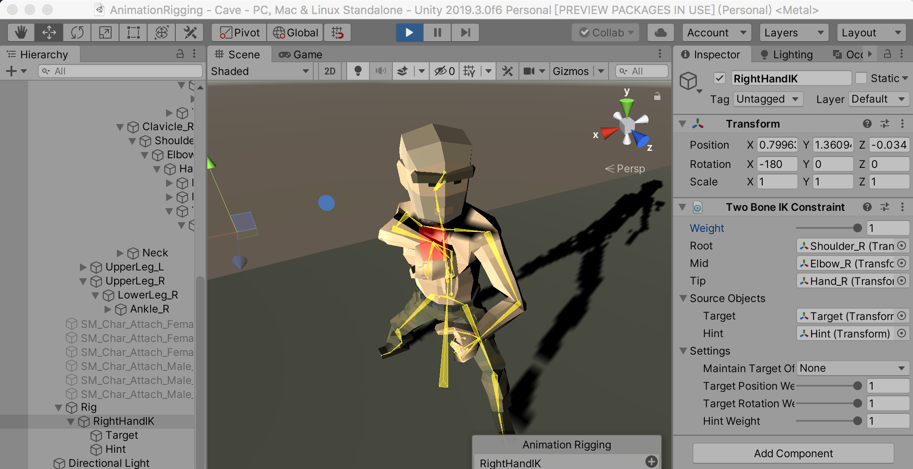

>特别强调，确定Target、Hint 的Transform 属性的过程，需要从0 慢慢增加Two Bone IK Constraint 组件Weight 的值到1，看哪个时刻的动作变化不舒服，再去试着调整Target 或者Hint 的位置和旋转，尤其是Hint 物件的属性，慢慢调整出一个好的动画渐变效果。而不是只看最终摆出来的效果，要看整个动作的变化过程！所以动画师的工作没有那么好做

复制刚才姿势下，Target、Hint 的位置和旋转的值（因为游戏停止后，这些调整好的值就又变回去了），停止游戏，再回填到Target、Hint上

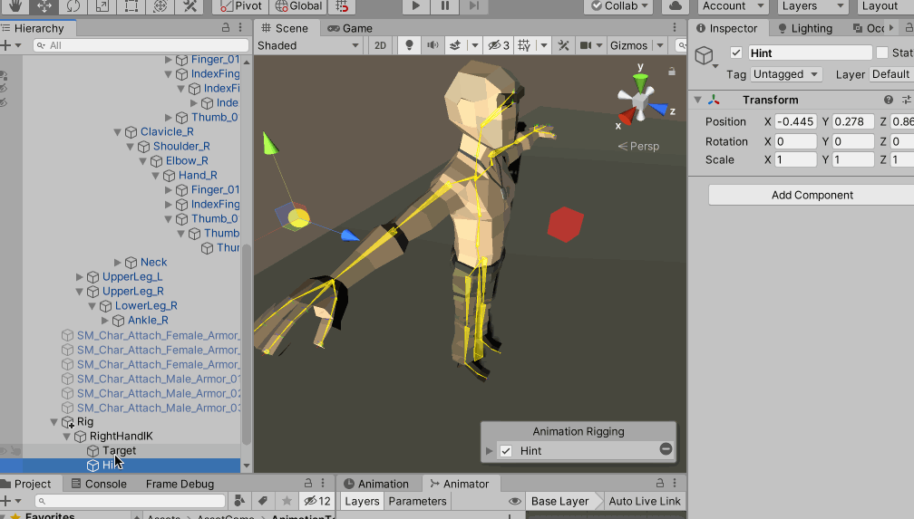

然后重新运行游戏，就可以通过调整Two Bone IK Constraint 组件Weight 的值来控制动作的变化了，实现了一个粗糙的出拳的动作

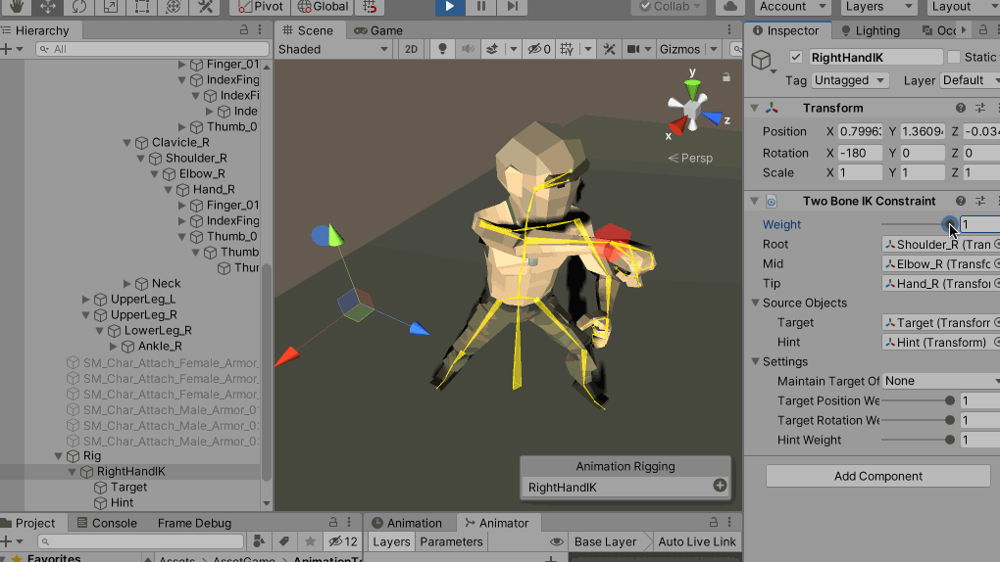

比如可以通过添加C# 脚本控制Two Bone IK Constraint 组件Weight 的值来在程序运行的时候，实时地更改动画效果

类似地，可以分别为右手、右腿、头部等身体的不同部分分别添加Rig，来分别进行控制

## 多个动作组合

使用上面相同的方法，来为角色的右腿摆放出踢腿的动作

在Rig 物体下新增一个空物体，命名为RightLegIK，然后为其添加Two Bone IK Constraint 组件，然后将大腿骨骼(UpperLeg_R）添加为Root，小腿骨骼（LowerLeg_R）添加为Mid，脚踝（Ankle_R）添加为Tip

然后新增右腿IK 对应的Target、Hint

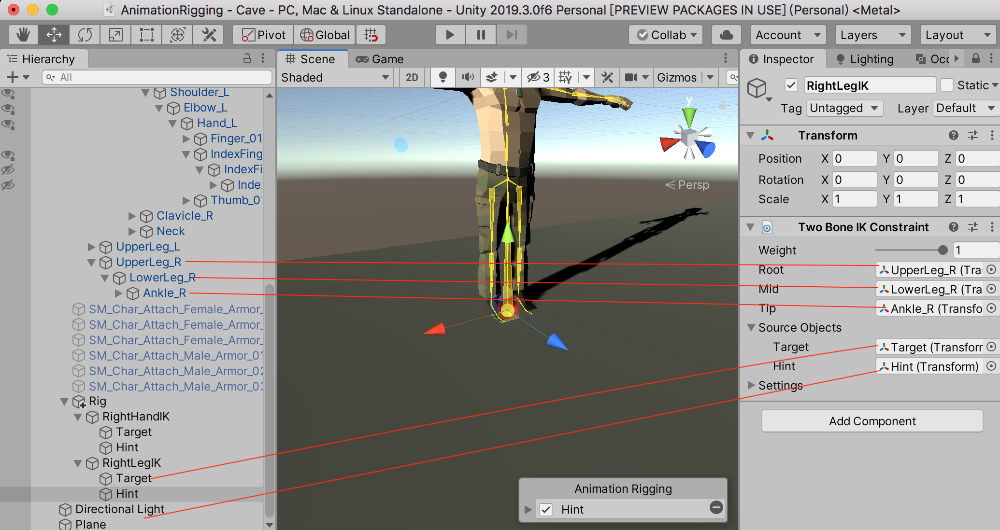

同样参考上面的步骤，去调整动画动作

调整腿部动作完成后，可以通过统一控制Rig 物件上的Rig 组件的Weight 属性，可以控制Rig 物件下所有约束器的Weight 来实现多个动作的同时播放

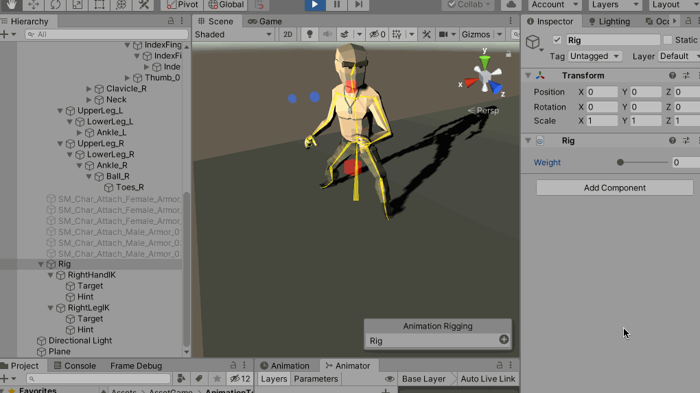

当然因为没有调整胯部的动作，所以这个动画看起来很尴尬，不过不影响展示出Animation Rigging 的强大！

这次是基于已有的罐头动画做出来的效果，所以也可以看出整个动画的制作流程是多么的复杂，尤其是想要做出来逼真的动作，需要动画师花大量的精力去调整、优化！

另外，上面提到除了Two Bone IK Constraint，Animation Rigging 提供了更多的约束器：[Blend Constraint](https://docs.unity3d.com/Packages/com.unity.animation.rigging@0.2/manual/constraints/BlendConstraint.html)、[Chain IK Constraint](https://docs.unity3d.com/Packages/com.unity.animation.rigging@0.2/manual/constraints/ChainIKConstraint.html)、[Damped Transform](https://docs.unity3d.com/Packages/com.unity.animation.rigging@0.2/manual/constraints/DampedTransform.html)、[Multi-Aim Constraint](https://docs.unity3d.com/Packages/com.unity.animation.rigging@0.2/manual/constraints/MultiAimConstraint.html)、[Multi-Parent Constraint](https://docs.unity3d.com/Packages/com.unity.animation.rigging@0.2/manual/constraints/MultiParentConstraint.html)、[Multi-Position Constraint](https://docs.unity3d.com/Packages/com.unity.animation.rigging@0.2/manual/constraints/MultiPositionConstraint.html)、[Multi-Referential Constraint](https://docs.unity3d.com/Packages/com.unity.animation.rigging@0.2/manual/constraints/MultiReferentialConstraint.html)、[Multi-Rotation Constraint](https://docs.unity3d.com/Packages/com.unity.animation.rigging@0.2/manual/constraints/MultiRotationConstraint.html)、[Override Transform](https://docs.unity3d.com/Packages/com.unity.animation.rigging@0.2/manual/constraints/OverrideTransform.html)、[Twist Correction](https://docs.unity3d.com/Packages/com.unity.animation.rigging@0.2/manual/constraints/TwistCorrection.html)、[Two Bone IK Constraint](https://docs.unity3d.com/Packages/com.unity.animation.rigging@0.2/manual/constraints/TwoBoneIKConstraint.html)，这些约束器可以做出来更多有意思的效果！

## 推荐资料

* [B 站up 主samlee2018](https://space.bilibili.com/291230921)
* [【ANIMATION RIGGING】JIGGLE CHAIN实现树枝晃动+SHADER动画实现花草晃动](http://rainyeve.com/wordpress/?p=441)
* [[官方直播] Unity最新程序化动画绑定(Animation Rigging)技术介绍](https://www.bilibili.com/video/BV1Z4411f7xk)