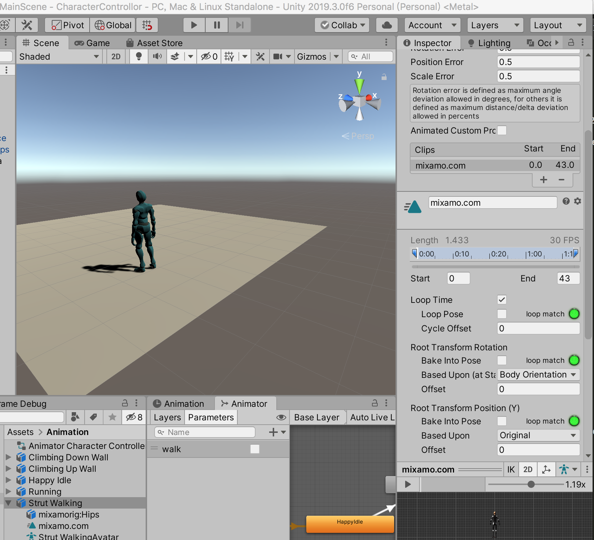

因为我不是美术人员，所以需要用到的角色模型和动画资源，目前全部都来自[https://www.mixamo.com/](https://www.mixamo.com/)，Unity 版本是2019.3.0.6f

本次动作系统作为开源项目，其项目地址为[https://github.com/xumenger/CharactorAnimatorSystem/tree/main](https://github.com/xumenger/CharactorAnimatorSystem/tree/main)

对应的一些教程性的视频，我会录制到B 站，视频地址：[https://www.bilibili.com/video/BV1xV411a75s/](https://www.bilibili.com/video/BV1xV411a75s/)

目前基于最简单的动画状态机的思路来进行设计和开发，本文主要记录大致的设计思路和注意事项！

## 操作设计

操作  &nbsp;&nbsp;&nbsp;&nbsp;&nbsp;&nbsp;&nbsp;&nbsp;        | 说明 &nbsp;&nbsp;&nbsp;&nbsp;&nbsp;&nbsp;&nbsp;&nbsp;&nbsp;&nbsp;&nbsp;&nbsp;&nbsp;&nbsp;&nbsp;&nbsp;&nbsp;&nbsp;&nbsp;&nbsp;&nbsp;&nbsp;&nbsp;&nbsp;&nbsp;&nbsp;&nbsp;&nbsp;&nbsp;&nbsp;&nbsp;&nbsp;&nbsp;&nbsp;
------------ | -------------
W键           | 角色向前运动：走路、跑步、向上爬
A键           | 角色向左运动：走路、跑步、向左爬
S键           | 角色向后运动：走路、跑步、向下爬
D键           | 角色向右运动：走路、跑步、向右爬
Shift键       | 角色加速开始跑
鼠标左键       | 攻击

## 动画状态机设计

下面的列表会慢慢补充完善更多的动作

动作  &nbsp;&nbsp;&nbsp;&nbsp;&nbsp;&nbsp;&nbsp;&nbsp;        | 说明   &nbsp;&nbsp;&nbsp;&nbsp;&nbsp;&nbsp;&nbsp;&nbsp;       | 状态转换 &nbsp;&nbsp;&nbsp;&nbsp;&nbsp;&nbsp;&nbsp;&nbsp;&nbsp;&nbsp;&nbsp;&nbsp;&nbsp;&nbsp;&nbsp;&nbsp;&nbsp;&nbsp;&nbsp;&nbsp;&nbsp;&nbsp;&nbsp;&nbsp;&nbsp;&nbsp;&nbsp;&nbsp;&nbsp;&nbsp;&nbsp;&nbsp;&nbsp;&nbsp; 
------------ | ------------- | -------------------
Idle         | 空闲状态       | 游戏最开始时处于该状态

## Loop Time

如果动画播放完之后，变停止播放，但是我们却希望其一直播放，比如在按住【W】键的时候，希望一直播放Walk 动画，那么可以选中Walk 动画文件，勾选起Loop Time

## Blend Tree

