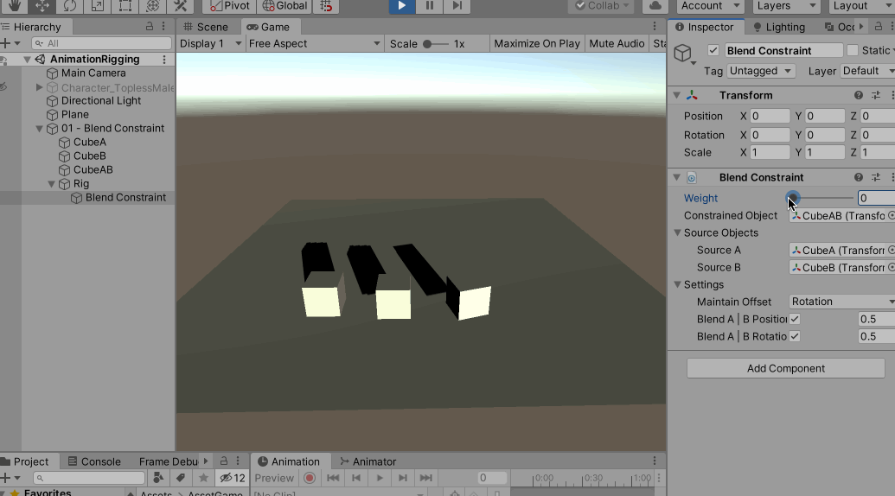
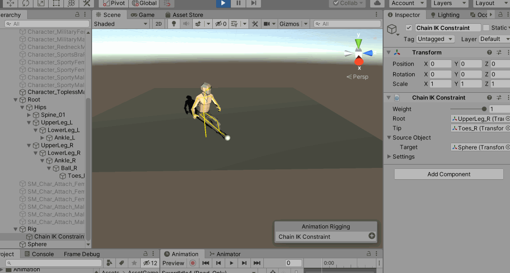

在上一篇文章中提到了Animation Rigging 的[Two Bone IK Constraint](https://docs.unity3d.com/Packages/com.unity.animation.rigging@0.2/manual/constraints/TwoBoneIKConstraint.html)。同时提到了Animation Rigging 还提供了其他更多的约束器，这里参考官方文档逐个研究一下

## [Blend Constraint](https://docs.unity3d.com/Packages/com.unity.animation.rigging@0.2/manual/constraints/BlendConstraint.html)

新增一个空物体命名为01 - Blend Constraint，为其添加Rig Builder，在这个物体下面分别建CubeA（为其制作位置移动的动画）、CubeB（为其制作旋转的动画）、CubeAB（用于测试Blend Constraint）

在01 - Blend Constraint 下面继续建一个空物体，命名为Rig，然后为其添加Rig 组件，将这个Rig 物体设置为01 - Blend Constraint 的Rig Builder 中对应的Rig Layer 属性

在Rig 下面新增一个空物体，命名为Blend Constraint，为其添加Blend Constraint 组件，然后Constrained Object 设置为CubeAB，SourceA 设置为CubeA，SourceB 设置为CubeB，其运行效果如下

>在这个案例中，特别需要注意Rig Builder、Rig、Blend Constraint 组件对应的物体的相对位置，另外CubeA、CubeB、CubeAB 也都必须属于Rig Builder 组件所在的物体的下级节点！

## [Chain IK Constraint](https://docs.unity3d.com/Packages/com.unity.animation.rigging@0.2/manual/constraints/ChainIKConstraint.html)

## [Damped Transform](https://docs.unity3d.com/Packages/com.unity.animation.rigging@0.2/manual/constraints/DampedTransform.html)

## [Multi-Aim Constraint](https://docs.unity3d.com/Packages/com.unity.animation.rigging@0.2/manual/constraints/MultiAimConstraint.html)

## [Multi-Parent Constraint](https://docs.unity3d.com/Packages/com.unity.animation.rigging@0.2/manual/constraints/MultiParentConstraint.html)

## [Multi-Position Constraint](https://docs.unity3d.com/Packages/com.unity.animation.rigging@0.2/manual/constraints/MultiPositionConstraint.html)

## [Multi-Referential Constraint](https://docs.unity3d.com/Packages/com.unity.animation.rigging@0.2/manual/constraints/MultiReferentialConstraint.html)

## [Multi-Rotation Constraint](https://docs.unity3d.com/Packages/com.unity.animation.rigging@0.2/manual/constraints/MultiRotationConstraint.html)

## [Override Transform](https://docs.unity3d.com/Packages/com.unity.animation.rigging@0.2/manual/constraints/OverrideTransform.html)

## [Twist Correction](https://docs.unity3d.com/Packages/com.unity.animation.rigging@0.2/manual/constraints/TwistCorrection.html)、

