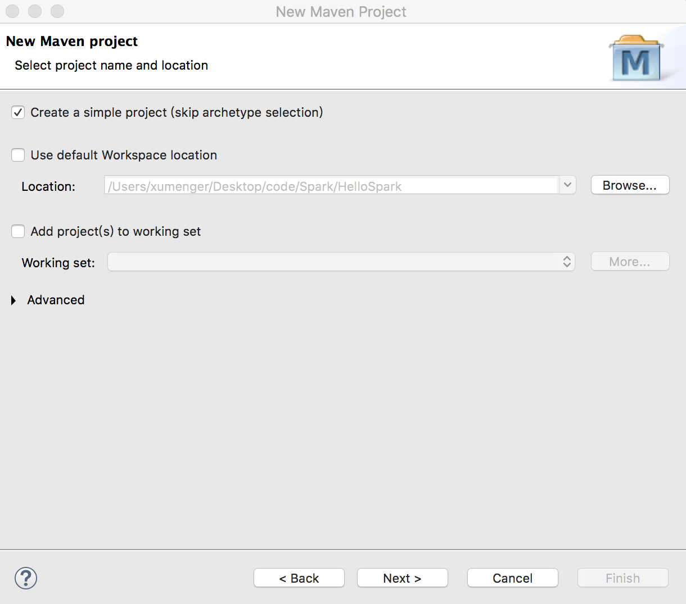
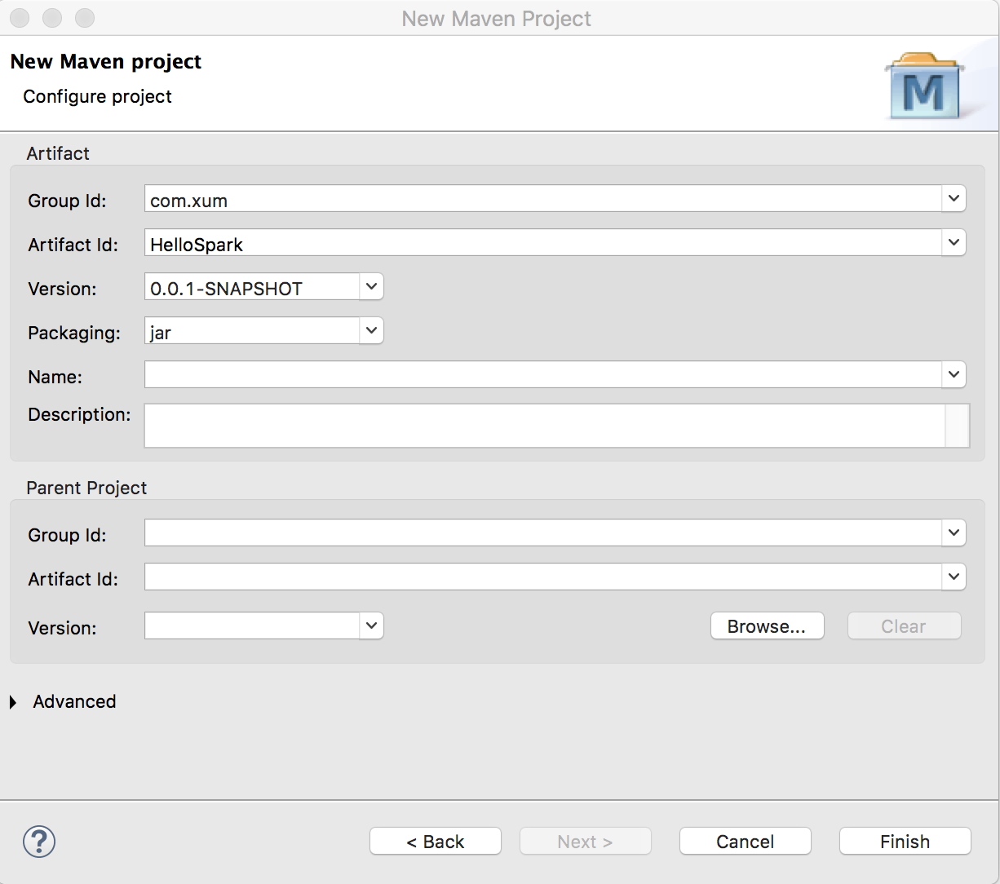
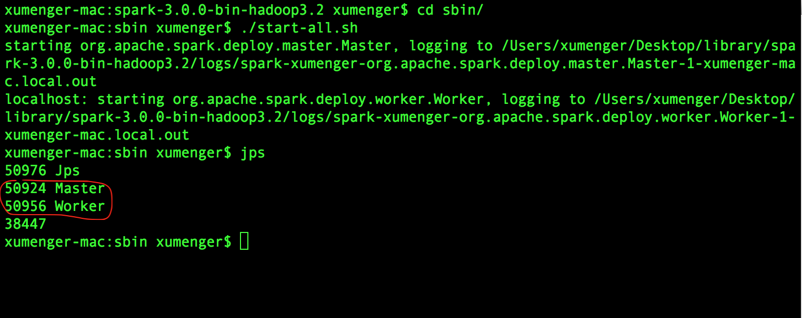
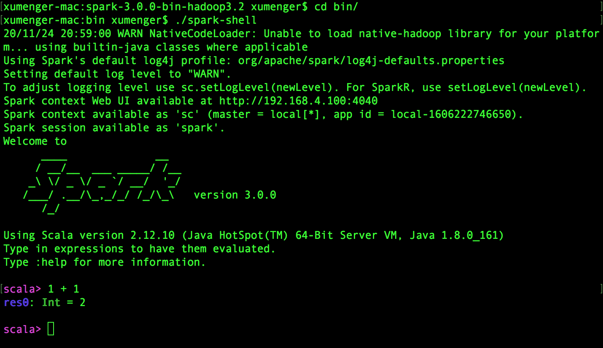
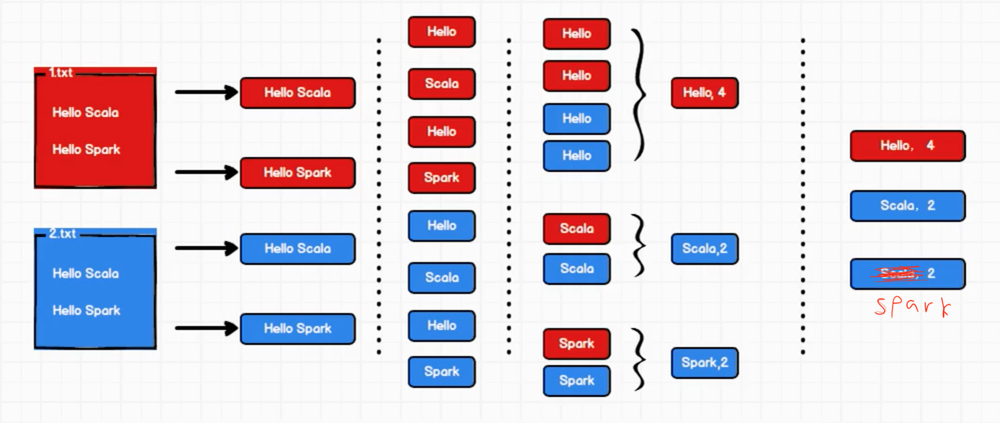

## 新建一个Scala 项目

在Scala IDE 中新建一个Maven 应用





此时创建的工程还不是Scala 的工程，在项目名称上点击右键-->Configure-->Add Scala Nature

点击Add Scala Nature 后项目才转换为Scala-Maven 项目

>推荐[eclipse + maven + scala + spark环境搭建](https://www.cnblogs.com/wmm15738807386/p/6723391.html)

编写测试代码

```scala
object HelloSpark {
  def main(args: Array[String]): Unit = {
    println("HelloWorld")
  }
}
```

运行效果如下


下面的案例需要依赖Spark-Core，这里先加好依赖

```xml
<dependency>
    <groupId>org.apache.spark</groupId>  
    <artifactId>spark-core_2.12</artifactId>  
    <version>3.0.0</version>  
</dependency>
```

## 搭建Spark 环境

进入官网下载页面[https://archive.apache.org/dist/spark/spark-3.0.0/](https://archive.apache.org/dist/spark/spark-3.0.0/)

选择下载spark-3.0.0-bin-hadoop3.2.tgz，这样就不用事先安装Hadoop 了

下载完成后，放到指定目录，然后按照下面的步骤操作

```shell
# 解压缩该文件
sudo tar -zvxf spark-3.0.0-bin-hadoop3.2.tgz

# 配置环境变量
sudo vim ~/.bash_profile

# 在配置文件里添加如下配置后保存退出
export SPARK_HOME="/Users/xumenger/Desktop/library/spark-3.0.0-bin-hadoop3.2"
export PATH=$PATH:$SPARK_HOME/bin

# 配置文件生效
source ~/.bash_profile
```

进入Spark 的目录中的sbin 子目录下，启动Spark：./start-all.sh



进去Spark目录下的bin子目录，使用Spark Shell 进行测试：./spark-shell



## Word Count 案例实现

>全部参考[尚硅谷2020最新版大数据Spark从入门到精通](https://www.bilibili.com/video/BV11A411L7CK?p=5)



编写代码如下

```scala
object HelloSpark {
  def main(args: Array[String]): Unit = {
    // 创建和Spark 框架的连接
    val sparkConf = new SparkConf().setMaster("local").setAppName("WordCount")
    val sc = new SparkContext(sparkConf)

    // 编写业务逻辑

    // 关闭连接
    sc.stop()

  }
}
```