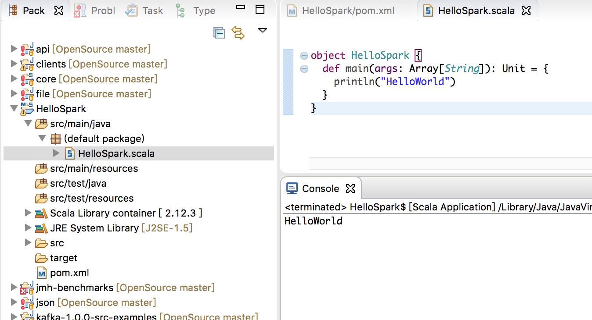

## 新建一个Scala 项目

在Scala IDE 中新建一个Maven 应用


此时创建的工程还不是Scala 的工程，在项目名称上-->点击右键-->Configure-->Add Scala Nature

点击Add Scala Nature 后项目才转换为Scala-Maven 项目

>推荐[eclipse + maven + scala + spark环境搭建](https://www.cnblogs.com/wmm15738807386/p/6723391.html)

编写测试代码

```scala
package com.xum

object HelloSpark {
  def main(args: Array[String]): Unit = {
    println("HelloWorld")
  }
}
```

运行效果如下



下面的案例需要依赖Spark-Core，这里先加好依赖

```xml
  <dependencies>
    <dependency>
      <groupId>org.apache.spark</groupId>  
      <artifactId>spark-core_2.12</artifactId>  
      <version>3.0.0</version>  
    </dependency>
  </dependencies>
```

这时候，点击项目-->Run As--> Maven Test

## 搭建Spark 环境

进入官网下载页面[https://archive.apache.org/dist/spark/spark-3.0.0/](https://archive.apache.org/dist/spark/spark-3.0.0/)

选择下载spark-3.0.0-bin-hadoop3.2.tgz，这样就不用事先安装Hadoop 了

下载完成后，放到指定目录，然后按照下面的步骤操作

```shell
# 解压缩该文件
sudo tar -zvxf spark-3.0.0-bin-hadoop3.2.tgz

# 配置环境变量
sudo vim ~/.bash_profile

# 在配置文件里添加如下配置后保存退出
export SPARK_HOME="/Users/xumenger/Desktop/library/spark-3.0.0-bin-hadoop3.2"
export PATH=$PATH:$SPARK_HOME/bin

# 配置文件生效
source ~/.bash_profile
```

进入Spark 的目录中的sbin 子目录下，启动Spark：./start-all.sh（这个是用来启动集群环境）


进去Spark目录下的bin子目录，使用Spark Shell 进行测试：./spark-shell（这个是用来启动本地环境）


准备一个测试用的文件，内容如下

```
Hello Spark
Hello Scala
```

然后通过在Spark 运行环境下对其进行单词统计工作：

```
sc.textFile("/Users/xumenger/Desktop/code/Spark/data/1.txt").flatMap(_.split(" ")).map((_, 1)).reduceByKey(_+_).collect
```


浏览器输入[http://localhost:4040/jobs/](http://localhost:4040/jobs/) 可以看到刚才执行的这个Job。刚才提交的是一个collect 方法，可以看到其提交时间、执行时间等信息


依次点击进去可以看到更详细的信息


## 提交任务到Spark 环境运行

在IDEA 或Eclipse 中开发的应用打包为一个jar 包，然后提交到这个环境中可以执行，比如Spark 自己在服务端运行环境下./examples/jars/ 中有一个spark-examples_2.12-3.0.0.jar的案例


然后执行下面的命令即可以提交这个任务执行

```
./bin/spark-submit \
--class org.apache.spark.examples.SparkPi \
--master local[2] \
./examples/jars/spark-examples_2.12-3.0.0.jar \
10
```


>这个是一个local 本地模式的演示，在真实工作中还是要将应用提交到集群中去执行的！

如果是集群环境的话，可能是这样的命令，要加上集群信息

```
./bin/spark-submit \
--class org.apache.spark.examples.SparkPi \
--master spark://linux1:7077 \
./examples/jars/spark-examples_2.12-3.0.0.jar \
10
```

Spark 有各种集群模式，比如yarn、standalone。Spark 自身节点运行的集群模式，即所谓的独立部署（Standalone）模式，使用了经典的master-slave 模式

机器        &nbsp;&nbsp;&nbsp;&nbsp;&nbsp;&nbsp;&nbsp;&nbsp;&nbsp;&nbsp;&nbsp;&nbsp;&nbsp;&nbsp;&nbsp;&nbsp;&nbsp;&nbsp; | Linux1   &nbsp;&nbsp;&nbsp;&nbsp;&nbsp;&nbsp;&nbsp;&nbsp;&nbsp;&nbsp;&nbsp;&nbsp;&nbsp;&nbsp;&nbsp;&nbsp;&nbsp;&nbsp;    | Linux2   &nbsp;&nbsp;&nbsp;&nbsp;&nbsp;&nbsp;&nbsp;&nbsp;&nbsp;&nbsp;&nbsp;&nbsp;&nbsp;&nbsp;&nbsp;&nbsp;&nbsp;&nbsp;     | Linux3  &nbsp;&nbsp;&nbsp;&nbsp;&nbsp;&nbsp;&nbsp;&nbsp;&nbsp;&nbsp;&nbsp;&nbsp;&nbsp;&nbsp;&nbsp;&nbsp;&nbsp;&nbsp;
------------ | ------------ | -------------| -------------
角色        | Worker Master | Worker        | Worker

>[https://www.bilibili.com/video/BV11A411L7CK?p=13](https://www.bilibili.com/video/BV11A411L7CK?p=13)

>[https://www.bilibili.com/video/BV11A411L7CK?p=18](https://www.bilibili.com/video/BV11A411L7CK?p=18)

>提问：什么是local 模式？什么是standalone 模式？什么是yarn 模式？

## Word Count 代码实现

>全部参考[尚硅谷2020最新版大数据Spark从入门到精通](https://www.bilibili.com/video/BV11A411L7CK?p=5)


再使用聚合的思路优化一下上面的分析过程，拆分之后顺便记一下每个单词的数量为1，再基于这个拆分的结果进行后续处理


编写代码如下

```scala
package com.xum

import org.apache.spark.rdd.RDD
import org.apache.spark.SparkConf
import org.apache.spark.SparkContext

object HelloSpark 
{
  def main(args: Array[String]): Unit = {
    // 创建Spark 运行配置对象，连接
    val sparkConf = new SparkConf().setMaster("local").setAppName("WordCount")
    val sc = new SparkContext(sparkConf)
    
    // 读取文件数据，一行一行读取
    val lineRDD: RDD[String] = sc.textFile("/Users/xumenger/Desktop/code/Spark/data/1.txt");
    
    // 将文件中的数据按照空格拆分分词
    val wordRDD: RDD[String] = lineRDD.flatMap(_.split(" "))
    
    // 转换数据结构 word => (word, 1)
    val word2OneRDD: RDD[(String, Int)] = wordRDD.map((_, 1))
    
    // 将转换结构后的数据按照相同的单词（key）进行分组聚合
    val word2CountRDD: RDD[(String, Int)] = word2OneRDD.reduceByKey(_ + _)
    
    // 将数据聚合结果采集到内存中
    val word2Count: Array[(String, Int)] = word2CountRDD.collect()
    
    // 打印结果
    word2Count.foreach(println)
    
    // 关闭spark 连接
    sc.stop()
  }
}
```

编写上面的案例，可能出现出现这样的“语法错误”：org.apache.spark.SparkConf does not have a constructor，试着Run as Maven Test，然后重启一下Eclipse 

运行程序后输出信息如下，统计出来的单词数量是正确的


当然，展示的这个案例只是一个在local 模式下运行的效果，帮助了解一下大概的编程思路，如何设计、开发一个计算任务，提交到Spark 分布式计算集群中去执行，后面的文章会陆续讲到

另外关于Scala 的语法、Spark 的相关API，上面的代码中也有涉及，这些也都后续再慢慢补充