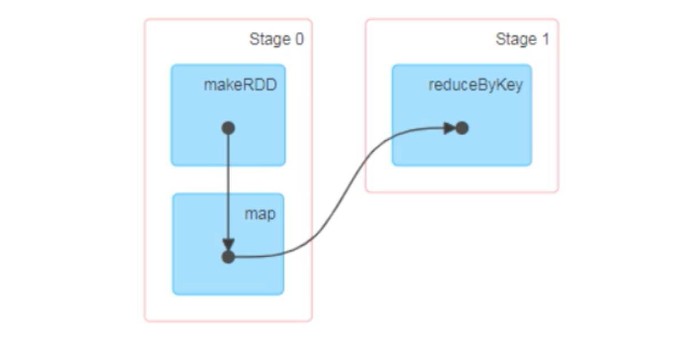
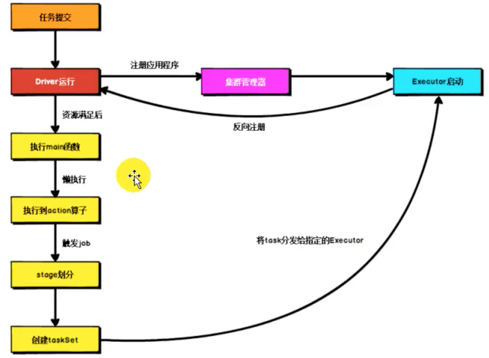

>[https://www.bilibili.com/video/BV11A411L7CK?p=19](https://www.bilibili.com/video/BV11A411L7CK?p=19)

Spark 框架的核心是一个计算引擎，整体来说，它采用了标准的master-slave 的结构。下图中的Driver 表示master，负责管理整个集群中的作业任务调度，Executor 是slave，负责实际执行任务

Dirver 是Spark 驱动器节点，用于执行Spark 任务中的main 方法，负责实际代码的执行工作，Driver 在Spark 作业执行时主要负责

* 将用户程序转换为作业Job
* 在Executor 之间调度任务Task
* 跟踪Executor 的执行情况
* 通过UI 展示查询运行情况

Executor 是集群中工作节点（Worker）中的一个JVM 进程，负责在Spark 作业中运行具体任务（Task），任务彼此之间相互独立。Spark 应用启动时，Executor 节点被同时启动，并且始终伴随着整个Spark 应用的生命周期而存在。如果有Executor 节点发生了故障或者崩溃，Spark 应用也可以继续执行，会将出错节点上的任务调度到其他Executor 节点上继续运行。Executor 有两个核心功能

* 负责运行组成Spark 应用的任务，并将结果返回给驱动器进程
* 它们通过自身的块管理器（Block Manager）为用户程序中要求缓存的RDD 提供内存式存储。RDD 时候直接缓存在Executor 进程中的，因此任务可以在运行时充分利用缓存数据加速运算

Spark 集群的独立部署环境中，不需要依赖其他的资源调度框架，自身就实现了资源调度的功能，所以环境中还有其他两个核心组件：Master 与Worker

Master 是一个进程，主要负责资源的调度和分配，并进行集群的监控，类似于Yarn 环境中的RM

而Worker 也是进程，一个Worker 运行在集群中的一台服务器上，由Master 分配资源对数据进行并行的处理和计算，类似于Yarn 环境中的NM

Driver 和Executor 是和计算相关的组件，Master 和Worker 是和资源相关的组件，计算和资源如果想交互，那么就需要一个中间层来解耦，就是ApplicationMaster

Spark Executor 时集群中运行在工作节点（Worker）中的一个JVM 进程，是整个集群中的专门用于计算的节点，在提交应用中，可以提供参数指定计算节点的个数，以及对应的资源。这里的资源一般指的是工作节点Executor 的内存大小和使用的**虚拟CPU 核**（Core）数量

有向无环图（DAG）主要起到了调度的作用，比如有多个任务，哪个任务先执行，哪个任务后执行，就是通过DAG 中点和线形成的关联来执行操作

大数据计算引擎框架根据使用方式的不同一般分为四类。第一类就是Hadoop 所承载的Map Reduce，它将计算分为两个阶段，分别是Map 阶段和Reduce 阶段，对于上层应用来说，就不得不想方设法去拆分算法，甚至不得不在上层应用实现多个Job 的串联，以完成一个完整的算法，比如迭代计算

正是因为这样的弊端，催生了支持DAG 框架的产生。因此DAG 的框架也被划分为第二代计算引擎

Spark 是典型的第三代计算引擎，主要特点是Job 内部的DAG 支持（不跨越Jon），以及实时计算

这里所说的有向无环图并不是真正意义上的图形，而是由Spark 程序直接映射成的数据流的高级抽象模型。简单理解就是将整个程序计算的执行过程用图形表示出来，这样更为直观

## 提交流程

所谓提交流程，就是开发人员根据需求写的应用程序通过Spark 客户端提交给Spark 运行环境执行计算的流程。在不同的部署环境中，这个提交流程基本相同，但也有细微的区别。下面主要是说基于Yarn 环境的提交流程

提交的流程分为两大块，一个是资源的申请（下图右箭头方向），一个是计算的准备（下图下箭头方向），当资源准备好了、计算准备好了，把计算发给资源就可以了

Spark 应用程序提交到Yarn 环境执行的时候，一般会有两种部署执行的方式：Client 和Cluster，主要的区别在于Driver 程序的运行节点位置

Client 模式将用于监控和调度的Driver 模块在客户端执行，而不是在Yarn 中，所以一般用于测试；而Cluster 模式，Driver 是运行在集群中的
