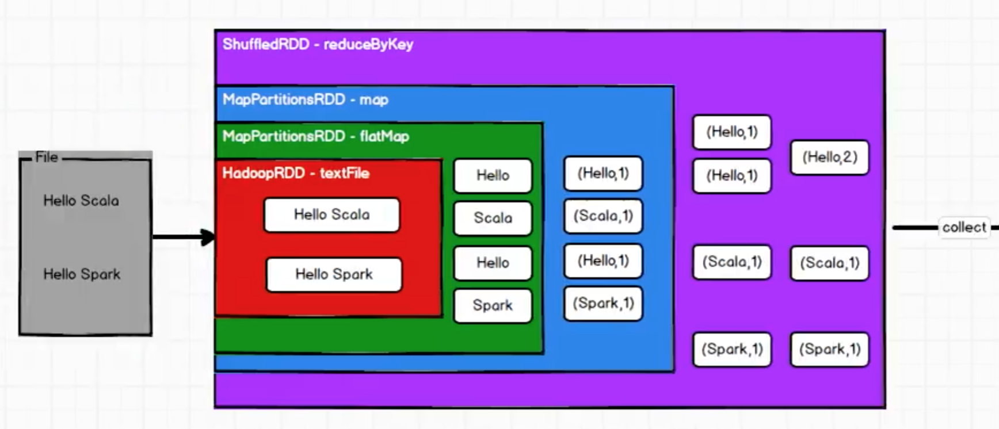

Spark 计算框架为了能够进行高并发和高吞吐的数据处理，封装了三大数据结构，用于处理不同的应用场景，分别是

* RDD：弹性分布式数据集
* 累加器：分布式共享只写变量
* 广播变量：分布式共享只读变量

## 什么是RDD？

RDD（Resilient Distributed Dataset）叫做弹性分布式数据集，是Spark 中最基本的数据处理模型。在代码中是一个抽象类，它代表了一个弹性的、不可变的、可分区的、里面的元素可并行计算的集合

比如，要实现一个逻辑，如果逻辑很复杂，那么后面扩展起来相对就不是很方便，所以把RDD 封装为最小计算单元，如果有新的逻辑的话，，在原来的基础上做一个关联就好了。所以在程序中可能不止一个RDD，每个RDD 都是一个计算单元，把多个RDD 关联在一起就会形成一个复杂的逻辑

这个复杂的逻辑从Driver 传给Executor 就可以完成复杂的计算需求了


RDD 简单的理解成把数据准备好、把逻辑准备好的一种结构

>[https://www.bilibili.com/video/BV11A411L7CK?p=26](https://www.bilibili.com/video/BV11A411L7CK?p=26)

Spark 中的RDD 在理解上可以和Java 的IO 流进行**类比**，比如下图使用FileInputStream 处理字节流，然后InputStreamReader 转换成字符流，再给到BufferedReader 处理


基于装饰者设计模式，每个RDD 按照自己的逻辑处理数据，然后将处理得到的结果给到下一个（或者叫下一层）RDD



RDD 的数据只有在调用collect 方法时，才会真正执行业务逻辑操作，之前的封装全部都是功能的扩展。不同于IO 临时保存一部分数据，RDD 是不保存数据的，上面的图中的数据只是展示计算的步骤用的！

下面是RDD 源码中的注释说明（**分区**是一个很重要的概念！）

```java
 /**
 * A Resilient Distributed Dataset (RDD), the basic abstraction in Spark. Represents an immutable,
 * partitioned collection of elements that can be operated on in parallel. This class contains the
 * basic operations available on all RDDs, such as `map`, `filter`, and `persist`. In addition,
 * [[org.apache.spark.rdd.PairRDDFunctions]] contains operations available only on RDDs of key-value
 * pairs, such as `groupByKey` and `join`;
 * [[org.apache.spark.rdd.DoubleRDDFunctions]] contains operations available only on RDDs of
 * Doubles; and
 * [[org.apache.spark.rdd.SequenceFileRDDFunctions]] contains operations available on RDDs that
 * can be saved as SequenceFiles.
 * All operations are automatically available on any RDD of the right type (e.g. RDD[(Int, Int)])
 * through implicit.
 *
 * Internally, each RDD is characterized by five main properties:
 *
 *  - A list of partitions
 *  - A function for computing each split
 *  - A list of dependencies on other RDDs
 *  - Optionally, a Partitioner for key-value RDDs (e.g. to say that the RDD is hash-partitioned)
 *  - Optionally, a list of preferred locations to compute each split on (e.g. block locations for
 *    an HDFS file)
 *
 * All of the scheduling and execution in Spark is done based on these methods, allowing each RDD
 * to implement its own way of computing itself. Indeed, users can implement custom RDDs (e.g. for
 * reading data from a new storage system) by overriding these functions. Please refer to the
 * <a href="http://people.csail.mit.edu/matei/papers/2012/nsdi_spark.pdf">Spark paper</a>
 * for more details on RDD internals.
 */
abstract class RDD[T: ClassTag](
    @transient private var _sc: SparkContext,
    @transient private var deps: Seq[Dependency[_]]
  ) extends Serializable with Logging {


```

Internally, each RDD is characterized by five main properties:

* A list of partitions
* A function for computing each split
* A list of dependencies on other RDDs
* Optionally, a Partitioner for key-value RDDs (e.g. to say that the RDD is hash-partitioned)
* Optionally, a list of preferred locations to compute each split on (e.g. block locations for an HDFS file)

## 执行原理

从计算的角度来讲，数据处理过程需要计算资源（内存 & CPU）和计算模型（逻辑）。执行时，需要将计算资源和计算模型进行协调和整合

Spark 框架在执行时，先申请资源，然后将应用程序的数据处理逻辑分解成一个一个的计算任务。然后将任务分发到已经分配资源的计算节点上，按照指定的计算模型进行数据计算，最后得到计算结果

RDD 是Spark 框架中用于数据处理的核心模型！

RDD 主要用于将逻辑进行封装，并生成Task 放给Executor 节点执行计算

## RDD 是如何处理数据的？

首先可以从集合（内存）中创建RDD，主要的方法是parallelize() 和makeRDD()

另外，可以从外部存储系统的数据集创建RDD，，包括本地文件系统、HDFS、HBase 等

而且，还可以通过一个RDD 运算完后，再产生新的RDD；也可以直接new。这两种用的比较少

```scala
package com.xum

import org.apache.spark.SparkConf
import org.apache.spark.SparkContext
import org.apache.spark.rdd.RDD

object TestRDD {
  def main(args: Array[String]): Unit = {
    // 创建Spark 运行配置对象，连接。[*]表示当前本机的核数是多少，比如8核，那么就会用8个线程模拟运行场景
    val sparkConf = new SparkConf().setMaster("local[*]").setAppName("WordCount")
    val sc = new SparkContext(sparkConf)
    
    // 准备一个集合
    val seq = Seq[Int](1, 2, 3, 4)
   
    println("内存方式创建，将内存中的数据当作处理的数据源。parallelize() ")
    val rdd1 : RDD[Int] = sc.parallelize(seq)
    // 只有触发collect() 方法才会执行计算
    rdd1.collect().foreach(println)

    println("内存方式创建，makeRDD() ")
    val rdd2 : RDD[Int] = sc.makeRDD(seq)
    rdd2.collect().foreach(println)
    
    
    println("读取本地文件数据，将文件中的数据作为数据源，一行一行读取，textFile() ")
    println("参数可以是某个具体文件路径，也可以文件夹目录，后者会将目录下所有文件作为数据源 ")
    val rdd3 : RDD[String] = sc.textFile("/Users/xumenger/Desktop/code/Spark/data/")
    rdd3.collect().foreach(println)
    
    println("使用通配符方式读取本地文件 ")
    val rdd4 : RDD[String] = sc.textFile("/Users/xumenger/Desktop/code/Spark/data/*.txt")
    rdd4.collect().foreach(println)
    
    
    println("读取RDFS文件数据，将文件中的数据作为数据源，一行一行读取，textFile() ")
    val rdd5 : RDD[String] = sc.textFile("hdfs://localhost:8020/Spark/data/*.txt")
    rdd5.collect().foreach(println)
    
    
    println("使用wholeTextFiles() 以文件为单位读取数据 ")
    println("读取结果为元组(String, String)，元组第一个元素是文件路径，第二个元素是文件内容 ")
    val rdd6 : RDD[(String, String)] = sc.wholeTextFiles("/Users/xumenger/Desktop/code/Spark/data/")
    rdd6.collect().foreach(println)
    
    // 关闭spark 
    sc.stop()
  }
}
```

>Spark RDD API: [http://spark.apache.org/docs/latest/api/scala/org/apache/spark/rdd/index.html](http://spark.apache.org/docs/latest/api/scala/org/apache/spark/rdd/index.html)

## RDD 的并行度与分区

>每个RDD 都有 A list of partitions

分区之间是独立的，所以每个分区有自己独立的Task，每个独立的Task 可以发给独立的Executor 执行，避免冲突！

当然，比如当只有一个Executor，但有三个分区的时候，那么三个分区对应的三个Task 都会分发给这一个Executor 执行！虽然有了分区，但因为Executor 资源不够，并行度也提不上去

```scala
package com.xum.rdd

import org.apache.spark.SparkConf
import org.apache.spark.SparkContext
import org.apache.spark.rdd.RDD

object TestRDDParallel {
  def main(args: Array[String]): Unit = {
    // 创建Spark 运行配置对象，连接
    val sparkConf = new SparkConf().setMaster("local").setAppName("WordCount")
    val sc = new SparkContext(sparkConf)
    
     // 准备一个集合
    val seq = Seq[Int](1, 2, 3, 4)

    println("内存方式创建，makeRDD()，第二个参数指定分区数量")
    val rdd1 : RDD[Int] = sc.makeRDD(seq, 2)
    
    println("将处理的结果保存为分区文件")
    rdd1.saveAsTextFile("/Users/xumenger/Desktop/code/Spark/data/output")
    
    // 关闭spark 连接
    sc.stop()
  }
}
```

运行的结果如下


>关于makeRDD()、saveAsTextFile() 方法的实现，以及每个参数的作用，建议自己平时使用这些API 的时候多通过Eclipse 等IDE 点进去看一下源码！关注一下代码逻辑、接口定义、类继承关系等

>[https://www.bilibili.com/video/BV11A411L7CK?p=35](https://www.bilibili.com/video/BV11A411L7CK?p=35)

## 数据是如何分配到不同的分区的？

比如对于上面从内存中读取数据的makeRDD() 方法，具体Spark 实现的源码如下

```scala
  def makeRDD[T: ClassTag](
      seq: Seq[T],
      numSlices: Int = defaultParallelism): RDD[T] = withScope {
    parallelize(seq, numSlices)
  }


  def parallelize[T: ClassTag](
      seq: Seq[T],
      numSlices: Int = defaultParallelism): RDD[T] = withScope {
    assertNotStopped()
    new ParallelCollectionRDD[T](this, seq, numSlices, Map[Int, Seq[String]]())
  }
```

可以看到最后new 了一个ParallelCollectionRDD，再去看这个类的源码，其中getPartitions() 方法就封装了分区规则

```scala
private[spark] class ParallelCollectionRDD[T: ClassTag](
    sc: SparkContext,
    @transient private val data: Seq[T],
    numSlices: Int,
    locationPrefs: Map[Int, Seq[String]])
    extends RDD[T](sc, Nil) {
  // TODO: Right now, each split sends along its full data, even if later down the RDD chain it gets
  // cached. It might be worthwhile to write the data to a file in the DFS and read it in the split
  // instead.
  // UPDATE: A parallel collection can be checkpointed to HDFS, which achieves this goal.

  override def getPartitions: Array[Partition] = {
    // 对数据data，按照分区数numSlices 进行切分
    val slices = ParallelCollectionRDD.slice(data, numSlices).toArray
    slices.indices.map(i => new ParallelCollectionPartition(id, i, slices(i))).toArray
  }

  override def compute(s: Partition, context: TaskContext): Iterator[T] = {
    new InterruptibleIterator(context, s.asInstanceOf[ParallelCollectionPartition[T]].iterator)
  }

  override def getPreferredLocations(s: Partition): Seq[String] = {
    locationPrefs.getOrElse(s.index, Nil)
  }
}
```

可以继续往下面看ParallelCollectionRDD.slice() 的代码逻辑

...

上面是针对从内存读取数据的分区方法，从文件读取数据的时候也是支持分区的。textFile() 的第二个参数是最小分区数量

```scala
  /**
   * Read a text file from HDFS, a local file system (available on all nodes), or any
   * Hadoop-supported file system URI, and return it as an RDD of Strings.
   * The text files must be encoded as UTF-8.
   *
   * @param path path to the text file on a supported file system
   * @param minPartitions suggested minimum number of partitions for the resulting RDD
   * @return RDD of lines of the text file
   */
  def textFile(
      path: String,
      minPartitions: Int = defaultMinPartitions): RDD[String] = withScope {
    assertNotStopped()
    hadoopFile(path, classOf[TextInputFormat], classOf[LongWritable], classOf[Text],
      minPartitions).map(pair => pair._2.toString).setName(path)
  }
```