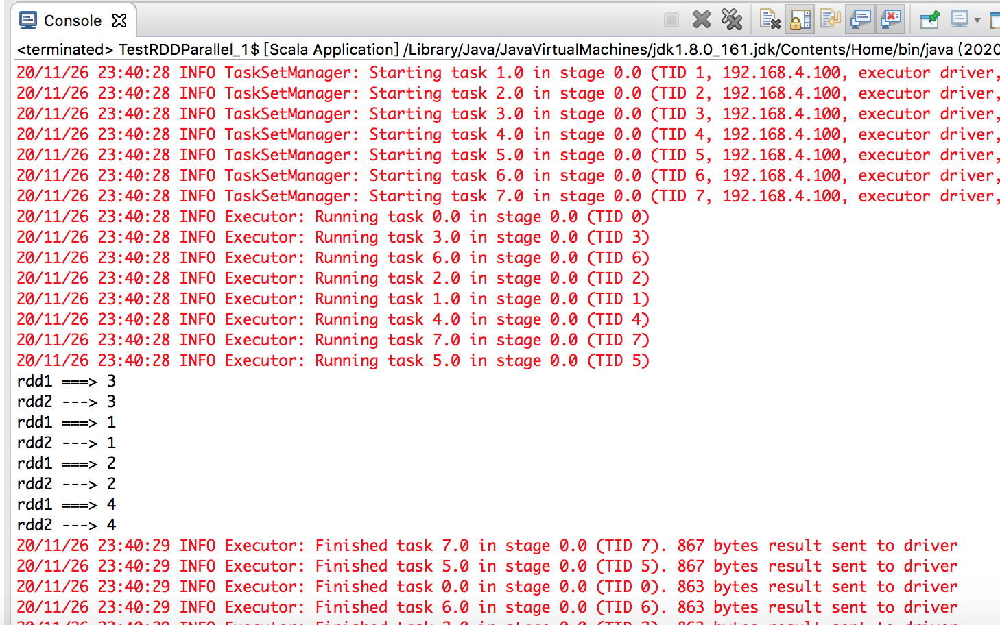
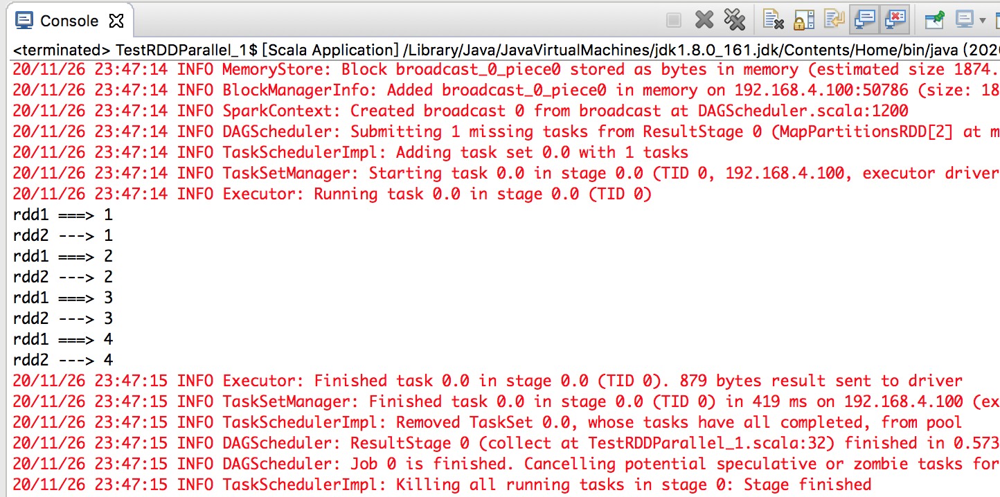
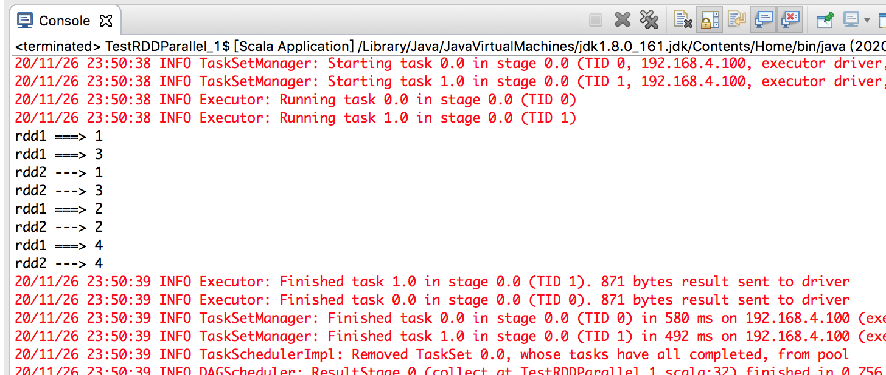
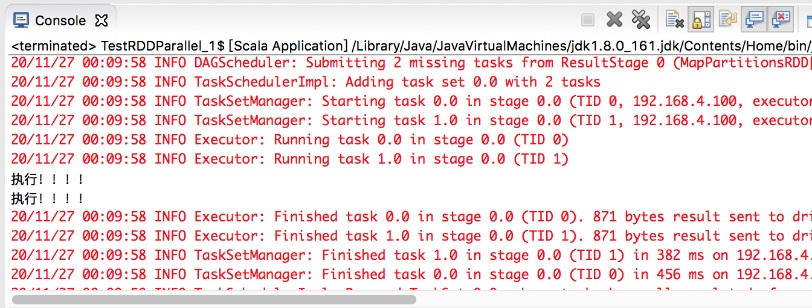
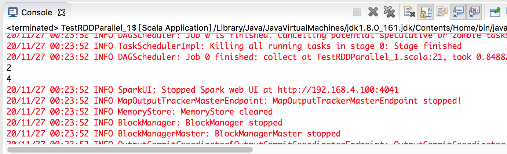

直接看一个基于map() 算子的例子

```scala
package com.xum.rdd

import org.apache.spark.SparkConf
import org.apache.spark.SparkContext

object TestRDDParallel_1 {
  def main(args: Array[String]): Unit = {
    // 创建Spark 运行配置对象，连接。注意这里为了测试并行，要用[*]
    val sparkConf = new SparkConf().setMaster("local[*]").setAppName("WordCount")
    val sc = new SparkContext(sparkConf)
    
    val rdd = sc.makeRDD(List(1,2,3,4))
    
    // 通过转换算子，得到第一个新的RDD
    val rdd1 = rdd.map(
      num => {
        println("rdd1 ===> " + num)
        num
      }
    )
    
    // 通过转换算子，得到第二个新的RDD
    val rdd2 = rdd1.map(
      num => {
        println("rdd2 ---> " + num)
        num
      }
    )
    
    // 通过rdd2 的collect() 触发运算执行
    rdd2.collect()
    
    sc.stop()
  }
}
```

运行效果如下，可以看到计算顺序是“乱掉的”！



>根据输出中的红色内容，可以看到，是有8 个Executor 的，因为上面设置了local[*]，所以默认当前本机的核数是多少，比如8核，那么就会用8个线程模拟运行场景

## 并发度为1的执行情况

在makeRDD() 时，指定一个分区，以控制并发度为1，然后看一下运行效果

```scala
package com.xum.rdd

import org.apache.spark.SparkConf
import org.apache.spark.SparkContext

object TestRDDParallel_1 {
  def main(args: Array[String]): Unit = {
    // 创建Spark 运行配置对象，连接
    val sparkConf = new SparkConf().setMaster("local[*]").setAppName("WordCount")
    val sc = new SparkContext(sparkConf)
    
    // 强制设置只有一个分区，以实现控制并发度为1
    val rdd = sc.makeRDD(List(1,2,3,4), 1)
    
    // 通过转换算子，得到第一个新的RDD
    val rdd1 = rdd.map(
      num => {
        println("rdd1 ===> " + num)
        num
      }
    )
    
    // 通过转换算子，得到第二个新的RDD
    val rdd2 = rdd1.map(
      num => {
        println("rdd2 ---> " + num)
        num
      }
    )
    
    // 通过rdd2 的collect() 触发运算执行
    rdd2.collect()
    
    sc.stop()
  }
}
```

按照List(1,2,3,4) 中的元素，逐个先执行第一个转换算子，再执行第二个转换算子。所以对于RDD，一个分区内的数据是顺序一个一个执行逻辑的！只有前面一个数据的全部逻辑执行完毕后，才会执行下一个数据！



>同样可以通过红色的输出看到，这种情况下只有一个Executor！

## 继续设置2个分区呢

```scala
package com.xum.rdd

import org.apache.spark.SparkConf
import org.apache.spark.SparkContext

object TestRDDParallel_1 {
  def main(args: Array[String]): Unit = {
    // 创建Spark 运行配置对象，连接
    val sparkConf = new SparkConf().setMaster("local[*]").setAppName("WordCount")
    val sc = new SparkContext(sparkConf)
    
    // 强制设置只有两个分区，以实现控制并发度为2
    val rdd = sc.makeRDD(List(1,2,3,4), 2)
    
    // 通过转换算子，得到第一个新的RDD
    val rdd1 = rdd.map(
      num => {
        println("rdd1 ===> " + num)
        num
      }
    )
    
    // 通过转换算子，得到第二个新的RDD
    val rdd2 = rdd1.map(
      num => {
        println("rdd2 ---> " + num)
        num
      }
    )
    
    // 通过rdd2 的collect() 触发运算执行
    rdd2.collect()
    
    sc.stop()
  }
}
```

解释一下下面的执行效果，首先红色输出显示，当前是2 个Executor 执行的！另外可以看到是1、3先执行完的，然后2、4 执行，因为按照Spark 的分区规则，1、2 是分到一个分区中的，3、4 是分到另一个分区的，1、2 只能顺序执行，3、4 只能顺序执行，但是1、3 在两个分区，可以并行！



## 用迭代器提升性能

上面展示了RDD 的执行，可以看到对于一个分区中的数据，数据一顺序执行完所有的逻辑后，才能继续获取数据二进行处理。如果是从文件中获取数据的话，要一个一个的加载数据（对应有一次IO），显然性能不够

在Java 的IO 流中，可以通过缓冲区来提升原来按照一个字节一个字节，后者一个字符一个字符的处理顺序，Spark 中也有类似的思想

mapPartitions() 方法可以把一个分区的数据全部拿到后再做操作，而不是一个一个的读取数据。mapPartitions() 方法第一个参数是一个迭代器（迭代器是Spark 中又一个重要的概念）

首先mapPartitions() 的源码如下

```scala
  /**
   * Return a new RDD by applying a function to each partition of this RDD.
   *
   * `preservesPartitioning` indicates whether the input function preserves the partitioner, which
   * should be `false` unless this is a pair RDD and the input function doesn't modify the keys.
   */
  def mapPartitions[U: ClassTag](
      f: Iterator[T] => Iterator[U],
      preservesPartitioning: Boolean = false): RDD[U] = withScope {
    val cleanedF = sc.clean(f)
    new MapPartitionsRDD(
      this,
      (_: TaskContext, _: Int, iter: Iterator[T]) => cleanedF(iter),
      preservesPartitioning)
  }
```

mapPartitions() 以分区为单位发送到计算节点进行处理。接下来看一个具体的例子

```scala
package com.xum.rdd

import org.apache.spark.SparkConf
import org.apache.spark.SparkContext

object TestRDDParallel_1 {
  def main(args: Array[String]): Unit = {
    // 创建Spark 运行配置对象，连接
    val sparkConf = new SparkConf().setMaster("local[*]").setAppName("WordCount")
    val sc = new SparkContext(sparkConf)
    
    // 强制设置只有两个分区，以实现控制并发度为2
    val rdd = sc.makeRDD(List(1,2,3,4), 2)
    
    val mapPartRDD = rdd.mapPartitions(
      iter => {
        println("执行！！！！")
        iter.map(_ * 2)
      }
    )
    
    mapPartRDD.collect()
    
    sc.stop()
  }
}
```

可以看到println("执行！！！！") 打印了两次，因为有几个分区，这个就会被执行多少次！比如1、2 在一个分区，**这个迭代器一次性拿到这个分区的所有数据加载到内存中**，即1、2，然后1、2 每一个再去做map(_ * 2) 的计算！这个map() 会是在内存中的操作，所以性能会比较高，这个就类似于批处理！



事情总是两面的，一个分区中的所有数据被全部加载到内存中，但是处理完的数据是不会被释放的（应该是全部的数据都处理完才能被释放！），因为存在对象的引用，所以在内存较小、数据量很大的情况下，用这个算子容易造成内存溢出！这种情况下用map() 这个算子可能更合适，一个一个地处理分区中的数据！map() 没有引用，来一条处理一条，处理完就可以释放了

map() 算子类似于串行操作，所以性能比较低；而mapPartitions() 算子类似于批处理，所以性能较高，但是会长时间占用内存

所以map()、mapPartitions() 有各自适用的场景！

## 案例：取出每个分区的最大值

map() 算子是每个数据拿过来，所以是分不清这个数据是来自于哪个分区的，而mapPartitions() 是按照分区为单位处理一个分区内的所有数据，所以用mapPartitions() 方便实现这个需求

```scala
package com.xum.rdd

import org.apache.spark.SparkConf
import org.apache.spark.SparkContext

object TestRDDParallel_1 {
  def main(args: Array[String]): Unit = {
    // 创建Spark 运行配置对象，连接
    val sparkConf = new SparkConf().setMaster("local[*]").setAppName("WordCount")
    val sc = new SparkContext(sparkConf)
    
    // 强制设置只有两个分区，以实现控制并发度为2
    val rdd = sc.makeRDD(List(1,2,3,4), 2)
    
    // mapPartitions() 要求传入一个迭代器，最后返回一个迭代器
    // 但是没有要求两个迭代器内数据数量一致
    val mapPartRDD = rdd.mapPartitions(
      iter => {
      	// 生成一个新的迭代器，只有一个数据（最大值！）
        List(iter.max).iterator
      }
    )
    
    mapPartRDD.collect().foreach(println)
    
    sc.stop()
  }
}
```


