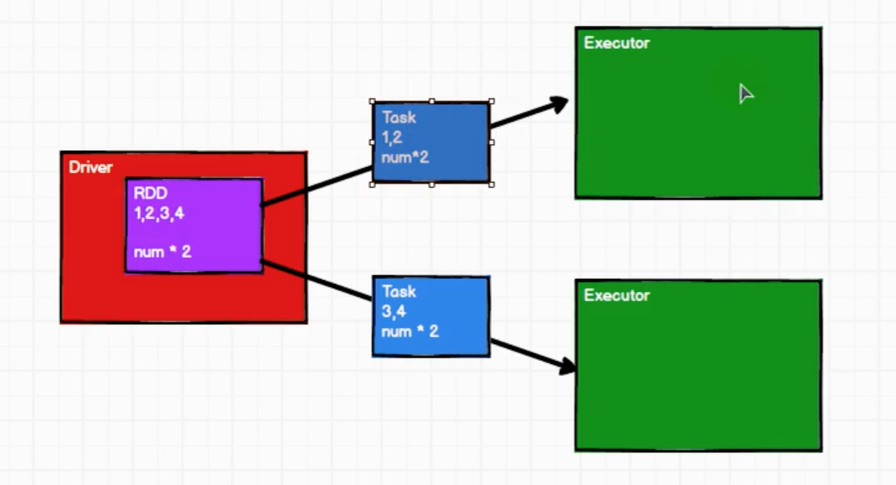
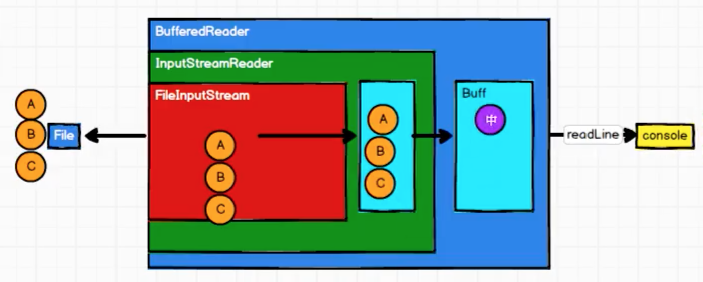
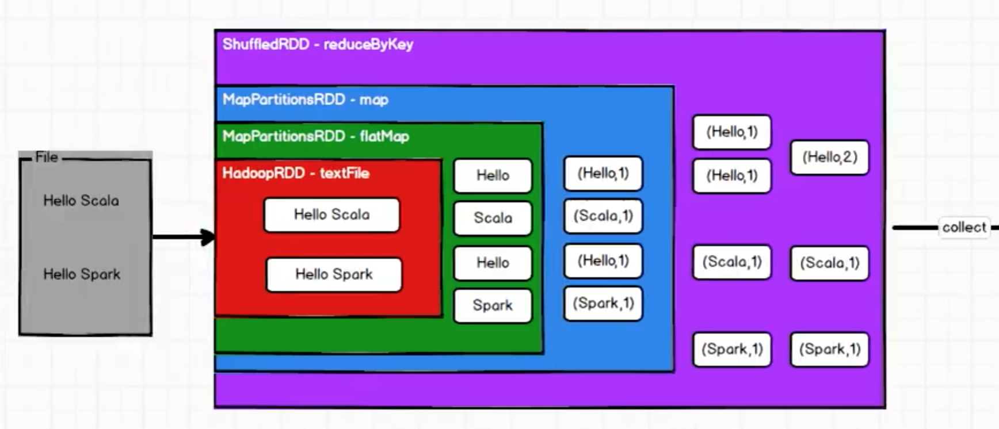

Spark 计算框架为了能够进行高并发和高吞吐的数据处理，封装了三大数据结构，用于处理不同的应用场景，分别是

* RDD：弹性分布式数据集
* 累加器：分布式共享只写变量
* 广播变量：分布式共享只读变量

## 什么是RDD

RDD（Resilient Distributed Dataset）叫做弹性分布式数据集，是Spark 中最基本的数据处理模型。在代码中是一个抽象类，它代表了一个弹性的、不可变的、可分区的、里面的元素可并行计算的集合

比如，要实现一个逻辑，如果逻辑很复杂，那么后面扩展起来相对就不是很方便，所以把RDD 封装为最小计算单元，如果有新的逻辑的话，，在原来的基础上做一个关联就好了。所以在程序中可能不止一个RDD，每个RDD 都是一个计算单元，把多个RDD 关联在一起就会形成一个复杂的逻辑

这个复杂的逻辑从Driver 传给Executor 就可以完成复杂的计算需求了

RDD 简单的理解成把数据准备好，把逻辑准备好的一种结构

>[https://www.bilibili.com/video/BV11A411L7CK?p=26](https://www.bilibili.com/video/BV11A411L7CK?p=26)

Spark 中的RDD 在理解上可以和Java 的IO 流进行**类比**，比如下图使用FileInputStream 处理字节流，然后InputStreamReader 转换成字符流，再给到BufferedReader 处理

基于装饰者设计模式，每个RDD 按照自己的逻辑处理数据，然后将处理得到的结果给到下一个（或者叫下一层）RDD

RDD 的数据只有在调用collect 方法时，才会真正执行业务逻辑操作，之前的封装全部都是功能的扩展。不同于IO 临时保存一部分数据，RDD 是不保存数据的！
