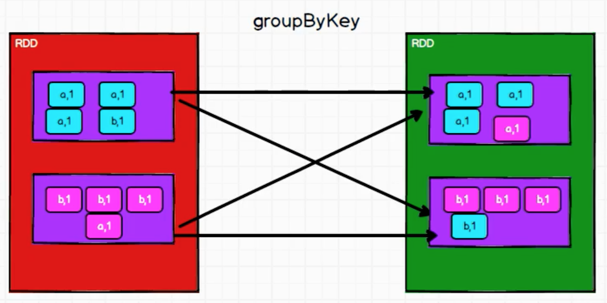
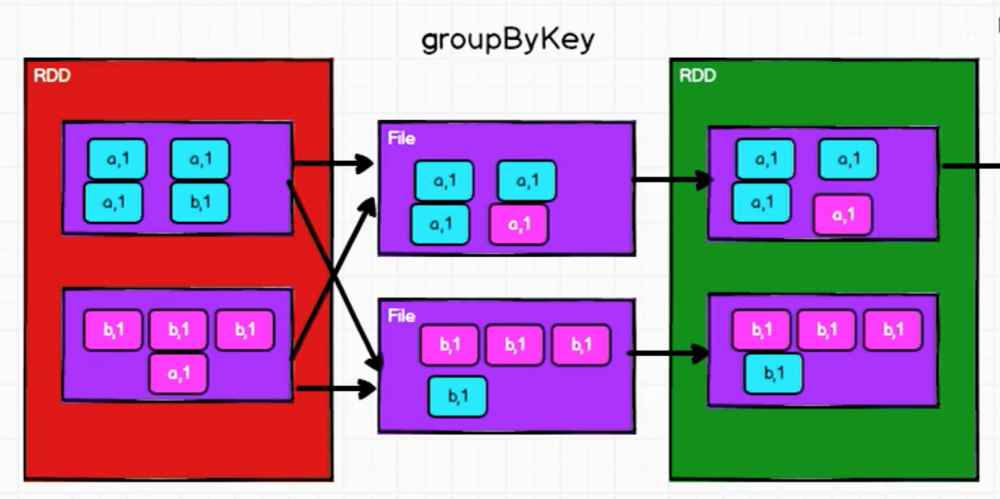
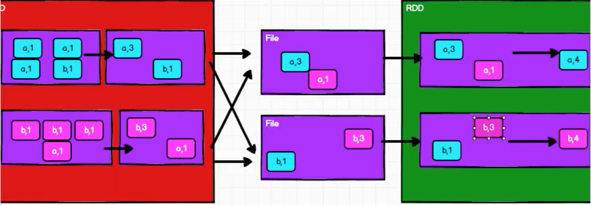

## groupBy算子

Spark分组与分区

groupBy会将数据打乱（打散），重新组合，这个操作称为shuffle！

使用groupBy统计apache.log，分析某个时间段的点击量

https://www.bilibili.com/video/BV11A411L7CK?p=52


## filter算子

计算规则是对每个分区做计算的

按照一定条件过滤，可能存在分区1剩下1条，分区2剩下10000条，这个称为数据倾斜

使用filter从服务器日志数据apache.log 中获取2015年5月17日的请求路径

```scala
val rdd = sc.textFile("datas/apache.log")
rdd.filter(
    line => {
        val datas = line.split(" ")
        val time = datas(3)
        time.startsWith("17/05/2015")
    }
).collect().foreach(println)
```

可以用sample算子来协助解决数据倾斜


## distinct算子

Scala中集合的distinct去重是使用HashSet实现的

而在Spark 中，数据分布在不同的分区中，如何实现去重？

```scala
// TODO 补充distinct 代码

map(x => (x, null)).reduceByKey((x, _) => x, numPartitions).map(_._1)
```

分布式的处理方式来实现去重。通过这个算子帮助理解单机模式下实现逻辑是如何设计算法与数据结构的；对比分布式计算模型下是如何设计算法与数据结构的！！！


## coalesce算子

根据数据量缩减分区，用于大数据集过滤后，提高小数据集的执行效率

当Spark 程序中，存在过多的小任务时，可以通过coalesce方法，收缩合并分区，减少分区的个数，减小任务调度成本

但是这个算子缩减分区可能导致数据不均衡，如果想要数据均衡，则进行shuffle 处理，即该算子的第二个参数设置为true

https://www.bilibili.com/video/BV11A411L7CK?p=58

比如可能发现分区太少了，每个分区的数据量太大，就想要扩大分区，使每个分区中的数据量稍微少一些。分区数变多后，也可以增强并行计算的能力

coalesce 算子也可以扩大分区，此时shuffle 参数必须指定为true！要打乱数据然后重新组合！

扩大分区也有一个专门的算子：repartition，其底层就是调用coalesce


## sortBy算子

```scala
val rdd = sc.makeRDD(List(("1", 1), ("2", 2), ("22", 3), (4", 4)))

// 按照键值降序排序
val newRDD = rdd.sortBy(t => t._1, false)

newRDD.saveAsTextFile("output")
```

排序前后，分区数不变，但因为做了排序，数据可能从原来的分区放到其他的分区，底层会有shuffle 操作


## 双值算子

```scala
val rdd1 = sc.makeRDD(List(1, 2, 3, 4))
val rdd2 = sc.makeRDD(List(3, 4, 5, 6))

// 交集
val rdd3 = rdd1.intersection(rdd2)
println(rdd3.collect().mkString(","))

// 并集
val rdd4 = rdd1.union(rdd2)
println(rdd4.collect().mkString(","))

// 差集
val rdd5 = rdd1.subtract(rdd2)
println(rdd5.collect().mkString(","))

// 前面三个如果两个RDD 的数据类型不一致，编译报错！
// 拉链算子，可以处理两个数据类型不一致的RDD，但是要求两个RDD 的分区数一致！每一个分区的数据量也要一致！
val rdd6 = rdd1.zip(rdd2)
println(rdd6.collect().mkString(","))
// (1,3),(2,4),(3,5),(4,6)
```


## partitionBy算子处理键值对

```scala
val rdd = sc.makeRDD(List(1, 2, 3, 4))

// 转换成tuple 类型
val mapRDD : RDD[(Int, Int)] = rdd.map((_, 1))

// 隐式转换：RDD => PairRDDFunctions
// 根据指定的分区规则，对数据进行重分区
val newRDD = rdd.partitionBy(new HashPartitioner(2))
```

partitionBy() 是PairRDDFunctions 中的一个方法，不是RDD 的算子！

因为RDD 中有一个方法（待补充）

```scala
implicit def rddToPairRDDFunctions[K, V]
....
```

>扩展内容：分区器！当然也可以自己实现一个分区器！


## reduceByKey算子

```scala
val rdd = sc.makeRDD(List(("a", 1), ("a", 2), ("b", 4)))

// reduceByKey 相同key 的数据进行value 的聚合
val reduceDD = rdd.reduceByKey((x:Int, y:Int) => {x + y})
```


## groupByKey算子

```scala
val rdd = sc.makeRDD(List(("a", 1), ("a", 2), ("b", 4)))

// groupByKey 相同key 的数据分在一个组中，形成一个对偶元组
// 对偶元组中的第一个元素是key，第二个元素是相同的key的value的集合
val groupRDD : RDD[(String, Iterable[Int])] = rdd.groupByKey((x:Int, y:Int) => {x + y})
```



如果groupByKey 会导致数据打乱重组，存在shuffle 操作。这个图中例子刚好分区和分组都是两个，但是还是不要把分区和分组搞混了！

分区之间可以并行计算的依据就是数据之间没有关系，不需要互相依赖，可以按照自己的逻辑专心处理当前分区

但是如上图如果先使用groupByKey 对数据进行分组，然后再在分组的基础上使用map 进行聚合，那么当处理完其中一个分区后，还要等待另一个分区处理完才能进行map 聚合，因为假如按照键值聚合，另外一个分区中可能也有这个键值的数据，但是当分区很多、数据很多的时候，要花多长时间等待，这些都是不确定的！严重影响分布式计算！那么这个在等待的Executor 的内存在等待的时间里就可能越积越多！

所以在Spark 中对于shuffle 操作必须先落到磁盘，不能在内存中数据等待！显然就会因为磁盘IO 影响性能，所以shuffle 的性能肯定不高！



在看reduceByKey 的原理，因为要把相同的key 放在一起，所以也一定会有shuffle！另外groupByKey 只有分组没有聚合，如果想要聚合，那么就需要将groupByKey 先分完组得到的RDD 再使用map 算子进行聚合，而reduceByKey 可以同时完成聚合

看起来groupByKey 分组后再map 聚合，和直接reduceByKey 聚合好像没有什么不同，都有shuffle。但其核心区别在于，groupByKey 后再map 聚合，那么必须先完成所有的分组，而reduceByKey 则是两两聚合，所以可以先在原来的RDD 中对各自分区中的数据先两两聚合。在落盘之前先通过两两聚合减少一部分数据（预聚合）！那么落盘的数据量就变少了，后续读取磁盘的数据量也少了，那么耗费在IO 上的时间就相对变少了



但如果只需要分组，不需要聚合，那么就还只能使用groupByKey


## aggregateByKey与foldByKey

```scala
val rdd = sc.makeRDD(List(("a", 1), ("a", 2), ("b", 4)), 2)

// aggregateByKey 存在函数柯里化，有两个参数列表
// 第一个参数列表，需要传递一个参数，表示初始值
//             初始值主要用于当碰见第一个key 的时候，和value 进行两两聚合
// 第二个参数列表有两个参数
//             第一个参数表示分区内计算规则
//             第二个参数表示分区件计算规则
// 下面这个实现分区内求最大值，分区间相加
rdd.aggregateByKey(0)(
    (x, y) => math.max(x, y),
    (x, y) => x + y
).collect().foreach(println)


// 获取相同key 的数据的平均值
val newRDD : RDD[(String, (Int, Int))] = rdd.aggregateByKey( (0, 0) )(
    (t, v) => {
        (t._1 + v, t._2 + 1)
    },
    (t1, t2) => {
        (t1._1 + t2._1, t1._2 + t2._2)
    }
)

val resultRDD : RDD[(String, Int)] = newRDD.mapValues{
    case (num, cnt) => {
        num / cnt
    }
}

resultRDD.collect().foreach(println)
```

如果分区内和分区间的计算规则一致的话可以直接使用foldByKey


## 


## 简单总结

理解RDD 算子很核心的一个点在于理解分区！

RDD 的这些算子和关系型数据库中的SQL 的很多理念是类似的或者一致的！