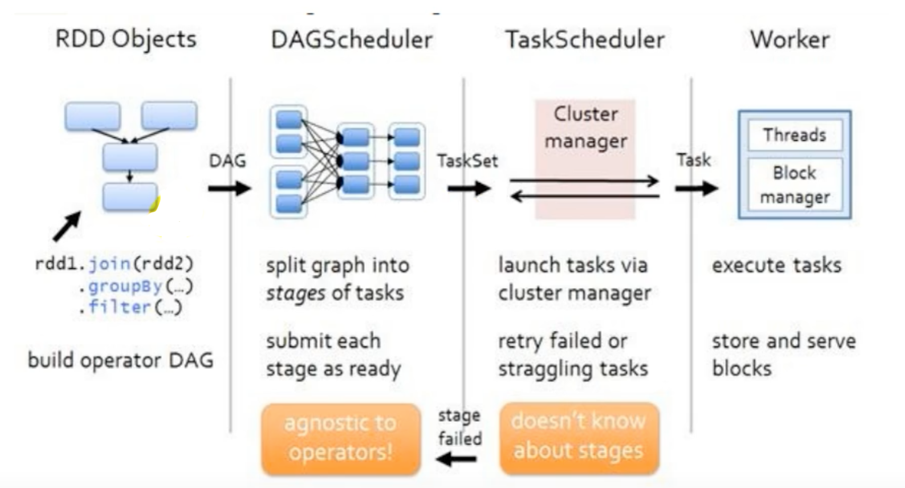

## RDD 血缘关系

https://www.bilibili.com/video/BV11A411L7CK?p=93


https://www.bilibili.com/video/BV11A411L7CK?p=94

## 宽依赖和窄依赖


## 阶段


阶段是和shuffle 有一定关系的，就是因为要打乱重新组合，才需要等待，而这个等待就会划分成一个阶段，本来Spark 的任务是没有依赖的，各自并行处理分区中的数据，因为有了shuffle，就导致分区间有了依赖，按照shuffle 划分阶段，那么下一个阶段必须依赖上一个阶段，要上一个阶段执行完才可以继续执行下一个阶段！

https://www.bilibili.com/video/BV11A411L7CK?p=96

可以从collect 算子一步一步点进去看Spark 是如何处理任务调度、shuffle、阶段的

当RDD 中存在shuffle 依赖时，阶段会自动增加一个。阶段的数量 = shuffle 依赖的数量 + 1。ResultStage 只有一个，最后需要执行的阶段！

## RDD 任务划分

* Application：初始化一个SparkContext 即生成一个Application
* Job：一个Action 算子就会生成一个Job
* Stage：Stage 等于宽依赖（ShuffleDependency）的个数加1
* Task：一个Stage 阶段中最后一个RDD 的分区个数就是Task 的个数，实现并行计算

Application -> Job -> Stage -> Task 每一层都是1对多的关系



## RDD 持久化

RDD 是不存储数据的，如果一个RDD 需要重复使用，那么需要从头再次执行来获取数据！RDD 对象是可以重用的，但是数据是不可以重用的！但是如果就是想重用某个RDD 的数据，不希望再从头开始执行，可以将这个RDD 的数据显式存储到内存或者磁盘，供后续反复使用！

RDD.cache() 实现RDD 数据存储到Java 虚拟机的堆内存中！

RDD.persist(StorageLevel.DISK_ONLY) 实现RDD 数据持久化到磁盘！

但是持久化并不是在调用cache() 或persist() 的时候触发的，而是只有在调用了collect() 等行动算子的时候才会触发！

RDD 持久化一方面是假如这个RDD 后面又分出多个RDD 的分支，那么每个分支都可以直接复用这个RDD 的持久化数据，而不需要从头开始执行；另一方面，假如就是一个串行RDD 流程，对于中间的某个耗时比较长，数据比较重要的RDD 进行持久化，当后续某个节点计算出错时，就不需要再从头开始了！

除了持久化可以把数据暂时保存，检查点（RDD.checkpoint()）也可以实现。不同的是，持久化的数据暂存方式在作业执行完后自动会删除数据，而检查点则在作业执行完后不会删除数据！一般检查点的数据都是保存在HDFS 等分布式存储中！检查点可以长久保存在磁盘文件中，并且实现跨作业执行！

对于检查点还有一点比较特殊的，为了保证数据的安全，当行动算子触发执行的时候，checkpoint 会产生一个新的作业！所以就会导致这个RDD 的逻辑，本来的作业流程要执行一遍，另外开启的新的作业还会再执行一遍。为了能够提高效率，一般情况下是要和cache 联合使用的，先cache() 再checkpoint() 可以减少RDD 的执行次数！

```scala
val list = List("Hello Scala", "Hello Spark")

val rdd = sc.makeRDD(list)

val flatRDD = rdd.flatMap(_.split(" "))

val mapRDD = flatRDD.map(
    word => {
        println("用输出表示该逻辑执行的次数")
        (word, 1)
})


// 测试当cache() 打开和关闭的情况下，上面的println("用输出表示该逻辑执行的次数") 分别执行几次
// mapRDD.cache()
mapRDD.checkpoint()

val reduceRDD : RDD[(String, Int)] = mapRDD.reduceByKey(_ + _)
reduceRDD.collect().foreach(println)
```

为什么checkpoint() 会触发新的Job，可以看一下checkpoint() 的源码

```scala

```

持久化和checkpoint 还有一个重要的不同，看一下其血缘关系有什么不同！

https://www.bilibili.com/video/BV11A411L7CK?p=102

持久化会在血缘关系中添加新的依赖，这样的话，一旦数据丢失了、缓存失效了，可以通过血缘关系回过头来找到持久化数据

而checkpoint 也会影响血缘关系，在执行过程中会切断原来的血缘关系，重建新的血缘关系。因为checkpoint 将计算结果保存到存储中（可以是本地存储，也可以是分布式存储），数据比较安全，就等同于数据源发生了改变，以前的数据源要经过很多的步骤才能到现在的位置，而checkpoint 保存了当前位置的数据，后续的流程就完全可以直接从现在的数据源取数据，所以完全可以改变它的血缘！！

所以checkpoint 等同于改变了数据源！

## RDD 分区器

https://www.bilibili.com/video/BV11A411L7CK?p=103

Spark 目前支持Hash 分区、Range 分区和用户自定义分区。用户可以实现一个自定义的分区器，那么数据就可以按照用户自定义的规则放在不同的分区！

比如想把NBA 的消息放到特定的分区

```scala
class MyPartitioner extends Partitioner
{
    // 分区数量，这里暂时硬编码写死
    override def numPartitions : Int = 3

    // 返回数据的分区索引（从0开始）。根据key 值计算得到数据的分区
    override def getPartition(key: Any) : Int = {
        key match {
            case "nba" => 0
            case "fifa" => 1
            case "cba" => 2
            case _ => 2
        }
    }
}
```

基于上面的自定义分区测试

```scala
val rdd = sc.makeRDD(List(
    ("nba", "1232323"),
    ("fifa", "2038023902"),
    ("nba", "2732739797"),
    ("cba", "982038023")
))

// 指定自定义分区器
rdd.partRDD: RDD[(String, String)] = rdd.partitionBy(new MyPartitioner


partRDD.saveAsTextFile("output")
```

