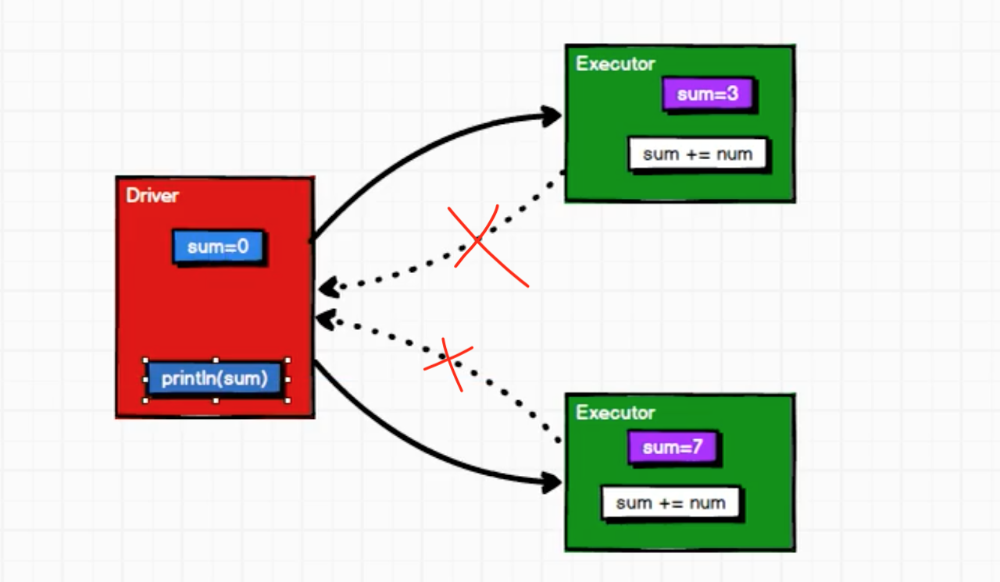

Spark 计算框架为了能够进行高并发和高吞吐的数据处理，封装了三大数据结构，用于处理不同的应用场景

* RDD：弹性分布式数据集
* 累加器：分布式共享只写变量
* 广播变量：分布式共享只读变量

比如我们想求RDD 所有数据的和，很简单，reduce 算子实现两两相加

```scala
val rdd = sc.makeRDD(List(1,2,3,4))

// reduce，包括分区内计算和分区间计算
val sum : Int = rdd.reduce(_ + _)

// 得到结果是10，没有问题
print(sum)
```

我们可不可以遍历RDD 的所有元素实现想相加，这不就是我们平时写代码常用的思维方式吗

```scala
val rdd = sc.makeRDD(List(1,2,3,4))

val sum = 0;
rdd.foreach(
    num => {
        sum += num
    }
)

// 但是得到结果是0，错误的！
print(sum)
```

对于后者，foreach() 是一个分布式的循环，foreach() 中的逻辑是分布式计算的，在local 模式下，是分布在多个线程中执行的，所以各个线程都有可能修改sum 的值，所以最终的sum 值是不确定的，但是就算是有并发安全问题，sum 也不应该是0 呀，为什么呢？

那就要看一下这个逻辑到底是怎么分布式执行的？！在分布式计算前，Driver 会把sum 的值发送给各个Executor，在各个Executor 中分布式执行，但是Executor 执行完了之后呢？按理应该是各个Executor 把结果返回给Driver，但是实际是没有返回结果的这个逻辑的，所以每次的增加都是Executor 中的sum 进行了变化，而Drvier 端的sum 是没有变化的



sum 在各个Executor 端也是独立的，并不是我们通常理解的多个线程写一个共享变量的并发问题！

## 累加器

累加器就可以解决上面的问题，Spark 可以把它从Driver 传给Executor，在Executor 计算完毕之后，又回将结果返回给Driver

累加器用来把Executor 端变量信息聚合到Drvier 端。在Driver 程序中定义的变量，在Executor 端的每个Task 都会得到这个变量的一个新的副本，每个task 更新这些副本的值后，传回Driver 端进行merge

```scala
val rdd = sc.makeRDD(List(1,2,3,4))

// 获取系统累加器
// Spark默认提供了简单数据聚合的累加器，除了longAccumulator 还有其他类型
val sumAcc = sc.longAccumulator("sum")

rdd.foreach(
    num => {
        // 使用累加器
        sumAcc.add(num)
    }
)

// 获取累加器的值
println(sumAcc.value)
```

## 广播变量

```scala

```
