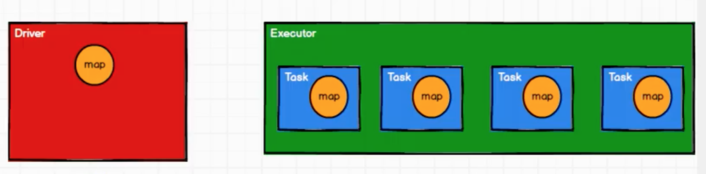

Spark 计算框架为了能够进行高并发和高吞吐的数据处理，封装了三大数据结构，用于处理不同的应用场景

* RDD：弹性分布式数据集
* 累加器：分布式共享只写变量
* 广播变量：分布式共享只读变量

比如我们想求RDD 所有数据的和，很简单，reduce 算子实现两两相加

```scala
val rdd = sc.makeRDD(List(1,2,3,4))

// reduce，包括分区内计算和分区间计算
val sum : Int = rdd.reduce(_ + _)

// 得到结果是10，没有问题
print(sum)
```

我们可不可以遍历RDD 的所有元素实现想相加，这不就是我们平时写代码常用的思维方式吗

```scala
val rdd = sc.makeRDD(List(1,2,3,4))

val sum = 0;
rdd.foreach(
    num => {
        sum += num
    }
)

// 但是得到结果是0，错误的！
print(sum)
```

对于后者，foreach() 是一个分布式的循环，foreach() 中的逻辑是分布式计算的，在local 模式下，是分布在多个线程中执行的，所以各个线程都有可能修改sum 的值，所以最终的sum 值是不确定的，但是就算是有并发安全问题，sum 也不应该是0 呀，为什么呢？

那就要看一下这个逻辑到底是怎么分布式执行的？！在分布式计算前，Driver 会把sum 的值发送给各个Executor，在各个Executor 中分布式执行，但是Executor 执行完了之后呢？按理应该是各个Executor 把结果返回给Driver，但是实际是没有返回结果的这个逻辑的，所以每次的增加都是Executor 中的sum 进行了变化，而Drvier 端的sum 是没有变化的


sum 在各个Executor 端也是独立的，并不是我们通常理解的多个线程写一个共享变量的并发问题！

## 累加器

累加器就可以解决上面的问题，Spark 可以把它从Driver 传给Executor，在Executor 计算完毕之后，又回将结果返回给Driver

累加器用来把Executor 端变量信息聚合到Drvier 端。在Driver 程序中定义的变量，在Executor 端的每个Task 都会得到这个变量的一个新的副本，每个task 更新这些副本的值后，传回Driver 端进行merge

```scala
val rdd = sc.makeRDD(List(1,2,3,4))

// 获取系统累加器
// Spark默认提供了简单数据聚合的累加器，除了longAccumulator 还有其他类型
val sumAcc = sc.longAccumulator("sum")

rdd.foreach(
    num => {
        // 使用累加器
        sumAcc.add(num)
    }
)

// 获取累加器的值
println(sumAcc.value)
```

使用累加器需要注意，如果在转换算子中调用累加器，如果没有行动算子的话，那么则不会执行！比如

```scala
val rdd = sc.makeRDD(List(1,2,3,4))

// 获取系统累加器
// Spark默认提供了简单数据聚合的累加器，除了longAccumulator 还有其他类型
val sumAcc = sc.longAccumulator("sum")

rdd.map(
    num => {
        // 使用累加器
        sumAcc.add(num)

        num
    }
)

// 获取累加器的值，结果是0
println(sumAcc.value)
```

除了少加的情况，还存在多加的情况，比如：

```scala
val rdd = sc.makeRDD(List(1,2,3,4))

// 获取系统累加器
// Spark默认提供了简单数据聚合的累加器，除了longAccumulator 还有其他类型
val sumAcc = sc.longAccumulator("sum")

val mapRDD = rdd.map(
    num => {
        // 使用累加器
        sumAcc.add(num)

        num
    }
)

// 两次调用行动算子
mapRDD.collect()
mapRDD.collect()

// 获取累加器的值，结果是20
// 因为累加器是全局共享的，调用了两次行动算子，就会导致多加
println(sumAcc.value)
```

所以一般情况下，累加器要放在行动算子中进行操作！

## 自定义累加器

比如普通的WordCount 使用reduceByKey() 会导致shuffle

```scala
val rdd = sc.makeRDD(List("hello", "spark", "hello"))

val resultRDD = rdd.map((_, 1)).reduceByKey(_ + _)

resultRDD.foreach(println)
```

可以使用自定义累加器避免shuffle

```scala
// 有一个输入和输出的泛型约束
// IN：累加器输入的数据类型。String
// OUT：累加器返回的数据类型。mutable.Map[String, Long] 键值对
class MyAccumulator extends AccumulatorV2[String, mutable.Map[String, Long]]
{
	private var wcMap = mutable.Map[String, Long]()

    // 判断是否为初始状态
    override def isZero: Boolean = {
        wcMap.isEmpty
    }


    override def copy() : AccumulatorV2[String, mutable.Map[String, Long]] = {
        new MyAccumulator
    }

    // 重置累加器
    override def reset(): Unit = {
        wcMap.clear
    }

    // 获取累加器需要计算的值
    override def add(word: String): Unit = {
        val newCnt = wcMap.getOrElse(word, 0L) + 1
        wcMap.update(word, newCnt)
    }

    // Driver合并多个累加器
    override def merge(other: AccumulatorV2[String, mutable.Map[String, Long]]): Unit = {
        val map1 = this.wcMap
        val map2 = other.value

        map2.foreach {
            case (word, count) => {
                val newCount = map1.getOrElse(word, 0L) + 1
                map1.update(word, newCount)
            }
        }
    }

    // 获取累加器结果
    override def value: mutable.Map[String, Long] = {
        wcMap
    }
}
```

然后可以使用自定义累加器

```scala
val rdd = sc.makeRDD(List("hello", "spark", "hello"))

// 创建累加器对象
val wcAcc = new MyAccumulator

// 向Spark 进行注册
sc.register(wcAcc, "wordCountAcc")

// 使用累加器
rdd.foreach(
    word => {
        wcAcc.add(word)
    }
)

// 获取累加器累加的结果
println(wcAcc.value)
```

## 广播变量

广播变量用来高效分发较大的对象。向所有工作节点发送一个较大的只读值，以供一个或多个Spark 操作使用。比如，如果你的应用需要向所有节点发送一个较大的只读查询表，广播变量用起来都很顺手

在多个并行操作中使用同一个变量，但是Spark 会为每个任务分别发送

```scala
val rdd1 = sc.makeRDD(List(
    ("a", 1), ("b", 2), ("c", 3)
))

val rdd2 = sc.makeRDD(List(
    ("a", 4), ("b", 5), ("c", 6)
))

// join 或导致数据几何增长，并且会影响shuffle 的性能，不推荐使用
val joinRDD : RDD[(String, [Int, Int])] = rdd1.join(rdd2)

// 结果： (a,(1,4)), (b,(2,5)), (c,(3,6))
joinRDD.collect().foreach(println)
```

可以用下面的逻辑实现上面的功能，这样就没有shuffle 了，性能明显提升！

```scala
val rdd1 = sc.makeRDD(List(
    ("a", 1), ("b", 2), ("c", 3)
))

val map = mutable.Map(("a", 4), ("b", 5), ("c", 6))

rdd1.map {
    case (w, c) => {
        val l: Int = map.getOrElse(w, 0)
        (w, (c, l))
    }
}
```

但是在分布式计算中，要把map 分发给所有的Executor，如果数据量很大，网络传输的成本也是很高的！假如有十个分区，只有一个Executor，那么一个Executor 上有10 个Task，每个Task 都有一份map，显然数据冗余

闭包数据，都是以Task 为单位发送的！每个任务都包含闭包数据！就可能导致一个Executor 中含有大量重复数据，并且占用大量内存



Executor 其实就是一个JVM，所以在启动时，会自动分配内存，所以可不可以将任务中的闭包数据，放在Executor 的内存中，作为共享数据？当然前提是这个数据不能被修改，否则就会导致线程安全问题


Spark 提供的广播变量就是这个作用，广播变量可以把闭包中的数据保存到Executor 的内存中。不能修改！所以广播变量是分布式共享只读变量

```scala
val rdd1 = sc.makeRDD(List(
    ("a", 1), ("b", 2), ("c", 3)
))

val map = mutable.Map(("a", 4), ("b", 5), ("c", 6))

// 封装广播变量
val bc : Broadcast[mutable.Map[String, Int]] = sc.broadcast(map)

rdd1.map {
    case (w, c) => {
        // 访问广播变量
        val l: Int = bc.value.getOrElse(w, 0)
        (w, (c, l))
    }
}
```
