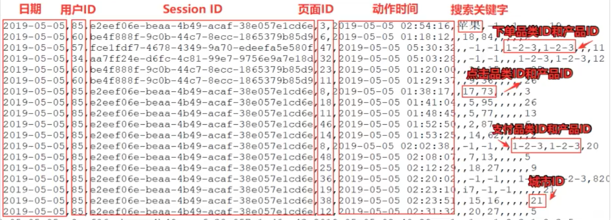

>同样，本文是[尚硅谷2021迎新版大数据Spark从入门到精通](https://www.bilibili.com/video/BV11A411L7CK)的学习笔记。尚硅谷牛逼！

>[https://www.bilibili.com/video/BV11A411L7CK?p=110](https://www.bilibili.com/video/BV11A411L7CK?p=110)

通过一些典型的案例了解各种算子的适用场景，同时帮助更进一步理解这些算子的实现原理！

按理基于的数据是这样的格式，主要包括用户的4 种行为：搜索、点击、下单、支付。一条数据只能是这4 种行为中的一种！

## 