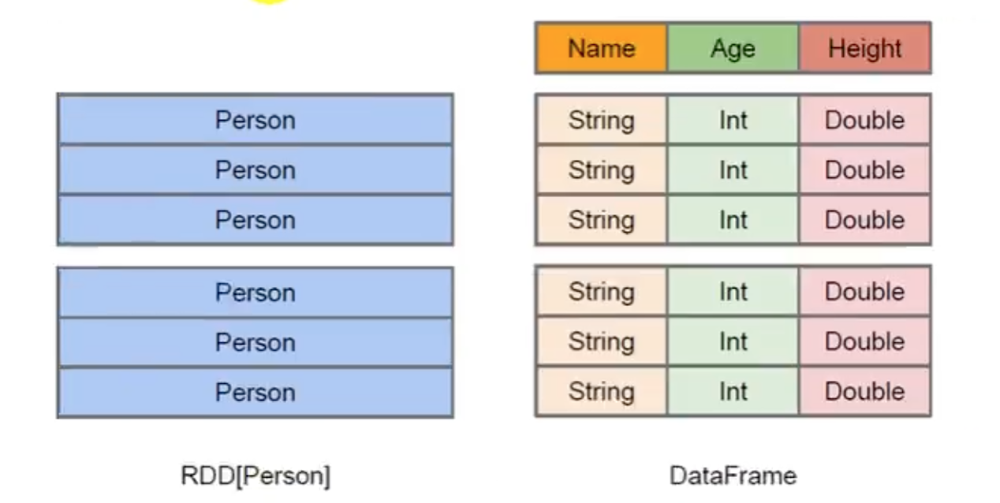
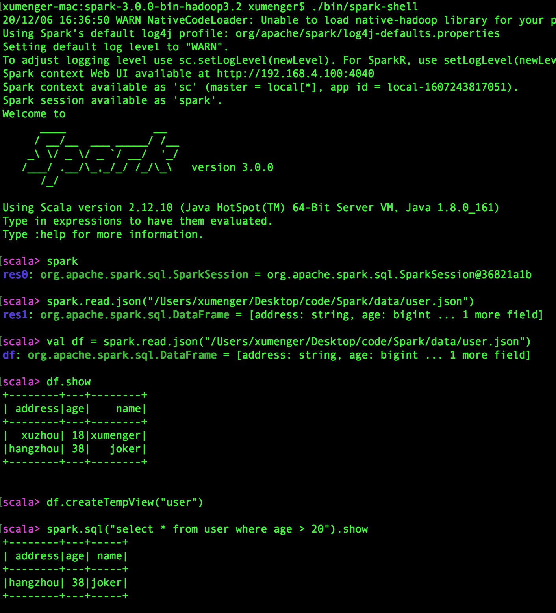
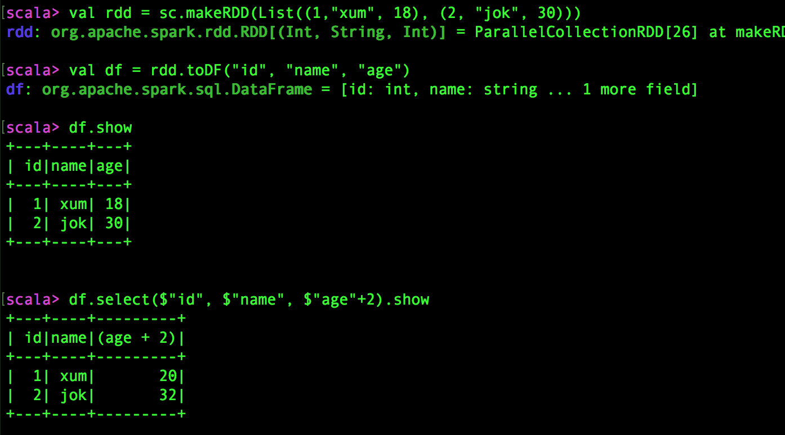
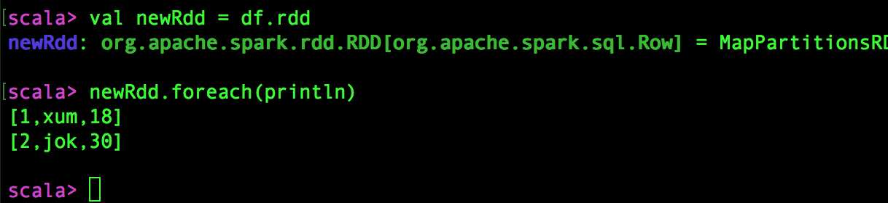

Spark SQL 就是对结构化数据处理的模块。为什么会出现Spark SQL 呢？先说一下Hive，Hive 是基于Hadoop 框架的SQL 引擎工具，目的是简化Map Reduce 开发，因为早期很多大数据开发人员都来自Web 开发或者Server 开发，这些程序员对于大数据开发不是很理解，所以开发效率并不高，因此Hive 就出现了，它用SQL 的方式简化Map Reduce，也就是说开发者编写一个SQL，框架把它转换成Map Reduce执行，执行效率可能不会提高，但是开发效率可以有效提升。Spark SQL 的出现则是为了简化RDD 的开发！

Spark SQL 为了简化RDD 的开发，提高开发效率，提供了2 个抽象模型，分别是DataFrame、DataSet

工作中会有数仓相关的业务，会和Hive 相结合，Spark SQL 在这个场景下会是一个不错的选择！

Spark SQL 使用相同的方式可以连接不同的数据源，比如数据库、HBase、Hive、文件等，只需要简单地修改一下参数即可

## DataFrame与DataSet

在Spark 中，DataFrame 是一种以RDD 为基础的分布式数据集，类似于传统数据库中的二维表格。DataFrame 与RDD 的主要区别在于，前者带有schema 元信息，即DataFrame 所表示的二维表数据集的每一列都带有名称和类型。这使得Spark SQL 得以洞察更多的结构信息，从而对藏于DataFrame 背后的数据源以及作用于DataFrame 之上的变换进行了针对性的优化，最终达到大幅度提升运行时效率的目标

反观RDD，由于无法得知所存数据元素的具体内部结构，Spark Core 只能在Stage 层面进行简单、通用的流水线优化

与Hive 类似，DataFrame 也支持嵌套数据类型（struct、array 和map），从API 易用性的角度上看，DataFrame API 提供的是一套高层的关系操作，比函数式的RDD API 要更加友好



DataFrame 是为数据提供了Schema 的视图，可以把它当作数据库中的一张表来对待。DataFrame 也是懒执行的，但性能上比RDD 高，主要原因是优化的执行计划，即查询计划通过Spark catalyst optimiser 进行优化

DataSet 是分布式数据集合。DataSet 是Spark 1.6 中添加的一个新抽象，是DataFrame 的一个扩展，它提供了RDD 的优势（强类型、使用强大的lambda 函数的能力）以及Spark SQL 优化执行引擎的优点。DataSet 也可以使用功能性的转换（操作map、flatMap、filter等）

## 控制台环境演示

准备一个JSON 格式的结构化数据

```json
{"name":"xumenger", "age":18, "address":"xuzhou"}
{"name":"joker", "age":38, "address":"hangzhou"}
```

然后展示在控制台环境下的应用



比如想要计算年龄的平均值，很简单

```sql
select avg(age) from user
```

试想一下如果用RDD 实现这个功能，那么相对上面的方式会复杂很多，所以Spark SQL 是很好的简化RDD 的方式

>[https://www.bilibili.com/video/BV11A411L7CK?p=157](https://www.bilibili.com/video/BV11A411L7CK?p=157)

>[https://www.bilibili.com/video/BV11A411L7CK?p=158](https://www.bilibili.com/video/BV11A411L7CK?p=158)

## RDD、DataFrame转换

同样，先在控制台环境下展示



调用toDF()，并且在toDF() 的参数中指定列名，即可从RDD 转化为DataFrame。另外DataFrame 也可以转化为RDD



