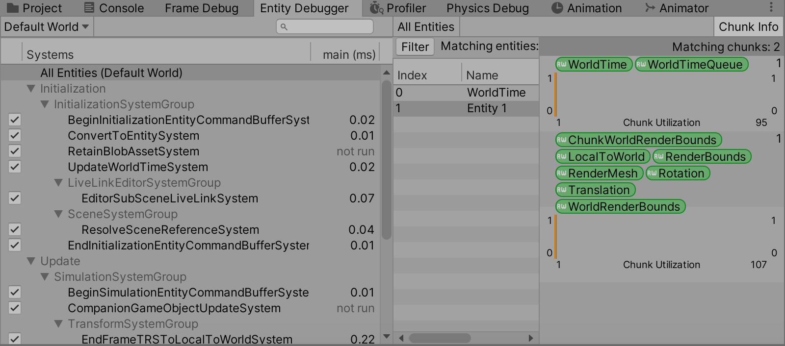
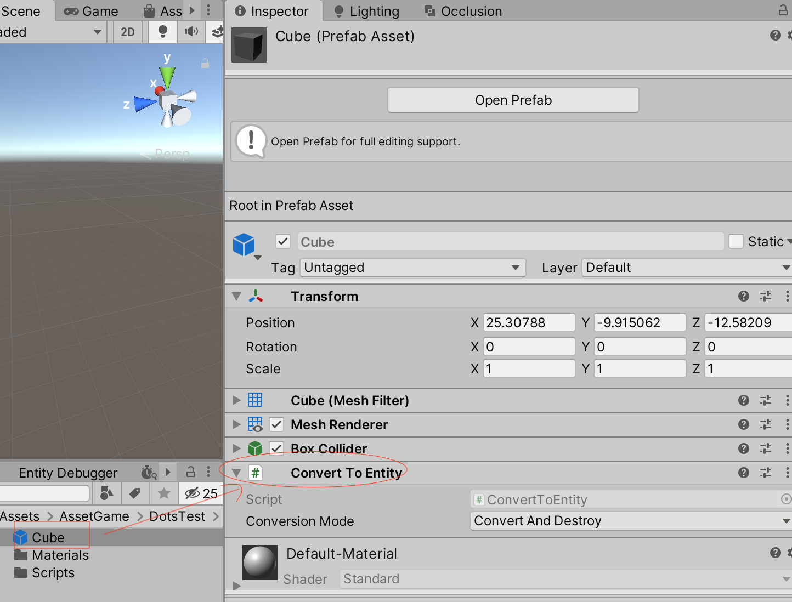
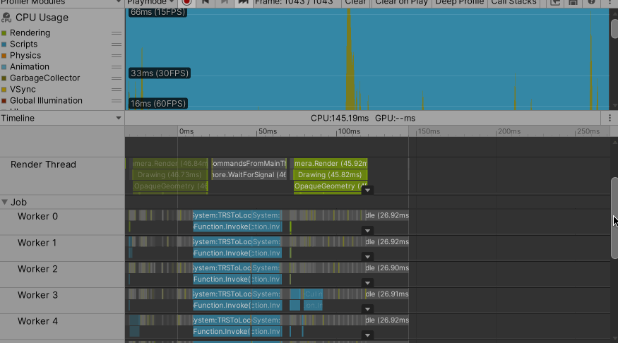

>DOTS(Data-Oriented Tech Stack)，是基于DOD（面向数据编程）的思想设计的一套系统。包括实体组件系统ECS、C# Job System、Brust 编译器。需要通过Package Manager 先安装这5 个包：Entities、Mathematics、Hybrid Render、Jobs、Burst

>缓存友好 + SIMD + 多线程 + struct去掉GC + LLVM burst编译器优化

>Unity DOTS 的优化思路，在其他的软件开发领域也都是可以参考的！

>ECS(Entity/Component/System)。使用ECS 开发，需要通过Package Manager 先安装这几个包：Entities、Mathematics、Hybrid Render

>ECS 是一种新的架构模式（当然是针对Unity 本身来说），这是一个取代GameObject/Component 的模式

Unity 的GameObject/Component 的模式对于开发者从编程思想上是很好理解的，是程序对现实的模拟，一个游戏物体上挂着一些组件，但是对内存的利用是很低效的，比如一个Unity 游戏对象，它下面的RigidBody、Render、Transform、Animator 等很多组件都是分散在内存的不同地方的，如果游戏对象不多，那么还好，如果游戏对象很多，那么影响就很大了，因为在计算机底层的实现中，内存是要加载到CPU 缓存中处理的，因为这些组件在内存中不连续，所以不能一次性加载到缓存，那么当游戏对象和组件很多的时候，CPU 缓存的命中率就会因此变得很低！需要在内存中大量的寻找！


CPU 访问内存的速度是L1 缓存的100 倍；访问速度：L1 > L2 > L3 > RAM；存储容量：L1 < L2 < L3 < RAM。ECS 的设计目的之一就是提高缓存命中率


传统的GameObject/Component 的模式处理海量游戏对象时，性能就因此降了下来！所以就希望在实例化游戏对象的时候，游戏对象上负载的这些组件，是不是也能在内存中都放在一个完整的内存区域？！

ECS 技术在实例化实体的时候，都是一个一个在内存中紧密排列的，就会有利于海量实例的处理！

Entity、Component 只相当于纯粹的数据，一点逻辑处理都没有。写逻辑处理的部分的是System 和Job

## ECS 组成

ECS 主要是Entities 的开发，包括：组件（Component）、系统（System）、Entities的管理器脚本（GameObjectEntity.cs），以下是ECS 的架构图


在开发的时候，首先开发一个组件，然后开发一个系统。组件相当于把传统的OOP 编程中的一个类的字段部分拆分成一个组件；一个类中的所有方法拆分成一个系统

一个Entity 可以包含多个Component。Entities 和MonoBehaviour 功能对比：

Entities   &nbsp;&nbsp;&nbsp;&nbsp;&nbsp;&nbsp;&nbsp;&nbsp;&nbsp;&nbsp;&nbsp;&nbsp;&nbsp;&nbsp;&nbsp;&nbsp;&nbsp;&nbsp;&nbsp;&nbsp;&nbsp;&nbsp;&nbsp;&nbsp;&nbsp;&nbsp;&nbsp;&nbsp;&nbsp;&nbsp;&nbsp;&nbsp;&nbsp;&nbsp;&nbsp;&nbsp;&nbsp;&nbsp;&nbsp;&nbsp;&nbsp;&nbsp;&nbsp;&nbsp;&nbsp;&nbsp;        | MonoBehaviour  &nbsp;&nbsp;&nbsp;&nbsp;&nbsp;&nbsp;&nbsp;&nbsp;&nbsp;&nbsp;&nbsp;&nbsp;&nbsp;&nbsp;&nbsp;&nbsp;&nbsp;&nbsp;&nbsp;&nbsp;&nbsp;&nbsp;&nbsp;&nbsp;&nbsp;&nbsp;&nbsp;&nbsp;&nbsp;&nbsp;&nbsp;&nbsp;&nbsp;&nbsp;&nbsp;&nbsp;&nbsp;&nbsp;&nbsp;&nbsp;&nbsp;&nbsp;&nbsp;&nbsp;&nbsp;&nbsp;
--------------------------|------------------
Entity: things            | GameObject
ComponentData: data       | Component 的字段变量
ComponentSystem: logic    | Component 的Update 方法


## 使用PureECS 创建一个实体

>Jobs -> Burst -> Enable Compilation 先不打开！

编写代码如下，脚本名为Spawner.cs

```c#
using System.Collections;
using System.Collections.Generic;
using UnityEngine;

using Unity.Entities;
using Unity.Transforms;
using Unity.Rendering;
using Unity.Mathematics;

public class Spawner : MonoBehaviour
{
    [SerializeField] private Mesh unitMesh;
    [SerializeField] private Material unitMaterial;

    // Start is called before the first frame update
    void Start()
    {
        MakeEntity();
    }

    private void MakeEntity()
    {
        // 得到Entity Manager
        EntityManager entityManager = World.DefaultGameObjectInjectionWorld.EntityManager;

        // 定义archetype，确定包含的组件Translation、RenderBounds 等都是struct！
        EntityArchetype archetype = entityManager.CreateArchetype(
            typeof(Translation),
            typeof(Rotation),
            typeof(RenderMesh),
            typeof(RenderBounds),
            typeof(LocalToWorld)
            );

        // 创建Entity，这个Entity 包含archetype 定义的组件
        Entity entity = entityManager.CreateEntity(archetype);

        // 为Entity 添加属性值，位置信息是每个Entity 共有的，所以AddComponentData
        entityManager.AddComponentData(entity, new Translation
            {
                Value = new float3(2f, 0f, 4f)
            });

        // 为Entity 添加属性值，网格、材质可以是多个Entity 共有的，所以AddSharedComponentData
        entityManager.AddSharedComponentData(entity, new RenderMesh()
        {
            mesh = unitMesh,
            material = unitMaterial
        }) ;
    }
}
```
>再次强调AddComponentData()、AddSharedComponentData() 的区别！

然后在Hierarchy 中创建一个空物体，为其设置网格、材质属性


Window -> Analysis -> Entity Debuger，可以看到这个Entity



## HybridECS 创建一个Cube

上面通过为空物体上设置Mesh、Material 属性的方式，并且在为EntityArchetype 指定相关属性的方式创建一个Cube，下面展示另一种方式

新建一个Cube，为其添加HybridECS 自带的ConvertToEntity.cs 脚本，然后将其做成一个预制件



然后创建一个空物体，命名为CreateCubeManager，为其添加一个CreateCubeManager.cs 脚本

```c#
using System.Collections;
using System.Collections.Generic;
using UnityEngine;

using Unity.Entities;
using Unity.Transforms;
using Unity.Rendering;
using Unity.Mathematics;

public class CreateCubeManager : MonoBehaviour
{
    [SerializeField] private GameObject gameObjectPrefab;

    private Entity entityPrefab;
    private World defaultWorld;
    private EntityManager entityManager;

    // Start is called before the first frame update
    void Start()
    {
        defaultWorld = World.DefaultGameObjectInjectionWorld;
        entityManager = defaultWorld.EntityManager;

        GameObjectConversionSettings settings = GameObjectConversionSettings.FromWorld(defaultWorld, null);

        // 预制件转换成Entity
        entityPrefab = GameObjectConversionUtility.ConvertGameObjectHierarchy(gameObjectPrefab, settings);

        // 实例化Entity
        Entity myEntity = entityManager.Instantiate(entityPrefab);

        // 为Entity设置位置组件信息
        entityManager.SetComponentData(myEntity, new Translation
        {
            Value = new float3(4f, 0f, 4f)
        });
    }
}
```

将刚才创建的Cube 预制件拖到CreateCubeManager 的gameObjectPrefab 属性上，然后运行程序，可以看到和上面一样的效果

ConvertToEntity.cs 可以简单的理解将Unity 原来的Component 转换成ECS 对应的Component，可以自己点开看一下代码实现！

## 使用HybridECS 创建“百万”游戏对象

上面我们为Entity 添加了Translation 等组件，这些是Unity ECS 默认提供的，当然我们也可以自定义需要的组件，在这个案例中，我想让所有的Entity 动起来，那么就要定义运动的一些参数，比如速度等，这其实就是ECS 中的Component（数据），另外还需要定义运动的逻辑，这个其实就是ECS 中的System（逻辑）

首先先定义Entity 运动需要的参数组件，MoveSpeedData.cs 然后将这个脚本也放到Cube 预制件上（先将预制件拖到Hierarchy 中，右键->Unpack Prefab，然后为这个游戏物体附上这个脚本，这时候针对Hierarchy 中的该游戏对象是可以修改MoveSpeedData.Value 属性的，比如将其修改为2，然后再拖回到Project 文件目录中，更新原来的预制件即可）

```c#
using System.Collections;
using System.Collections.Generic;
using UnityEngine;

using Unity.Entities;

// 加了[GenerateAuthoringComponent] 之后，这个脚本就可以直接拖到游戏对象中了
[GenerateAuthoringComponent]
public struct MoveSpeedData : IComponentData
{
    public float Value;
}
```

直接运行程序的话，可以在Entity Debugger 中看到在原来Translation、Rotation、RenderMesh 等组件的基础上，又多了我们自定义的MoveSpeedData 组件


同理，如果你需要在这个Entity 上设置更多属性来实现更复杂的逻辑、存储更多数据，那么就可以添加更多的自定义Component，下面为其添加一个新的Component 用于控制Entity 的振幅、偏移等信息，用于实现整体的波动效果。同样将这个Component 放到预制件上。比如设置Amplitute 为5、XOffset 为0.25、YOffset 为0.25

```c#
using System.Collections;
using System.Collections.Generic;
using UnityEngine;

using Unity.Entities;
using Unity.Mathematics;

// 加了[GenerateAuthoringComponent] 之后，这个脚本就可以直接拖到游戏对象中了
[GenerateAuthoringComponent]
public struct WaveData : IComponentData
{
    public float Amplitute;   // 振幅
    public float XOffset;
    public float ZOffset;
}
```

然后定义运行的逻辑，WaveSystem.cs。注意这个脚本不需要拖放到任何游戏物体上，运行时，Unity 引擎会自动处理System 脚本！

```c#
using System.Collections;
using System.Collections.Generic;
using UnityEngine;

using Unity.Entities;
using Unity.Transforms;
using Unity.Mathematics;

public class WaveSystem : ComponentSystem
{
    // 和MonoBehaviour Update() 类似，每帧执行
    protected override void OnUpdate()
    {
        // 遍历所有有Translation、MoveSpeedData 组件的实体，通过Lambda 表达式编写逻辑
        // ref 是读写变量
        Entities.ForEach((ref Translation trans, ref MoveSpeedData speed, ref WaveData wave) =>
        {
            // math.sin() 也是Unity.Mathematics 提供的方法
            // y(t) = Asin(wt + q)
            // A: 振幅
            // w: 角频率
            // q: 相移
            float yPosition = wave.Amplitute * math.sin((float)Time.ElapsedTime * speed.Value + trans.Value.x * wave.XOffset + trans.Value.z * wave.ZOffset);

            // 在OnUpdate 方法中更新实体的Translation 组件
            trans.Value = new float3(trans.Value.x, yPosition, trans.Value.z);
        });
    }
}
```

系统的生命周期如下，其中只有OnUpdate() 是必须要实现的方法


然后，在CreateCubeManager 脚本中在Start() 方法中新增创建“百万”游戏对象的逻辑

```c#
using System.Collections;
using System.Collections.Generic;
using UnityEngine;

using Unity.Entities;
using Unity.Transforms;
using Unity.Rendering;
using Unity.Mathematics;

public class CreateCubeManager : MonoBehaviour
{
    // 同样的，要在运行前，先把Cube Prefab 拖到这个属性上
    [SerializeField] private GameObject gameObjectPrefab;

    // 用于设置Entity在各个方向的数量
    public int xNum = 40;
    public int zNum = 40;

    // Entity的间隔
    [Range (0f, 2f)]
    public float spacing = 1.5f;

    private Entity entityPrefab;
    private World defaultWorld;
    private EntityManager entityManager;

    // Start is called before the first frame update
    void Start()
    {
        defaultWorld = World.DefaultGameObjectInjectionWorld;
        entityManager = defaultWorld.EntityManager;

        GameObjectConversionSettings settings = GameObjectConversionSettings.FromWorld(defaultWorld, null);

        // 预制件转换成Entity
        entityPrefab = GameObjectConversionUtility.ConvertGameObjectHierarchy(gameObjectPrefab, settings);

        // 循环创建指定数量的实体
        for (int x = 0; x < xNum; x++)
        {
            for (int z = 0; z < zNum; z++)
            {
                // 实例化Entity
                Entity myEntity = entityManager.Instantiate(entityPrefab);

                // 为Entity设置位置组件信息
                entityManager.SetComponentData(myEntity, new Translation
                {
                    Value = new float3(x * spacing, 0f, z * spacing)
                });
            }
        }
    }
}
```

设置100 x 100 个游戏实体，最终运行的效果如下，可以看到性能值：9 FPS、20300 Batches、245k Tris、492k Verts。多次测试，有的时候也可以达到11 FPS


打开Entity Debugger 看一下，现在有10000 个Entity


打开Window -> Analysis -> Profiler 看一下，现在这种情况下是是主线程在处理，各个Worker 线程处于Idle 状态等待！显然计算资源没有利用起来！



下文会使用C# Job 来开启并发优化这个处理流程，看一下性能会有怎样的提升！

## 参考资料

* [UUG Online直播回放：DOTS从原理到应用-雨松MOMO](https://www.bilibili.com/video/BV1sD4y1Q7an)
* [DOTS深度研究之从原理到实践](https://www.xuanyusong.com/archives/4708)
* [Unity官方ECS样例](https://github.com/Unity-Technologies/EntityComponentSystemSamples.git)
* [Unity官方文档 ECS](https://docs.unity3d.com/Packages/com.unity.entities@0.16/manual/index.html)
* [Unity官方文档 Burst编译器](https://docs.unity3d.com/Packages/com.unity.burst@1.4/manual/index.html)
* [Unity官方文档 C# Job](https://docs.unity3d.com/Manual/JobSystem.html)
* [Unity官方文档 Mathematics](https://docs.unity3d.com/Packages/com.unity.mathematics@1.2/manual/index.html)
* [https://connect.unity.com/u/yu-song-momo-1](https://connect.unity.com/u/yu-song-momo-1)
* [Unity DOTS 介绍](https://www.bilibili.com/video/BV1tp4y1S7sc)
* [【游戏开发】Unity ECS DOTS 教程 （合集）机翻！](https://www.bilibili.com/video/BV1qE411x7Wg)
* [https://software.intel.com/sites/landingpage/IntrinsicsGuide/](https://software.intel.com/sites/landingpage/IntrinsicsGuide/)
