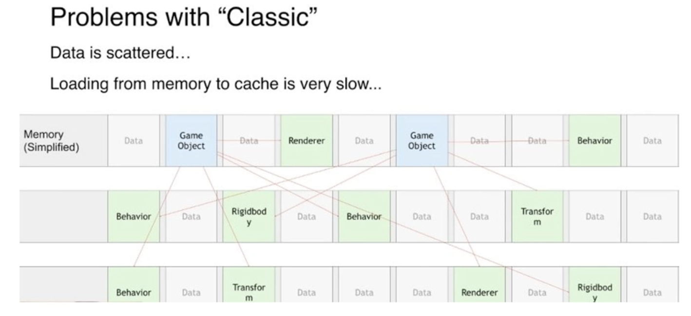
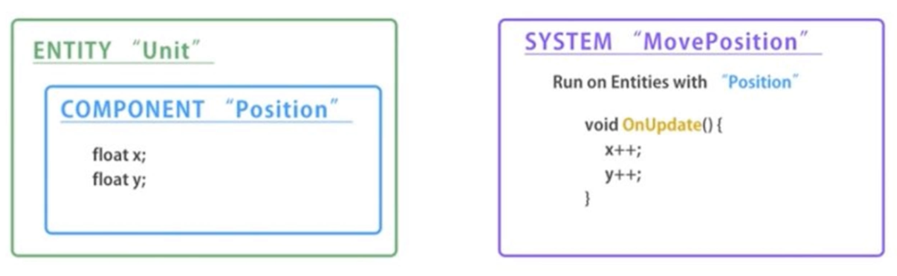

>ECS(Entity/Component/System)。使用ECS 开发，需要通过Package Manager 先安装这5 个包：Entities、Mathematics、Hybrid Render、Jobs、Burst

>ECS 是一种新的架构模式（当然是针对Unity 本身来说），这是一个取代GameObject/Component 的模式

Unity 的GameObject/Component 的模式对于开发者从编程思想上是很好理解的，是程序对现实的模拟，一个游戏物体上挂着一些组件，但是对内存的利用是很低效的，比如一个Unity 游戏对象，它下面的RigidBody、Render、Transform、Animator 等很多组件都是分散在内存的不同地方的，如果游戏对象不多，那么还好，如果游戏对象很多，那么影响就很大了，因为在计算机底层的实现中，内存是要加载到CPU 缓存中处理的，因为这些组件在内存中不连续，所以不能一次性加载到缓存，那么当游戏对象和组件很多的时候，CPU 缓存的命中率就会因此变得很低！需要在内存中大量的寻找！



传统的GameObject/Component 的模式处理海量游戏对象时，性能就因此降了下来！所以就希望在实例化游戏对象的时候，游戏对象上负载的这些组件，是不是也能在内存中都放在一个完整的内存区域？！

ECS 技术在实例化实体的时候，都是一个一个在内存中紧密排列的，就会有利于海量实例的处理！

## ECS 组成

ECS 主要是Entities 的开发，包括：组件（Component）、系统（System）、Entities的管理器脚本（GameObjectEntity.cs），以下是ECS 的架构图



在开发的时候，首先开发一个组件，然后开发一个系统。组件相当于把传统的OOP 编程中的一个类的字段部分拆分成一个组件；一个类中的所有方法拆分成一个系统

一个Entity 可以包含多个Component

Entities 和MonoBehaviour 功能对比：

Entities   &nbsp;&nbsp;&nbsp;&nbsp;&nbsp;&nbsp;&nbsp;&nbsp;&nbsp;&nbsp;&nbsp;&nbsp;&nbsp;&nbsp;&nbsp;&nbsp;&nbsp;&nbsp;&nbsp;&nbsp;&nbsp;&nbsp;&nbsp;&nbsp;&nbsp;&nbsp;&nbsp;&nbsp;&nbsp;&nbsp;&nbsp;&nbsp;&nbsp;&nbsp;&nbsp;&nbsp;&nbsp;        | MonoBehaviour  &nbsp;&nbsp;&nbsp;&nbsp;&nbsp;&nbsp;&nbsp;&nbsp;&nbsp;&nbsp;&nbsp;&nbsp;&nbsp;&nbsp;&nbsp;&nbsp;&nbsp;&nbsp;&nbsp;&nbsp;&nbsp;&nbsp;&nbsp;&nbsp;&nbsp;&nbsp;&nbsp;&nbsp;&nbsp;&nbsp;&nbsp;&nbsp;&nbsp;&nbsp;&nbsp;&nbsp;&nbsp;
-------------------|------------------
Entity             | GameObject
ComponentData      | Component 的字段变量
ComponentSystem    | Component 的Update 方法


## 使用ECS 实现10000 个Cube 同屏

接下来的案例基于Unity 2019 版本开发实现

首先定义组件。

```c#

```

然后定义系统。继承ComponentSystem 抽象类，实现内部的OnUpdate() 抽象方法，在OnUpdate() 方法中，使用Entities.ForEach() 来遍历更新所有实体（Entity）中的组件（Component）

```c#

```

最后定义实体管理器。

```c#

```

## 参考资料

* [Unity ECS 开发百万同屏游戏技术](https://www.bilibili.com/video/BV1yt411u7dh)
* [Unity ECS(二) 小试牛刀](https://www.bilibili.com/video/BV187411T7vA)
* [[官方直播] Unity新2D和ECS开发介绍（Unity新加坡办公室直播特辑）](https://www.bilibili.com/video/BV1At41117n6)