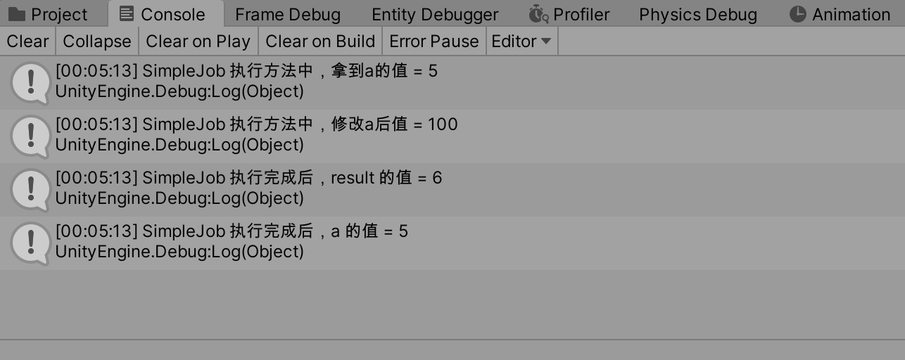

>Job System 是Unity 对CPU 多核编程的应用。通过把工作分散到CPU 的各个核心上来大大提升运行效率。而ECS 与它的搭配则是由于ECS 的System 部分天然是以批量处理为核心的，因此只要稍加改动，就可以转变为批量的分Job 交到多核去处理，实现性能的极大提升

>使用C# Job 开发，需要通过Package Manager 先安装这个包：Job

>Native Containers: Unity.Collections、NativeArray/NativeList/NativeHashMap/NativeQueue、Memory Management(Allocator/Dispose)

## C# Job 使用展示

首先独立于上文的案例，在场景中创建一个空物体，在物体上加一个MonoBehaviour

```c#
using System.Collections;
using System.Collections.Generic;
using UnityEngine;

using Unity.Jobs;
using Unity.Collections;

public class JobExample : MonoBehaviour
{
    // Start is called before the first frame update
    void Start()
    {
        // NativeArray定义为一个struct
        NativeArray<float> resultArray = new NativeArray<float>(1, Allocator.TempJob);

        // 创建一个SimpleJob
        SimpleJob job1 = new SimpleJob
        {
            a = 5f,
            result = resultArray
        };

        // 创建另一个Job
        AnotherJob job2 = new AnotherJob
        {
            // job1 与job2 的result 指向一个实际变量！
            result = resultArray
        };

        // 开启调度Job
        JobHandle handle1 = job1.Schedule();
        // job2依赖job1（即要求在job1执行完成之后job2再执行）
        JobHandle handle2 = job2.Schedule(handle1);

        // 等待job1执行结束
        // handle1.Complete();
        // 因为job2 依赖job1，所以一定是job1 先执行完，这里主线程只用等待job2 执行结束就好了！
        handle2.Complete();

        // 拿到结果
        float resultingValue = resultArray[0];
        Debug.Log("SimpleJob 执行完成后，result 的值 = " + resultingValue);
        Debug.Log("SimpleJob 执行完成后，a 的值 = " + job1.a);

        // 释放资源
        resultArray.Dispose();
    }


    private struct SimpleJob : IJob
    {
        public float a;
        public NativeArray<float> result;

        void IJob.Execute()
        {
            result[0] = a;
            Debug.Log("SimpleJob 执行方法中，拿到a的值 = " + a);

            // 尝试修改一下a 的值
            a = 100f;
            Debug.Log("SimpleJob 执行方法中，修改a后值 = " + a);
        }
    }


    // 用于测试Job 间的依赖
    private struct AnotherJob: IJob
    {
        public NativeArray<float> result;

        void IJob.Execute()
        {
            result[0] = result[0] + 1;
        }
    }
}
```

然后游戏运行起来的效果是这样的



简单说明一下：在SimpleJob 的Execute() 中修改了a 的值，但是在外面直接访问a 的时候看到其是没有变的；因为AnotherJob 在SimpleJob 执行完后再执行，而两个Job 的result 实际都是执行一个变量的，所以当AnotherJob 执行完之后，result 的值从原来的5 增加了1 变成了6！

>这个是不是和[Java 线程池异步任务](http://www.xumenger.com/callable-future-20201105/) 的思想有点像？！

## 使用C# Job 优化程序

>Jobs -> Burst -> Enable Compilation 先不打开！另外，上面的案例也先从场景中删除！

在上文中，使用了HybridECS 开发了一个简单的案例，本文在上面代码的基础上添加C# Job，看一下优化后的效果，只需要修改原来的WaveSystem.cs。不需要像上面的例子一样，专门实现一个IJob，并且把原来OnUpdate() 中的逻辑挪到这个IJob 的Execute() 方法中，Unity 已经做好了封装，直接在原来的代码基础上引入Unity.Jobs，然后对应改一下代码就可以了

```c#
using System.Collections;
using System.Collections.Generic;
using UnityEngine;

using Unity.Entities;
using Unity.Transforms;
using Unity.Mathematics;

using Unity.Jobs;


// 从原来的继承自ComponentSystem，修改为继承JobComponentSystem
// 或者可以继承SystemBase，函数原型稍微变了一些
public class WaveSystem : JobComponentSystem
{
    // 和MonoBehaviour Update() 类似，每帧执行
    // 这里实现的OnUpdate() 方法的原型对应也有变化！
    protected override JobHandle OnUpdate(JobHandle inputHandle)
    {
        // Entities.ForEach() 不能使用引用型变量，Time.ElapsedTime是引用型变量
        // 所以需要现在外面转成值类型变量，然后在Entities.ForEach 中使用值类型变量
        float elapsedTime = (float)Time.ElapsedTime;

        // 遍历所有有Translation、MoveSpeedData 组件的实体，通过Lambda 表达式编写逻辑
        // ref 是读写变量。in 是只读变量
        JobHandle outputHandle = Entities.ForEach((ref Translation trans, in MoveSpeedData speed, in WaveData wave) =>
        {
            // math.sin() 也是Unity.Mathematics 提供的方法
            // y(t) = Asin(wt + q)
            // A: 振幅
            // w: 角频率
            // q: 相移
            float yPosition = wave.Amplitute * math.sin(elapsedTime * speed.Value + trans.Value.x * wave.XOffset + trans.Value.z * wave.ZOffset);

            // 在OnUpdate 方法中更新实体的Translation 组件
            trans.Value = new float3(trans.Value.x, yPosition, trans.Value.z);
        }).Schedule(inputHandle);

        return outputHandle;
    }
}
```

再次运行游戏，可以看一下FPS 等性能的指标。现在FPS 可以达到11 左右了，相比于之前提升很小！但观察资源管理器，看到CPU 占用在310% 左右，CPU 利用率确实是提升了的！


现在再打开Profiler 看一下整体性能，在Main 线程运行的时候，其他的Worker 也有在执行逻辑，但是看起来还是主要是Idle 状态的，为什么呢？


>如何解释这个问题？开了C# Job 后，好像性能也没有提升！Worker 线程看起来也主要处于Idle 状态？Profiler 的性能指标怎么看？是不是瓶颈在GPU，不在CPU？Batches 值为什么这么高？感觉应该和Batches 数过高有关！

## 参考资料

* [UUG Online直播回放：DOTS从原理到应用-雨松MOMO](https://www.bilibili.com/video/BV1sD4y1Q7an)
* [DOTS深度研究之从原理到实践](https://www.xuanyusong.com/archives/4708)
* [Unity官方ECS样例](https://github.com/Unity-Technologies/EntityComponentSystemSamples.git)
* [Unity官方文档 ECS](https://docs.unity3d.com/Packages/com.unity.entities@0.16/manual/index.html)
* [Unity官方文档 Burst编译器](https://docs.unity3d.com/Packages/com.unity.burst@1.4/manual/index.html)
* [Unity官方文档 C# Job](https://docs.unity3d.com/Manual/JobSystem.html)
* [Unity官方文档 Mathematics](https://docs.unity3d.com/Packages/com.unity.mathematics@1.2/manual/index.html)
* [https://connect.unity.com/u/yu-song-momo-1](https://connect.unity.com/u/yu-song-momo-1)
* [Unity DOTS 介绍](https://www.bilibili.com/video/BV1tp4y1S7sc)
* [【游戏开发】Unity ECS DOTS 教程 （合集）机翻！](https://www.bilibili.com/video/BV1qE411x7Wg)
* [https://software.intel.com/sites/landingpage/IntrinsicsGuide/](https://software.intel.com/sites/landingpage/IntrinsicsGuide/)
