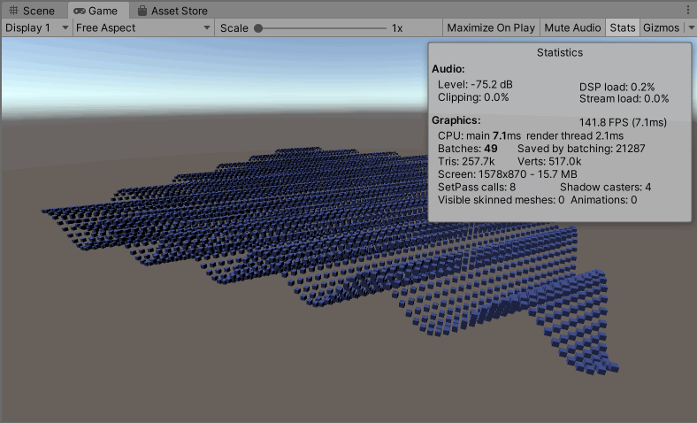

>Brust 编译器是Unity 开发的全新快速编译器，使得项目性能有了更大的提升。现在C# 写的代码首先要转换成中间代码，这样就会比较慢，Unity 就自己开发了Brust 编译器使得C# 代码不经过中间代码，直接变成汇编

Unity.Mathematics 数学库提供了矢量类型（float4、float3……），可以直接映射到硬件SIMD 寄存器。Unity.Mathematics 的Math 类中也提供了直接映射到硬件SIMD 寄存器，这样原本CPU 需要一个一个计算得到，有了SIMD 可以一次性计算完毕。注意Unity 之前的Math 类默认是不支持映射SIMD 寄存器的。还有需要注意的一点是Unity.Mathematics 必须和Burst 编译器配合使用，不使用Burst 的话，只在一个普通的脚本中编写是没有意义的

Unity.Mathematics 建议使用float3 代替Vector3，使用quaternion 代替Quaternion！

.Net Core 比C++ 慢了2 倍；Mono 比.Net Core 慢3 倍；IL2CPP 比Mono 快2-3 倍，IL2CPP 于.Net Core 效率相当，但依然比C++ 慢2 倍；Unity 使用Burst 编译后可以让C# 代码的运行效率比C++ 更快！

## 继续使用Brust 优化

使用Burst 开发，需要通过Package Manager 先安装这个包：Mathematics、Burst

在上两篇文章中，使用了HybridECS 和C# Job 开发了一个简单的案例，本文在上面代码的基础上添加Burst 支持，看一下优化后的效果

>Jobs -> Burst -> Enable Compilation 这次要打开

现在再次运行游戏可以看到游戏的帧率达到了140FPS，相比于之前开启ECS、Jobs，这次打开Burst 才真正有了质的提升！

## 调试和调优

Jobs -> Burst -> Open Inspector 即可打开Burst 编译面板窗口。配合[https://software.intel.com/sites/landingpage/IntrinsicsGuide/](https://software.intel.com/sites/landingpage/IntrinsicsGuide/) 分析编译出来的代码是否是最优的！

## 参考资料

* [转换你的游戏到DOTS（一）](https://connect.unity.com/p/zhuan-huan-ni-de-you-xi-dao-dots-yi)
* [转换场景数据到DOTS（二）](https://connect.unity.com/p/zhuan-huan-chang-jing-shu-ju-dao-dots-er)
* [拆解DOTS工作流程（三）](https://connect.unity.com/p/chai-jie-dotsgong-zuo-liu-cheng-san)
* [DOTS创建第三人称僵尸射击游戏（四）](https://connect.unity.com/p/dotschuang-jian-di-san-ren-cheng-jiang-shi-she-ji-you-xi)
* [Burst 编译器入门（五）](https://connect.unity.com/p/burst-bian-yi-qi-ru-men-wu)
* [Burst 编译器底层开发（六）](https://connect.unity.com/p/burst-bian-yi-qi-di-ceng-kai-fa-liu)
* [Unity新版数学库简介（七）](https://connect.unity.com/p/unityxin-ban-shu-xue-ku-jian-jie-qi)
* [UUG Online直播回放：DOTS从原理到应用-雨松MOMO](https://www.bilibili.com/video/BV1sD4y1Q7an)