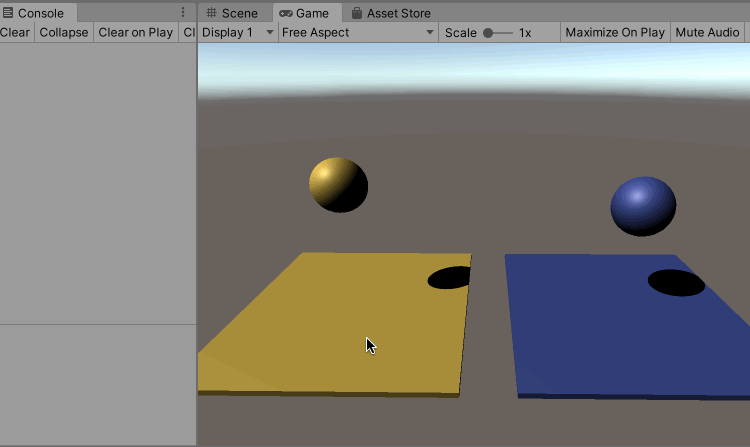

首先需要通过包管理器安装Unity Physics


## Unity 内置的物理引擎

先直接看一个Unity 内置物理引擎的使用以及效果，基于碰撞体、刚体、物理材质实现

创建一个Cube，默认是带有Box Collider 组件的

再创建一个Sphere，默认是带有Sphere Collider 组件的，然后为其新增一个Rigid Body 组件

在Asserts 中创建一个Physic Material，为其设置如下参数，这个物理材质是为了实现球体落到平面上弹跳的效果


然后在Sphere 的Sphere Collider 组件中的Material 属性中，将上面创建的Physic Material 拖入，使得物理材质在Sphere 上生效

然后运行游戏可以看到效果如下


## [Unity Physics](https://docs.unity3d.com/Manual/com.unity.physics.html) 引擎

然后看一下DOTS Physics 物理引擎，实现上面一样的效果，为了区分，为使用DOTS Physics 测试用的游戏物体设置蓝色的材质

创建一个Cube，移除其Box Collider 组件，然后分别添加Convert To Entity 组件和DTOS/Physics Shape 组件（Shape Type 改为Box），后者类似于Box Collider

创建一个Sphere，移除其Sphere Collider 组件，然后分别添加Convert To Entity 组件、DTOS/Physics Shape 组件（Shape Type 改为Sphere），再添加DTOS/Physics Body，后者类似RigidBody

并且为Sphere 的Physics Shape 组件的Material 下的Restitution 进行如下设置（类比上述Physic Material 的配置）


最终运行效果如下


## 编写代码进行控制

编写一个System（ECS 中的System 不需要拖放到某个游戏物体上，可以直接被调用），其代码逻辑如下

```c#
using System.Collections;
using System.Collections.Generic;
using UnityEngine;
using Unity.Entities;
using Unity.Physics;

public class BallJumpSystem : ComponentSystem
{
    protected override void OnUpdate()
    {
        Entities.ForEach((ref PhysicsVelocity physicsVelocity) =>
        {
            // 按下空格键的时候，物体位置向上变化
            if (Input.GetKeyDown(KeyCode.Space))
            {
                physicsVelocity.Linear.y = 5f;
            }
        });
    }
}
```

这样每次按下空格键的时候，带有PhysicsVelocity 组件的物体的位置会被向上移动


## 测试射线

编写一个脚本用来测试DOTS Physics 下的射线的使用以及效果

```c#
using System.Collections;
using System.Collections.Generic;
using UnityEngine;
using Unity.Entities;
using Unity.Physics;
using Unity.Physics.Systems;
using Unity.Mathematics;

public class TestRayCast : MonoBehaviour
{
    // 从fromPosition 到toPosition，判断有没有“Hit”某个Entity
    private Entity Raycast(float3 fromPosition, float3 toPosition)
    {
        BuildPhysicsWorld buildPhysicsWorld = World.DefaultGameObjectInjectionWorld.GetExistingSystem<BuildPhysicsWorld>();
        CollisionWorld collisionWorld = buildPhysicsWorld.PhysicsWorld.CollisionWorld;

        RaycastInput raycastInput = new RaycastInput
        {
            Start = fromPosition,
            End = toPosition,
            Filter = new CollisionFilter
            {
                BelongsTo = ~0u,
                CollidesWith = ~0u,
                GroupIndex = 0,
            }
        };

        Unity.Physics.RaycastHit raycastHit = new Unity.Physics.RaycastHit();

        if (collisionWorld.CastRay(raycastInput, out raycastHit))
        {
            // Hit Something
            Entity hitEntity = buildPhysicsWorld.PhysicsWorld.Bodies[raycastHit.RigidBodyIndex].Entity;
            return hitEntity;
        }
        else
        {
            return Entity.Null;
        }

    }

    // Update is called once per frame
    void Update()
    {
        // 判断如果鼠标左键按下的那一帧
        if (Input.GetMouseButtonDown(0))
        {
            // 传入一个屏幕上的像素坐标，返回一条在世界空间下从 Camera 的近裁剪面出发穿过屏幕上的像素坐标点的射线
            UnityEngine.Ray ray = Camera.main.ScreenPointToRay(Input.mousePosition);

            // 判断从射线的起点到沿着射线1000f 的距离有没有Hit 某个Entity
            // 注意测试过程中发现点击鼠标没有Hit 某个Entity 很有可能是因为这个距离设置的小了
            float rayDistince = 1000f;
            Debug.Log(Raycast(ray.origin, ray.direction * rayDistince));
        }
    }
}
```

运行效果如下，蓝色的Cube 和Sphere 为Entity，所以当鼠标点击后，Raycast 判断击中，但是黄色的Cube 和Sphere 是普通的GameObject，不是Entity，所以使用DOTS Physics 的Raycast 无法判断鼠标是否点击到这些非Entity 的GameObject



关于Unity.Physics 的更多用法，请移步: [https://docs.unity3d.com/Manual/com.unity.physics.html](https://docs.unity3d.com/Manual/com.unity.physics.html)