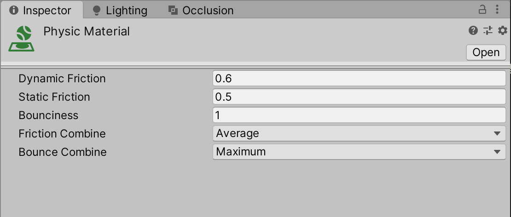
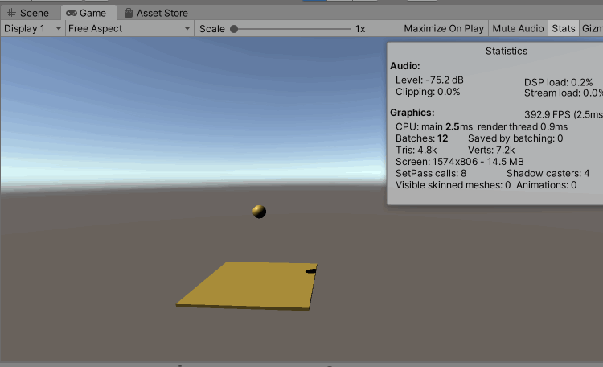
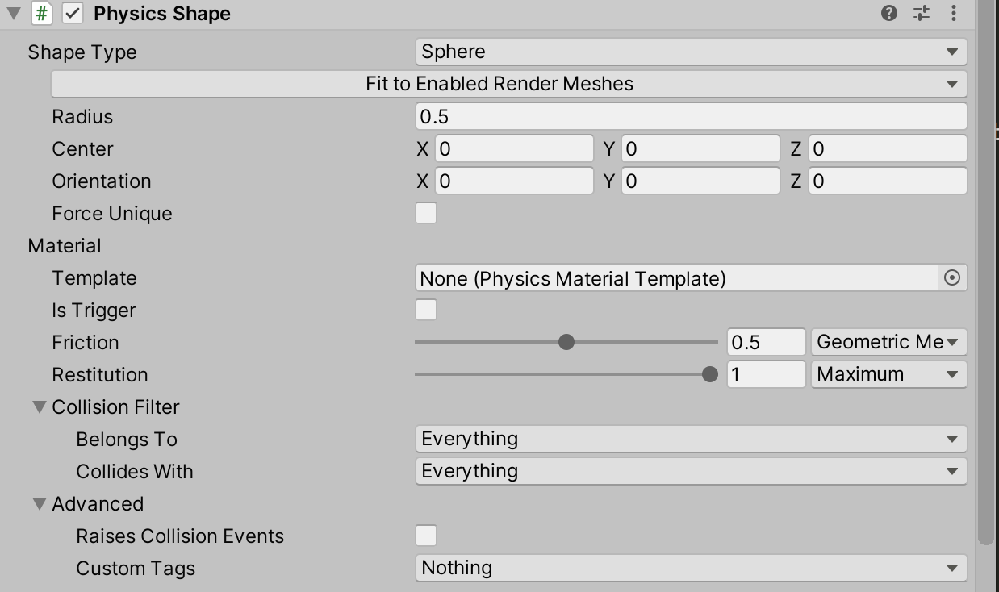
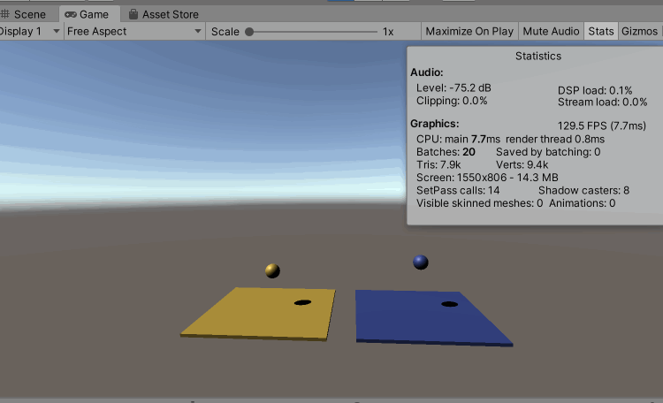
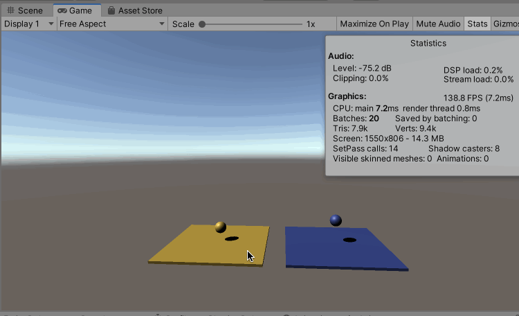

首先需要通过包管理器安装Unity Physics


## Unity 内置的物理引擎

先直接看一个Unity 内置物理引擎的使用以及效果，基于碰撞体、刚体、物理材质实现

创建一个Cube，默认是带有Box Collider 组件的

再创建一个Sphere，默认是带有Sphere Collider 组件的，然后为其新增一个Rigid Body 组件

在Asserts 中创建一个Physic Material，为其设置如下参数，这个物理材质是为了实现球体落到平面上弹跳的效果



然后在Sphere 的Sphere Collider 组件中的Material 属性中，将上面创建的Physic Material 拖入，使得物理材质在Sphere 上生效

然后运行游戏可以看到效果如下



## Unity Physics 引擎

然后看一下DOTS Physics 物理引擎，实现上面一样的效果，为了区分，为使用DOTS Physics 测试用的游戏物体设置蓝色的材质

创建一个Cube，移除其Box Collider 组件，然后分别添加Convert To Entity 组件和DTOS/Physics Shape 组件（Shape Type 改为Box），后者类似于Box Collider

创建一个Sphere，移除其Sphere Collider 组件，然后分别添加Convert To Entity 组件、DTOS/Physics Shape 组件（Shape Type 改为Sphere），再添加DTOS/Physics Body，后者类似RigidBody

并且为Sphere 的Physics Shape 组件的Material 下的Restitution 进行如下设置（类比上述Physic Material 的配置）



最终运行效果如下



## 编写代码进行控制

编写一个System（ECS 中的System 不需要拖放到某个游戏物体上，可以直接被调用），其代码逻辑如下

```c#
using System.Collections;
using System.Collections.Generic;
using UnityEngine;
using Unity.Entities;
using Unity.Physics;

public class BallJumpSystem : ComponentSystem
{
    protected override void OnUpdate()
    {
        Entities.ForEach((ref PhysicsVelocity physicsVelocity) =>
        {
            // 按下空格键的时候，物体位置向上变化
            if (Input.GetKeyDown(KeyCode.Space))
            {
                physicsVelocity.Linear.y = 5f;
            }
        });
    }
}
```

这样每次按下空格键的时候，带有PhysicsVelocity 组件的物体的位置会被向上移动

