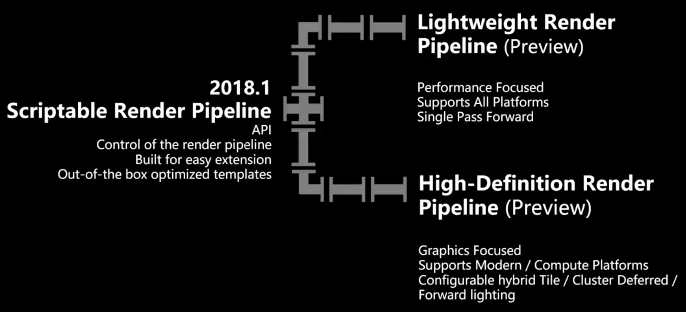
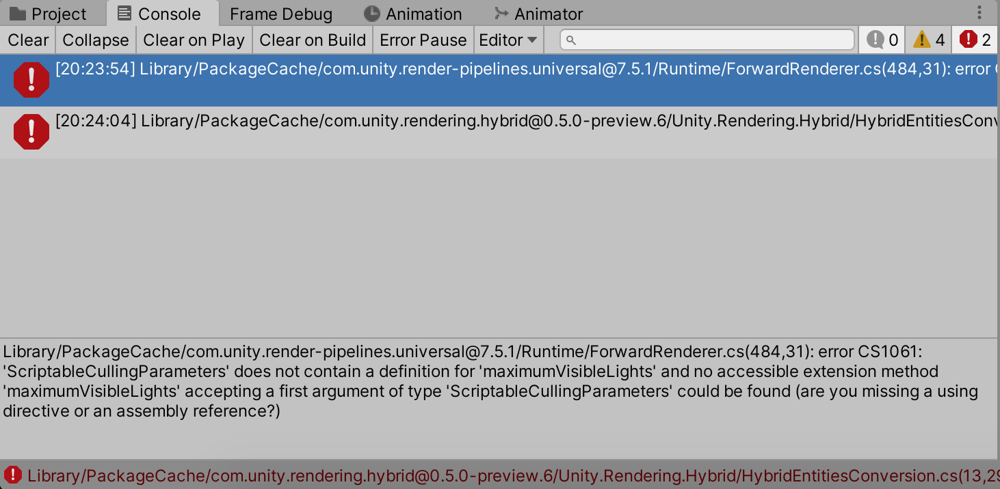
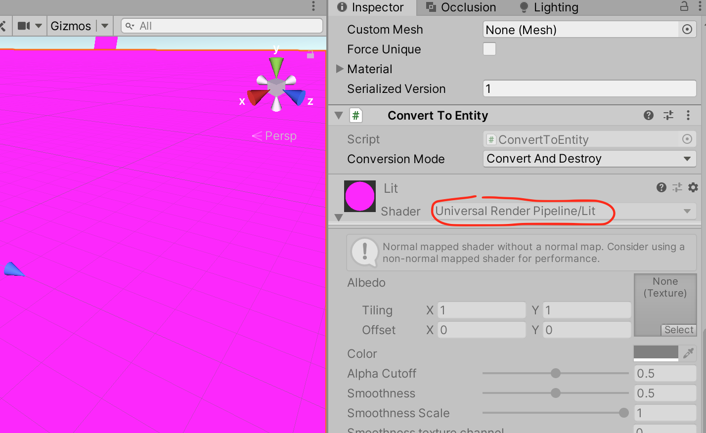
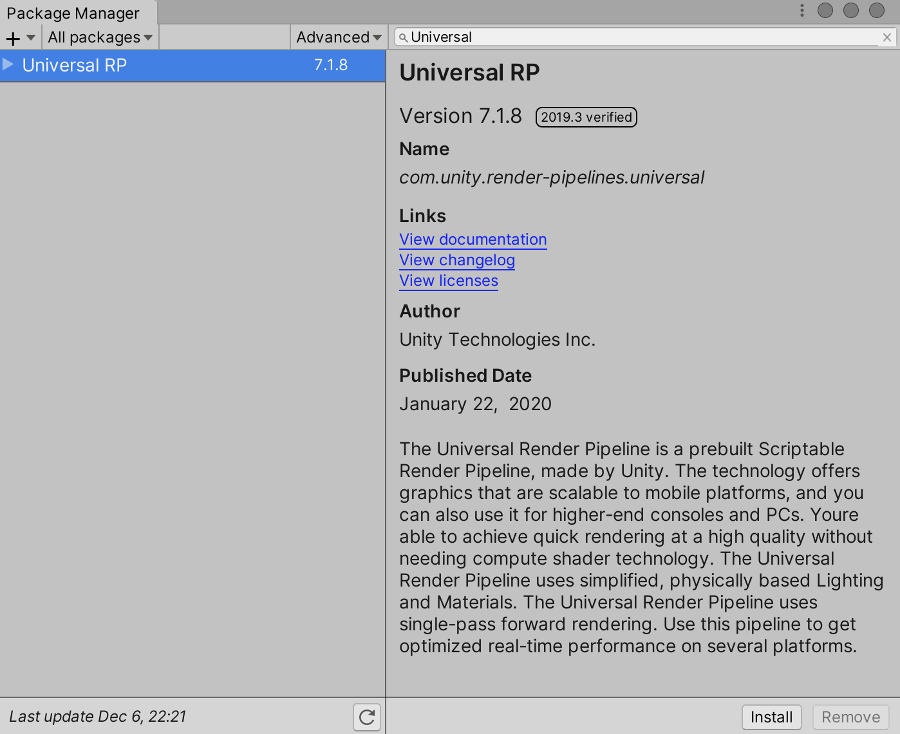
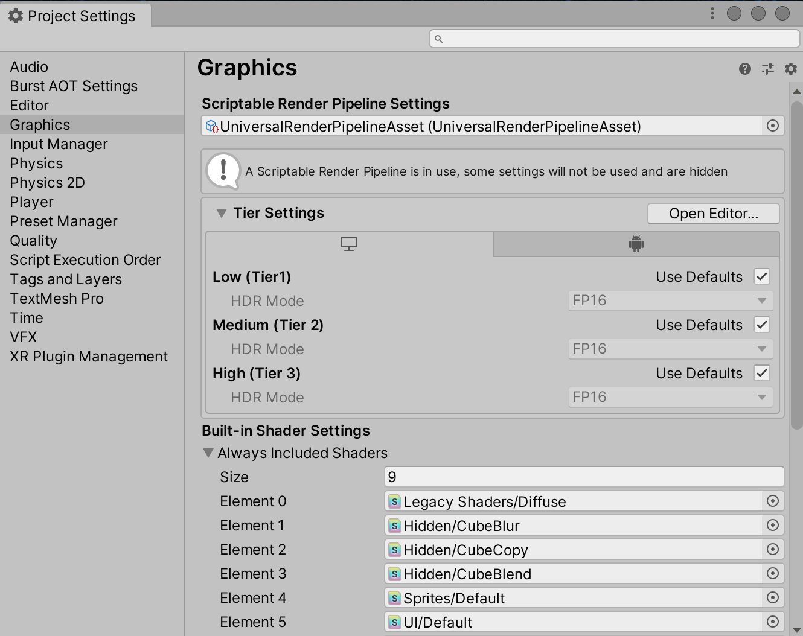
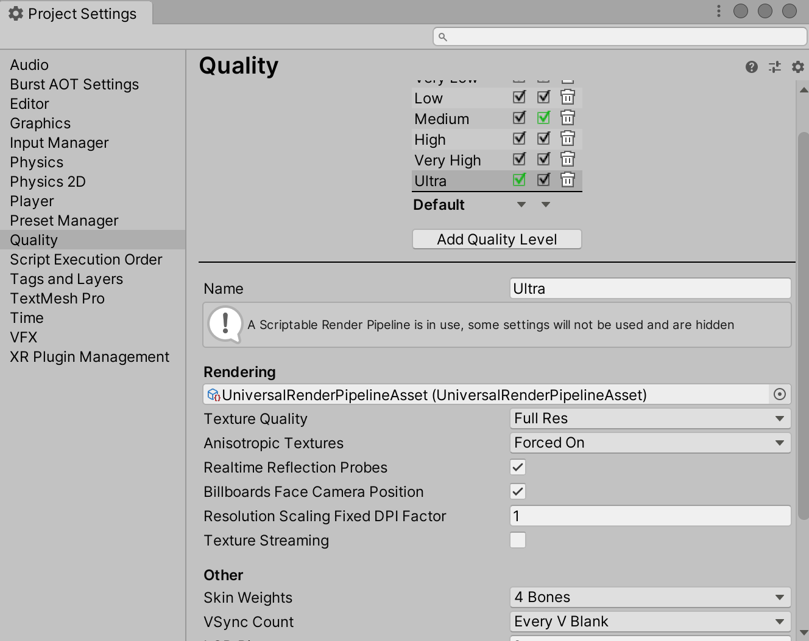
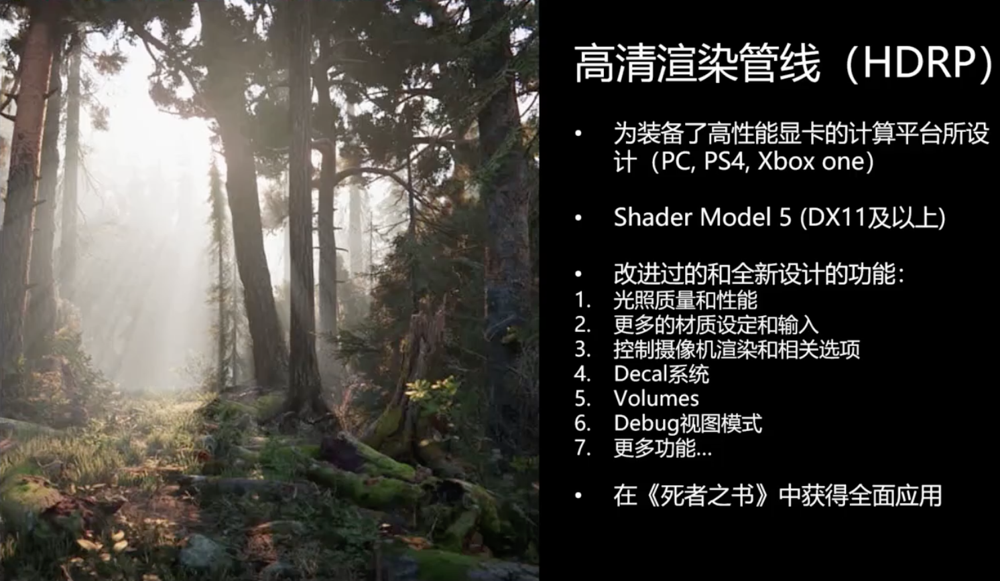

可编程渲染管线（Scriptable Render Pipeline），支持直接通过C# 脚本控制渲染管线。目前Unity 官方提供高清渲染管线（HDRP）和轻量级渲染管线（LWRP），前者专注于高端图形渲染，为支持Compute Shader 的现代平台优化，可配置的集合了Tile/Cluster Deferred/Forward 光照；后者专注于性能，支持所有平台，Single-Pass 前向渲染



渲染管线最主要需要关注的事情包括：剔除（Culling）、渲染（Render）、后期处理（Post Processing）

## 项目升级为URP/LWRP

Unity 已经正式将LWRP 的名称变更为Universal RP，即通用渲染管线，并将正式接过内置管线的大旗，成为新一代Unity 的兼容所有平台的通用渲染管线

比如从github 下载一个基于URP 的Unity 项目，在本机打开后可能有这样的错误



```
Library/PackageCache/com.unity.render-pipelines.universal@7.5.1/Runtime/ForwardRenderer.cs(484,31): 
error CS1061: 'ScriptableCullingParameters' does not contain a definition for 'maximumVisibleLights' 
and no accessible extension method 'maximumVisibleLights' accepting a first argument of type 
'ScriptableCullingParameters' could be found (are you missing a using directive or an assembly reference?)
```

同时可以看到场景中的材质失效，显示为紫粉色



这里可以看到材质是Universal Render Pipeline，而不是Standard！所以需要为当前项目设置URP（通用渲染管线）

首先需要在包管理器中安装Universal RP（如果原来安装了Lightweight RP，请先Remove）



Projects窗口 -> Assets -> Create -> Rendering -> Universal Render Pipeline -> Pipeline Asset (Forward Renderer)

菜单 -> Edit -> Project Settings -> Graphics 在Scriptable Render Pipeline Settings 选择刚才创建的URP 配置资源

菜单 -> Edit -> Project Settings -> Quality 在Rendering 选择刚才创建的URP 配置资源





## 项目升级为HDRP

如何从现有的渲染管线升级到HDRP 渲染管线呢？

首先从Package Manager 安装这几个插件包

* Render-pipeline.high（HDRP）
* Postprocessing（Post Processing Stack v2）
* Cinemachine

现在不支持内置的渲染管线和HDRP 渲染管线混用，因为它们的渲染模式不一样的，所以还需要把现有的标准的材质升级为HDRP 的材质（Standard Shader 升级为HDRP Shader）

* Projects窗口 -> Assets -> Create -> Rendering -> High Definition Render Pipeline Asset
* 菜单 -> Edit -> Project Settings -> Graphics 在Scriptable Render Pipeline Settings 选择刚才创建的HDRP 配置资源

不过，如果是自己编写的Shader，需要自己手动修改代码的方式以支持HDRP

原来的材质还都是使用的Standard Shader，Unity 提供了一个工具，可以将所有的Standard Shader 更新为HDRP Shader

菜单 -> Edit -> Render Pipeline -> Upgrade Project Materials to High Definition Materials，把当前项目中所有的标准材质找出来统一升级为HDRP 材质！150 个材质升级大概需要5 分钟！

>HDRP 渲染管线不能应用于手游项目，一些影视项目可以考虑使用HDRP 渲染管线



## URP/LWRP 原理

以上主要讲到了如何在Unity 进行配置以将项目升级为URP 或者HDRP，或者解决因为配置错误而导致的编译报错问题，但是最主要的还是弄清楚各种可编程渲染管线的工作原理，相对而言HDRP 在我目前的应用场景中还是用不到，所以下面主要通过参考一些资料，和内置管线进行对比的方式展示URP 的原理

URP 是单Pass 前向渲染管线，而内置管线是多Pass 前向渲染管线和延迟渲染管线。URP 没有延迟渲染，因此我们只对比前向渲染这一项（其实手游也基本只会用前向渲染，延迟渲染的G-Buffer 所需要的带宽带来的开销太大）

所谓的前向渲染，就是在渲染物体受光点光照的时候，分别对每个点光对该物体产生的影响进行计算，最后将所有光的渲染结果相加得到最终物体的颜色。内置管线的做法是，用多个Pass 来渲染光照，第一个Pass 只渲染主光源，然后多出来的光每个光用一个Pass 单独渲染，这也是为什么在做手游的时候很少会用点光源，因为对于内置管线来说，每多一盏光，整个场景的DrawCall 就会翻倍，这个性能开销是无法接受的

URP 的做法则是在一个Pass 当中，对这个物体收到的所有光源通过一个for 循环一次性计算，这样一个物体的光照可以在一次DrawCall 中计算完毕，省去多个Pass 的上下文切换以及光栅化等开销。不过URP 只支持一盏直光，单个物体最多支持4 盏点光，单个相机最多支持16 盏灯光

用了URP 之后，只要控制好点光的范围，在手游里面也可以做多点光照明了，例如释放一个火球照亮周围物件，这在内置管线里基本是可以放弃的功能（或者用其他作假的方式模拟）

## 参考资料

* [[官方直播] Unity HDRP高清渲染管线 – 艺术家工作流](https://www.bilibili.com/video/BV1Bt41127ji)
* [走进LWRP（Universal RP）的世界](https://connect.unity.com/p/zou-jin-lwrp-universal-rp-de-shi-jie)