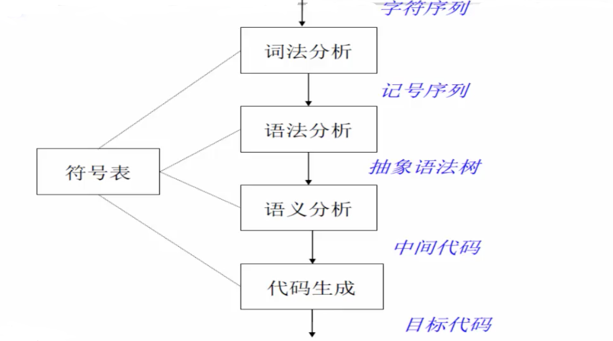

>本文内容主要来自《一起手写一个JIT 编译器》！！先学习实现一个简单的编译器（只涉及前端），关于编译原理的知识后续会慢慢补充和完善

>[编译原理 — 中科大](https://www.bilibili.com/video/BV17W41187gL)

## 文章目录

* [编译器前端架构](#001)
* [Lexer 词法分析器](#002)
* [Parser 语法分析器](#003)
* [中间代码生成](#004)
* [ANTLR 定义的Lua 文法](#005)

## <span id="001">编译器前端架构</span>

比如下面是一种没有优化的编译器结构（来自[《编译原理 — 中科大》](https://www.bilibili.com/video/BV17W41187gL)）



这个是一种更复杂的编译器结构


比如针对下面的C 程序（注：参考自[《1106c语言语法树》](https://www.cnblogs.com/queenjuan/p/4943388.html)）

```c
#include <stdio.h>

main()
{
    int i, j. temp;
    int a[10];

    for (i=0; i<10; i++)
        scanf("%d", &a[i]);

    for (j=0; j<=9; j++)
    {
        for (i=0; i<10-j; i++)
            if (a[i] > a[i+1])
            {
                temp = a[i];
                a[i] = a[i+1];
                a[i+1] = temp;
            }
    }

    for (i=1; i<11; i++)
        printf("%5d", a[i]);

    printf("\n");
}
```

解析得到其语法树是


## <span id="002">Lexer 词法分析器</span>

比如解析表达式`auto x = y + 1` 为

```
[
  {type : 'keyword', value : 'auto'},
  {type : 'id', value : 'x'},
  {type : 'op', value : '='},
  {type : 'id', value : 'y'},
  {type : 'op', value : '+'},
  {type : 'number', value : 1},
]
```

语法分析器中使用的技术主要是自动机处理状态（包括在TCP 协议等很多技术领域，都大量应用了状态的概念），以下参考[《编译原理学习笔记之词法分析中的状态机与自动机》](https://blog.csdn.net/ZP_icenow/article/details/82661407)

比如解析比较符号


比如解析标识符：`id ->letter (letter | digit )*`


比如解析无符号数（不考虑十进制外的其他计数法等）：`num ->digit+ (.digit+)? (E (+ | -)? digit+)?`


使用JavaScript 实现一个简单的词法分析器

```javascript

```

## <span id="003">Parser 语法分析器</span>

上面对于“源码”进行了词法分析之后，得到token 流（记号流），token 流作为词法分析的输出，输入给语法分析器，语法分析器处理token 流

使用JavaScript 实现一个简单的语法分析器

```javascript

```

## <span id="004">中间代码生成</span>


## <span id="005">ANTLR 定义的Lua 文法</span>

[ANTLR](https://www.antlr.org/) 语言识别的一个工具 (ANother Tool for Language Recognition) 是一种语言工具，它提供了一个框架，可以通过包含Java、C++ 或C# 动作（action）的语法描述来构造语言识别器，编译器和解释器。计算机语言的解析已经变成了一种非常普遍的工作，在这方面的理论和工具经过近40 年的发展已经相当成熟，使用ANTLR 等识别工具来识别，解析，构造编译器比手工编程更加容易，同时开发的程序也更易于维护

语言识别的工具有很多种，比如大名鼎鼎的Lex 和YACC，Linux 中有他们的开源版本，分别是Flex 和Bison。在Java 社区里，除了ANTLR 外，语言识别工具还有JavaCC 和SableCC 等

和大多数语言识别工具一样，ANTLR 使用上下文无关文法描述语言。最新的ANTLR 是一个基于LL(\*) 的语言识别器。在ANTLR 中通过解析用户自定义的上下文无关文法，自动生成词法分析器 (Lexer)、语法分析器 (Parser) 和树分析器 (Tree Parser)

识别和处理编程语言是ANTLR 的首要任务，编程语言的处理是一项繁重复杂的任务，为了简化处理，一般的编译技术都将语言处理工作分为前端和后端两个部分。其中前端包括词法分析、语法分析、语义分析、中间代码生成等若干步骤，后端包括目标代码生成和代码优化等步骤

ANTLR 致力于解决编译前端的所有工作。使用ANTLR 的语法可以定义目标语言的词法记号和语法规则，ANTLR 自动生成目标语言的词法分析器和语法分析器；此外，如果在语法规则中指定抽象语法树的规则，在生成语法分析器的同时，ANTLR 还能够生成抽象语法树；最终使用树分析器遍历抽象语法树，完成语义分析和中间代码生成。整个工作在ANTLR 强大的支持下，将变得非常轻松和愉快

比如在[https://github.com/antlr/grammars-v4](https://github.com/antlr/grammars-v4) 项目中，使用ANTLR 定义了很多语言的文法，比如[Lua](https://github.com/lua/lua)

```
/*
BSD License
Copyright (c) 2013, Kazunori Sakamoto
Copyright (c) 2016, Alexander Alexeev
All rights reserved.
Redistribution and use in source and binary forms, with or without
modification, are permitted provided that the following conditions
are met:
1. Redistributions of source code must retain the above copyright
   notice, this list of conditions and the following disclaimer.
2. Redistributions in binary form must reproduce the above copyright
   notice, this list of conditions and the following disclaimer in the
   documentation and/or other materials provided with the distribution.
3. Neither the NAME of Rainer Schuster nor the NAMEs of its contributors
   may be used to endorse or promote products derived from this software
   without specific prior written permission.
THIS SOFTWARE IS PROVIDED BY THE COPYRIGHT HOLDERS AND CONTRIBUTORS
"AS IS" AND ANY EXPRESS OR IMPLIED WARRANTIES, INCLUDING, BUT NOT
LIMITED TO, THE IMPLIED WARRANTIES OF MERCHANTABILITY AND FITNESS FOR
A PARTICULAR PURPOSE ARE DISCLAIMED. IN NO EVENT SHALL THE COPYRIGHT
HOLDER OR CONTRIBUTORS BE LIABLE FOR ANY DIRECT, INDIRECT, INCIDENTAL,
SPECIAL, EXEMPLARY, OR CONSEQUENTIAL DAMAGES (INCLUDING, BUT NOT
LIMITED TO, PROCUREMENT OF SUBSTITUTE GOODS OR SERVICES; LOSS OF USE,
DATA, OR PROFITS; OR BUSINESS INTERRUPTION) HOWEVER CAUSED AND ON ANY
THEORY OF LIABILITY, WHETHER IN CONTRACT, STRICT LIABILITY, OR TORT
(INCLUDING NEGLIGENCE OR OTHERWISE) ARISING IN ANY WAY OUT OF THE USE
OF THIS SOFTWARE, EVEN IF ADVISED OF THE POSSIBILITY OF SUCH DAMAGE.
This grammar file derived from:
    Lua 5.3 Reference Manual
    http://www.lua.org/manual/5.3/manual.html
    Lua 5.2 Reference Manual
    http://www.lua.org/manual/5.2/manual.html
    Lua 5.1 grammar written by Nicolai Mainiero
    http://www.antlr3.org/grammar/1178608849736/Lua.g
Tested by Kazunori Sakamoto with Test suite for Lua 5.2 (http://www.lua.org/tests/5.2/)
Tested by Alexander Alexeev with Test suite for Lua 5.3 http://www.lua.org/tests/lua-5.3.2-tests.tar.gz
*/

grammar Lua;

chunk
    : block EOF
    ;

block
    : stat* retstat?
    ;

stat
    : ';'
    | varlist '=' explist
    | functioncall
    | label
    | 'break'
    | 'goto' NAME
    | 'do' block 'end'
    | 'while' exp 'do' block 'end'
    | 'repeat' block 'until' exp
    | 'if' exp 'then' block ('elseif' exp 'then' block)* ('else' block)? 'end'
    | 'for' NAME '=' exp ',' exp (',' exp)? 'do' block 'end'
    | 'for' namelist 'in' explist 'do' block 'end'
    | 'function' funcname funcbody
    | 'local' 'function' NAME funcbody
    | 'local' attnamelist ('=' explist)?
    ;

attnamelist
    : NAME attrib (',' NAME attrib)*
    ;

attrib
    : ('<' NAME '>')?
    ;

retstat
    : 'return' explist? ';'?
    ;

label
    : '::' NAME '::'
    ;

funcname
    : NAME ('.' NAME)* (':' NAME)?
    ;

varlist
    : var (',' var)*
    ;

namelist
    : NAME (',' NAME)*
    ;

explist
    : exp (',' exp)*
    ;

exp
    : 'nil' | 'false' | 'true'
    | number
    | string
    | '...'
    | functiondef
    | prefixexp
    | tableconstructor
    | <assoc=right> exp operatorPower exp
    | operatorUnary exp
    | exp operatorMulDivMod exp
    | exp operatorAddSub exp
    | <assoc=right> exp operatorStrcat exp
    | exp operatorComparison exp
    | exp operatorAnd exp
    | exp operatorOr exp
    | exp operatorBitwise exp
    ;

prefixexp
    : varOrExp nameAndArgs*
    ;

functioncall
    : varOrExp nameAndArgs+
    ;

varOrExp
    : var | '(' exp ')'
    ;

var
    : (NAME | '(' exp ')' varSuffix) varSuffix*
    ;

varSuffix
    : nameAndArgs* ('[' exp ']' | '.' NAME)
    ;

nameAndArgs
    : (':' NAME)? args
    ;

/*
var
    : NAME | prefixexp '[' exp ']' | prefixexp '.' NAME
    ;
prefixexp
    : var | functioncall | '(' exp ')'
    ;
functioncall
    : prefixexp args | prefixexp ':' NAME args
    ;
*/

args
    : '(' explist? ')' | tableconstructor | string
    ;

functiondef
    : 'function' funcbody
    ;

funcbody
    : '(' parlist? ')' block 'end'
    ;

parlist
    : namelist (',' '...')? | '...'
    ;

tableconstructor
    : '{' fieldlist? '}'
    ;

fieldlist
    : field (fieldsep field)* fieldsep?
    ;

field
    : '[' exp ']' '=' exp | NAME '=' exp | exp
    ;

fieldsep
    : ',' | ';'
    ;

operatorOr
	: 'or';

operatorAnd
	: 'and';

operatorComparison
	: '<' | '>' | '<=' | '>=' | '~=' | '==';

operatorStrcat
	: '..';

operatorAddSub
	: '+' | '-';

operatorMulDivMod
	: '*' | '/' | '%' | '//';

operatorBitwise
	: '&' | '|' | '~' | '<<' | '>>';

operatorUnary
    : 'not' | '#' | '-' | '~';

operatorPower
    : '^';

number
    : INT | HEX | FLOAT | HEX_FLOAT
    ;

string
    : NORMALSTRING | CHARSTRING | LONGSTRING
    ;

// LEXER

NAME
    : [a-zA-Z_][a-zA-Z_0-9]*
    ;

NORMALSTRING
    : '"' ( EscapeSequence | ~('\\'|'"') )* '"'
    ;

CHARSTRING
    : '\'' ( EscapeSequence | ~('\''|'\\') )* '\''
    ;

LONGSTRING
    : '[' NESTED_STR ']'
    ;

fragment
NESTED_STR
    : '=' NESTED_STR '='
    | '[' .*? ']'
    ;

INT
    : Digit+
    ;

HEX
    : '0' [xX] HexDigit+
    ;

FLOAT
    : Digit+ '.' Digit* ExponentPart?
    | '.' Digit+ ExponentPart?
    | Digit+ ExponentPart
    ;

HEX_FLOAT
    : '0' [xX] HexDigit+ '.' HexDigit* HexExponentPart?
    | '0' [xX] '.' HexDigit+ HexExponentPart?
    | '0' [xX] HexDigit+ HexExponentPart
    ;

fragment
ExponentPart
    : [eE] [+-]? Digit+
    ;

fragment
HexExponentPart
    : [pP] [+-]? Digit+
    ;

fragment
EscapeSequence
    : '\\' [abfnrtvz"'\\]
    | '\\' '\r'? '\n'
    | DecimalEscape
    | HexEscape
    | UtfEscape
    ;
fragment
DecimalEscape
    : '\\' Digit
    | '\\' Digit Digit
    | '\\' [0-2] Digit Digit
    ;
fragment
HexEscape
    : '\\' 'x' HexDigit HexDigit
    ;
fragment
UtfEscape
    : '\\' 'u{' HexDigit+ '}'
    ;
fragment
Digit
    : [0-9]
    ;
fragment
HexDigit
    : [0-9a-fA-F]
    ;
COMMENT
    : '--[' NESTED_STR ']' -> channel(HIDDEN)
    ;
LINE_COMMENT
    : '--'
    (                                               // --
    | '[' '='*                                      // --[==
    | '[' '='* ~('='|'['|'\r'|'\n') ~('\r'|'\n')*   // --[==AA
    | ~('['|'\r'|'\n') ~('\r'|'\n')*                // --AAA
    ) ('\r\n'|'\r'|'\n'|EOF)
    -> channel(HIDDEN)
    ;
WS
    : [ \t\u000C\r\n]+ -> skip
    ;
SHEBANG
    : '#' '!' ~('\n'|'\r')* -> channel(HIDDEN)
    ;
```
