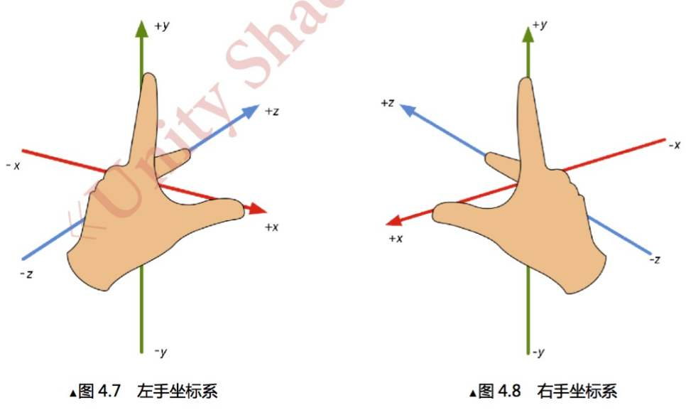
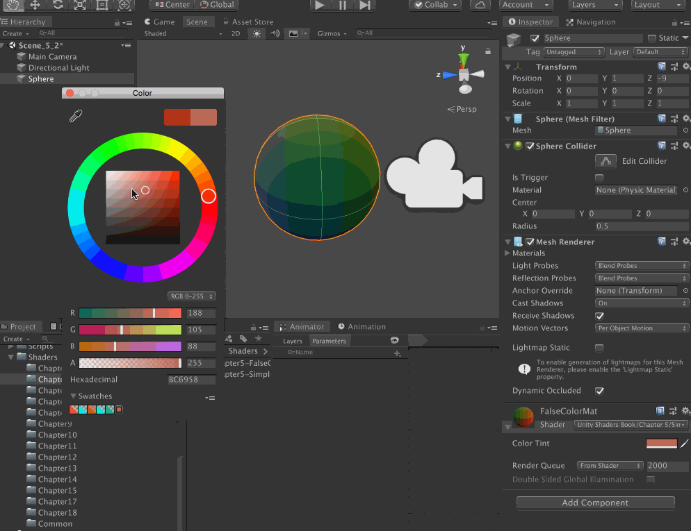

>[第 N-1 手资料](http://www.xumenger.com/docs-20200916/)

>[https://github.com/xumenger/UnityToonShader](https://github.com/xumenger/UnityToonShader)

>[https://github.com/xumenger/Unity_Shaders_Book](https://github.com/xumenger/Unity_Shaders_Book)

>本文内容来自《Unity Shader 入门精要》！！

>[https://github.com/xumenger/Awesome-Unity-Shader](https://github.com/xumenger/Awesome-Unity-Shader)

>[https://blog.csdn.net/zhmxy555/category_9264739.html](https://blog.csdn.net/zhmxy555/category_9264739.html)

>Book of Shader：[https://thebookofshaders.com/(英)](https://thebookofshaders.com/)与[https://thebookofshaders.com/?lan=ch(中)](https://thebookofshaders.com/?lan=ch)

>[Shader语法](https://docs.unity3d.com/Manual/SL-ShaderSemantics.html)、[Sampler语法](https://docs.unity3d.com/2018.4/Documentation/Manual/SL-SamplerStates.html)、[Unity Shader 例子](https://docs.unity3d.com/Manual/SL-VertexFragmentShaderExamples.html)

>[GLSL 成像具体过程](https://learnopengl.com/Getting-started/Hello-Triangle)

## 文章目录

* [3D图形学理论基础](#001)
* [Unity Shader 基础结构](#002)
* [Unity Shader 调试](#003)
* [一个简单的Shader](#004)

## <span id="001">3D图形学理论基础</span>

对于模型空间和世界空间，Unity 使用的是左手坐标。但是对于观察空间来说，Unity 使用的是右手坐标系，通俗来说观察空间就是以摄像机为原点的坐标系



顶点着色器最基本的功能就是把模型的顶点坐标从模型空间转换到齐次裁剪坐标空间中。渲染游戏的过程可以理解成是把一个个顶点经过层层处理最终转化到屏幕上的过程

顶点变换的第一步就是将顶点坐标从模型空间变换到世界空间中去，这个变换通常称为模型变换

顶点变换的第二步就是将顶点坐标从世界空间变换到观察空间（摄像机空间）中去，这个变换通常称为观察变换

顶点坐标接下来要从观察空间转换到裁剪空间（齐次裁剪空间），这个用于转换的矩阵是裁剪矩阵，也叫做投影矩阵。裁剪空间的目标是能够方便地对渲染图元进行裁剪，完全位于这块空间内部的图元将被保留，完全位于这块空间之外的图元将被剔除，而与这块空间边界相交的图元就会被裁剪

经过投影矩阵的变换之后，就可以进行裁剪操作。当完成了所有的裁剪工作后，就需要进行真正的投影了，即需要讲视锥体投影到屏幕空间，经过这一步变换，就会得到真正的像素位置，而不是虚拟的三维坐标。屏幕空间是一个二维坐标

在游戏中，模型的一个顶点往往会携带额外的信息，而顶点法线就是其中一种信息，当变换一个模型的时候，不仅需要变换它的顶点，还需要变换顶点法线，以便于后续处理（比如片元着色器）中计算光照

Unity 中内置的变换矩阵

变量名               | 描述 
------------------- | ---------------------------------------------------- 
UNITY_MATRIX_MVP    |  当前的模型观察投影矩阵，用于将顶点/方向矢量从模型空间变换到裁剪空间
UNITY_MATRIX_MV     |  当前的模型观察矩阵，用于将顶点/方向矢量从模型空间变换到观察空间
UNITY_MATRIX_V      |  当前的观察矩阵，用于将顶点/方向矢量从世界空间变换到观察空间
UNITY_MATRIX_P      |  当前的投影矩阵，用于将顶点/方向矢量从观察空间变换到裁剪空间
UNITY_MATRIX_VP     |  当前的观察投影矩阵，用于将顶点/方向矢量从观察空间变换到裁剪空间
UNITY_MATRIX_T_MV   |  UINTY_MATRIX_MV的转置矩阵，用于将顶点/方向矢量从观察空间变换到模型空间
UNITY_MATRIX_IT_MV  |  UINTY_MATRIX_MV的逆转置矩阵，用于将法线从模型空间变换到观察空间，也用于得到UINTY_MATRIX_MV的逆矩阵
_Object2World       |  当前的模型矩阵，用于将顶点/方向矢量从模型空间变换到世界空间
_World2Object       |  _Object2World的逆矩阵，用于将顶点/方向矢量从世界空间变换到模型空间

最后推荐B 站[up 主Flynnmnn](https://space.bilibili.com/398411802)的一个视频[Unity Shader 102 - 3D成像的过程和depth的小应用](https://www.bilibili.com/video/BV1MD4y1U7B6)

## <span id="002">Unity Shader 基础结构</span>

比如下面是编写Unity Shader 的基本框架！

```shader
Shader "Test/ShaderExample" {

    Properties {
        // 属性
        // Name ("display name", PropertyType) = DefaultValue

        // Numbers and Sliders
        _Int ("Int", Int) = 2
        _Float ("Float", Float) = 1.25
        _Range ("Range", Range(0.0, 5.0)) = 3.0

        // Colors and Vectors
        _Color ("Color", Color) = (1, 1, 1, 1)
        _Vector ("Vector", Vector) = (2, 3, 6, 1)

        // Texture
        _2D ("2D", 2D) = "" {}
        _Cube ("Cube", Cube) = "white" {}
        _3D ("3D", 3D = "black" {}
    }

    SubShader {
        // 显卡A使用的子着色器

        // 标签，可选的
        [Tags]

        // 状态，可选的
        [RenderSetup]

        // 每个Pass 定义了一次完整的渲染流程，但如果Pass 数量过多，会造成渲染性能的下降
        Pass {
            [Name]
            [Tags]
            [RenderSetup]

            // Other Code

        }

        // Other Pass

    }

    SubShader {
        // 显卡B使用的子着色器

    }

    // 如果显卡对于上面的子着色器都不支持的话，会使用Fallback 语义指定的Unity Shader
    Fallback "VertexLit"
}
```

## <span id="003">Unity Shader 调试</span>

在Unity 的Project 窗口选中Unity Shader 文件后，对应在Inspector 窗口点击【Compile and show code】下拉列表可以让开发者检查该Unity Shader 针对不同的图形编程接口（例如OpenGL、D3D9 等）最终编译生成的Shader 代码，可以利用这些代码来分析和优化着色器！

Mac 使用的图像编程接口是基于OpenGL 的，而其他平台，比如Windows，可能使用的是DirectX。在OpenGL 中，渲染纹理（Render Texture）的(0, 0) 点在左下角，而在DirectX 中(0, 0) 在左上角


## <span id="004">一个简单的Shader</span>

以下给出书中第一个Shader 实例源码，并添加必要的说明

```
Shader "Example/SimpleShader" {
    Properties {
        // 定义一个属性，可以在材质面板上选择颜色
        _Color ("Color Tint", Color) = (1, 1, 1, 1)
    }

    SubShader {
        Pass {
            CGPROGRAM

            #include "UnityCG.cginc"

            // 告诉编译器 vert 是顶点着色器
            #pragma vertex vert
            // 告诉编译器 frag 是片元着色器
            #pragma fragment frag


            // uniform 关键词是 Cg 中用于修饰变量和参数的一种修饰词
            // 它仅仅用于提供一些关于该变量的初始值是如何制定和存储的相关信息
            uniform fixed4 _Color;


            // 使用一个结构体定义顶点着色器的输入
            // POSITION、NORMAL、TEXCOORD0 语义的数据来自哪里？
            // 它们由该材质的 Mesh Render 组件提供，在每帧调用 Draw Call 的时候
            // Mesh Render 组件会把它负责渲染的模型数据发送给 Unity Shader
            struct a2v {
                // vertex 包含了顶点的位置，通过 POSITION 语义指定的
                // POSITION 语义告诉 Unity 用模型空间的顶点坐标填充 vertex 变量
                float4 vertex : POSITION;

                // NORMAL 语义告诉 Unity 用模型空间的法线向量填充 normal 变量
                float3 normal : NORMAL;

                // TEXCOORD0 语义告诉 Unity 用模型的第一套纹理坐标填充 texcoord 变量
                float4 texcoord : TEXCOORD0;
            };

            // 使用一个结构体定义顶点着色器的输出
            // 用于在顶点着色器和片元着色器之间传输信息
            struct v2f {
                // SV_POSITION 语义表示顶点在裁剪空间的位置
                // SV_POSITION 语义告诉 Unity，pos 里包含了顶点在裁剪空间中的位置信息
                // 否则，渲染器将无法得到裁剪空间中的顶点坐标，也无法将顶点渲染到屏幕上
                float4 pos : SV_POSITION;

                // COLOR0 语义 可用于存储颜色信息
                // COLOR0 语义中的数据可以由用户自己定义，但一般存储颜色，比如逐顶点的漫反射颜色或者逐顶点的高光反射颜色
                // 类似的语义还有 COLOR1 等
                fixed3 color : COLOR0;
            };


            // 顶点着色器是逐顶点执行的
            v2f vert(a2v v) {
                v2f o;

                // 下面一行，等价于 o.pos = mul(UNITY_MATRIX_MVP, v.vertex);
                // UNITY_MATRIX_MVP 当前的模型观察投影矩阵，用于将顶点/方向矢量从模型空间变换到裁剪空间
                o.pos = UnityObjectToClipPos(v.vertex);

                // v.normal 包含了顶点的法线向量，其分量范围在[-1.0, 1.0]
                // 下面的代码将分量范围映射到 [0.0, 1.0]
                // 存储到 o.color 中传递给片元着色器
                o.color = v.normal * 0.5 + fixed3(0.5, 0.5, 0.5);
                return o;
            }


            // 片元着色器是逐片元执行的
            // 片元大致可以认为对应屏幕像素，或者说render target上的像素，在透视投影下，离得近的模型占的屏幕面积大，自然片元就更多
            // 片元着色器的输入实际上是把顶点着色器的输出进行插值后得到的结果
            fixed4 frag(v2f i) : SV_Target {
                fixed3 c = i.color;

                // 使用 _Color 属性来控制输出颜色
                c *= _Color.rbg;

                // 将插值后的 i.color 显示到屏幕上
                return fixed4(c, 1.0);
            }

            ENDCG
        }
    }
}
```



顶点/片元着色器的复杂之处在于，很多事情都需要开发者亲力亲为，比如需要自己转换法线向量、自己处理光照和阴影等等

为了方便开发者的编码过程，Unity 提供了很多的内置文件，这些文件包含了很多提前定义的函数、变量和宏等，在后续的具体案例中，用到的地方会详细介绍

[https://docs.unity3d.com/2019.3/Documentation/Manual/SL-Reference.html](https://docs.unity3d.com/2019.3/Documentation/Manual/SL-Reference.html)

[https://docs.unity3d.com/2019.3/Documentation/Manual/SL-BuiltinFunctions.html](https://docs.unity3d.com/2019.3/Documentation/Manual/SL-BuiltinFunctions.html)

[https://docs.unity3d.com/2019.3/Documentation/Manual/SL-UnityShaderVariables.html](https://docs.unity3d.com/2019.3/Documentation/Manual/SL-UnityShaderVariables.html)